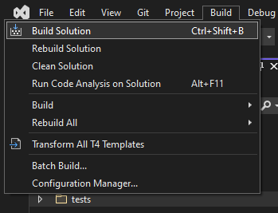
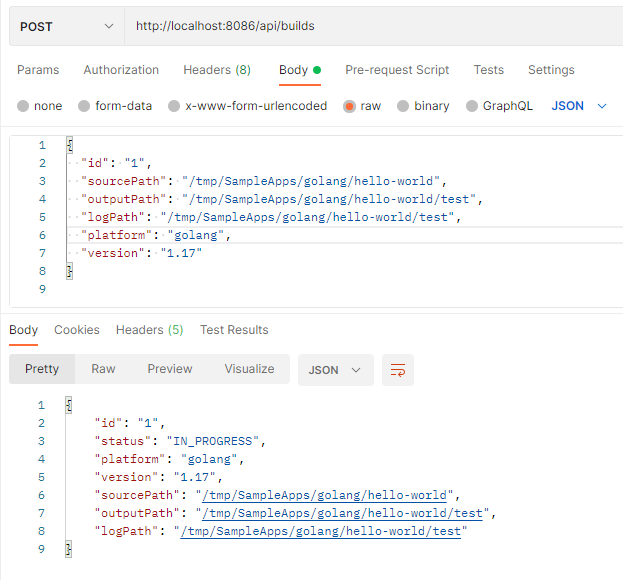
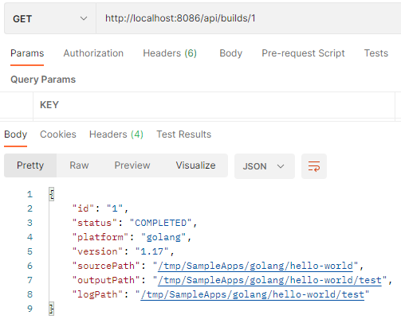
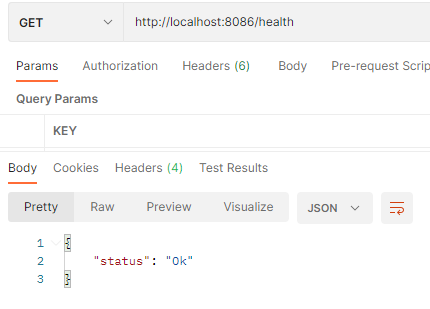

# Oryx
#test
[](https://devdiv.visualstudio.com/DevDiv/_build/latest?definitionId=10393&branchName=main)

Oryx is a build system which automatically compiles source code repos into
runnable artifacts. It is used to build web apps for [Azure App Service][] and
other platforms.

To receive updates on runtimes and versions supported by Oryx and App Service,
subscribe to [Azure Updates][] or watch the
[github.com/Azure/app-service-announcements](https://github.com/Azure/app-service-announcements)
tracker.

[Azure App Service]: https://azure.microsoft.com/services/app-service/
[Azure Updates]: https://azure.microsoft.com/updates

Oryx generates and runs an opinionated build script within a *build* container
based on analysis of a codebase's contents. For example, if `package.json` is
discovered in the repo Oryx includes `npm run build` in the build script; or if
`requirements.txt` is found it includes `pip install -r requirements.txt`.

Oryx also generates a run-time startup script for the app including typical
start commands like  `npm run start` for Node.js or a WSGI module and server
for Python.

The built artifacts and start script are loaded into a minimalistic *run*
container and run.

# Supported platforms and versions

[Link](./doc/supportedPlatformVersions.md)

Patches (0.0.**x**) are applied as soon as possible after they are released upstream.

# Get started

Though built first for use within Azure services, you can also use the Oryx
build system yourself for troubleshooting and tests. Following are simple
instructions; for complete background see our [architecture
doc](./doc/architecture.md).

Oryx includes two command-line applications; the first is included in the
*build* image and generates a build script by analyzing a codebase. The second
is included in *run* images and generates a startup script. Both are aliased
and accessible as `oryx` in their respective images.

### `oryx build`

When `oryx build` is run, the system detects which programming platforms appear
to be in use and applies toolsets appropriate for each one. You can override
the default choices through [configuration](./doc/configuration.md#oryx-configuration).

The `--output` (or `-o`)  parameter specifies where prepared artifacts will be
placed; if not specified the source directory is used for output as well.

For all options, specify `oryx --help`.

### `oryx create-script -appPath`

When `oryx` is run in the runtime images it generates a start script named
run.sh, by default in the same folder as the compiled artifact.

## Support for Build Configuration File

The App Service YAML file (`appsvc.yaml`) is used to specify the build and run commands for your Web Apps, thus
overriding any defaults provided by the App Service Build Service. App Service expects this file to be in the root
directory of your project.

### Format

There are ordered keys for `pre-build`, `post-build`, and `run`. The commands/scripts referenced by these keys are
executed in-order. If a key is missing, it will be skipped and the next key will be processed. An optional `version` key
specifies the version of the `appsvc.yaml` file, if new versions are introduced in the future.

```yaml
version: 1

pre-build: apt-get install jq

post-build: |
    python manage.py makemigrations
    python manage.py migrate

run: gunicorn myapp.app --workers 5
```

## Build and run an app

To build and run an app from a repo, follow these approximate steps. An example
script follows.

1. Mount the repo as a volume in Oryx's `docker.io/oryxprod/build` container.
1. Run `oryx build ...` within the repo directory to build a runnable artifact.
1. Mount the output directory from build in an appropriate Oryx "run"
   container, such as `docker.io/oryxprod/node-10.14`.
1. Run `oryx ...` within the "run" container to write a startup script.
1. Run the generated startup script, by default `/run.sh`.

```bash
# Run these from the root of the repo.
# build
docker run --volume $(pwd):/repo \
    'mcr.microsoft.com/oryx/build:latest' \
    oryx build /repo --output /repo

# run

# the -p/--publish and -e/--env flags specify and open a host port
docker run --detach --rm \
    --volume $(pwd):/app \
    --env PORT=8080 \
    --publish 8080:8080 \
    'mcr.microsoft.com/oryx/node:10' \
    sh -c 'oryx create-script -appPath /app && /run.sh'
```

## Build Server Invocation
1. Build the Oryx solution
    1. 
1. Create image with oryx and platform binaries
    1. `time build/buildBuildImages.sh -t ltsversion`
1. Run docker to port map, volume mount a directory, specify the image with `oryx build`, and invoke BuildServer
    1. ```bash
        docker run -it -p 8086:80 \
        -v C:\Repo\Oryx\tests\SampleApps\:/tmp/SampleApps \
        -e "ASPNETCORE_URLS=http://+80" \
        oryxdevmcr.azurecr.io/public/oryx/build:lts-versions \
        /opt/buildscriptgen/BuildServer
        ```
        
1. Invoke build
    1.  
        1. Under the hood `oryx build` is invoked
            ```bash
            oryx build [sourcePath] \
                --platform [platform] \
                --platform-version [version] \
                --output [outputPath] \
                --log-file [logPath]
            ```
1. Check build status with id `1`
    1. 
1. Check server healthcheck
    1. 

# Components

Oryx consists of a build image, a collection of runtime images, a build script generator, and a collection of
startup script generators. For more details, refer to our [architecture](./doc/architecture.md) page.

# Testing Locally
## startup script generator
`build/testStartupScriptGenerators.sh` will perform tests on all startup script generators written in go.
The tests are copied into a docker image for performing `go test` on all platforms.

# Contributing

See [CONTRIBUTING.md](./CONTRIBUTING.md).

# License

MIT, see [LICENSE.md](./LICENSE.md).

# Security

Security issues and bugs should be reported privately, via email, to the
Microsoft Security Response Center (MSRC) at
[secure@microsoft.com](mailto:secure@microsoft.com). You should receive a
response within 24 hours. If for some reason you do not, please follow up via
email to ensure we received your original message. Further information,
including the [MSRC
PGP](https://technet.microsoft.com/en-us/security/dn606155) key, can be found
in the [Security
TechCenter](https://technet.microsoft.com/en-us/security/default).

# Trademark

This project may contain trademarks or logos for projects, products, or services.
Authorized use of Microsoft trademarks or logos is subject to and must follow
[Microsoft’s Trademark & Brand Guidelines](https://www.microsoft.com/en-us/legal/intellectualproperty/trademarks).
Use of Microsoft trademarks or logos in modified versions of this project must not
cause confusion or imply Microsoft sponsorship. Any use of third-party trademarks
or logos are subject to those third-party’s policies.

# Data/Telemetry

When utilized within Azure services, this project collects usage data and
sends it to Microsoft to help improve our products and services. Read
[Microsoft's privacy statement][] to learn more.

[Microsoft's privacy statement]: http://go.microsoft.com/fwlink/?LinkId=521839

This project follows the [Microsoft Open Source Code of Conduct][coc]. For
more information see the [Code of Conduct FAQ][cocfaq]. Contact
[opencode@microsoft.com][cocmail] with questions and comments.

[coc]: https://opensource.microsoft.com/codeofconduct/
[cocfaq]: https://opensource.microsoft.com/codeofconduct/faq/
[cocmail]: mailto:opencode@microsoft.com

## Disable Data Collection

To prevent Oryx command line tools from collecting any data, set the environment variable
`ORYX_DISABLE_TELEMETRY` to `true`.
