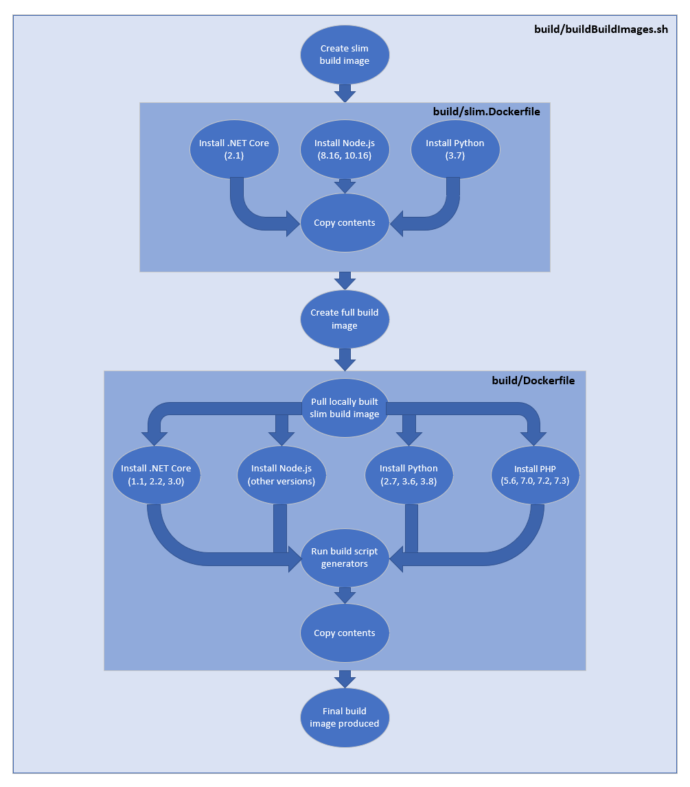
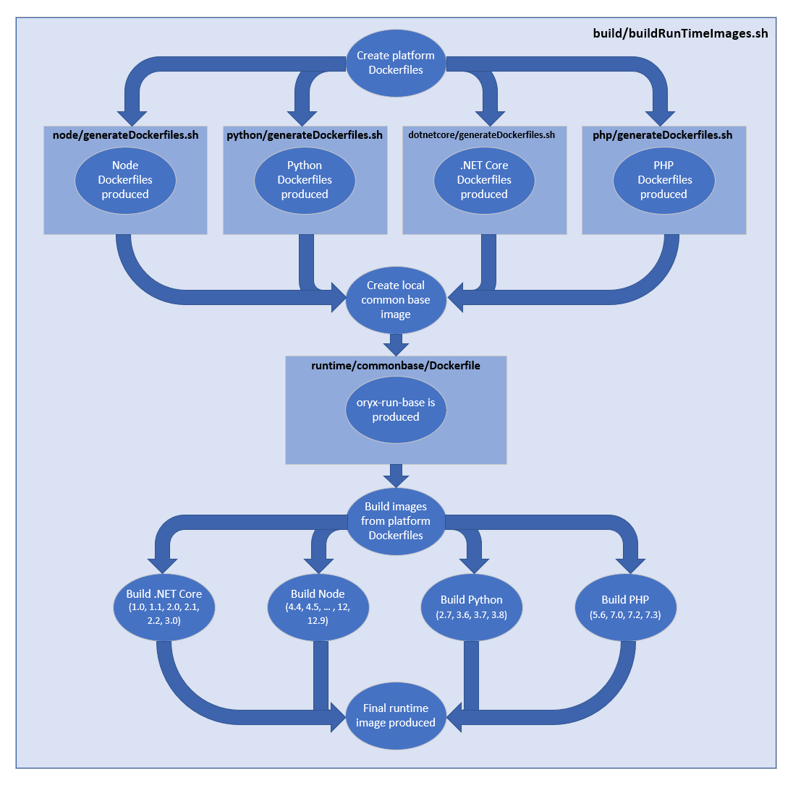

# Oryx Architecture

The Oryx system comprises *Build* and *Run* images. **Build** images include
compilers, libraries, headers and other tools necessary to prepare artifacts;
**Run** images are smaller and contain only components required to run
programs.

After the generated build script runs, artifacts are exported as files from
the Build image to be mounted into the Run image or added to a derived
container in a Dockerfile.

Another script generator in Run images generates a script to start the app
correctly.

## Components

Follows a description of each of our components.

### Build script generator

The build script generator is a command line tool (and .NET Core library) that can generate and execute build
scripts for a given source repo.
It analyzes the codebase, detecting which programming platforms are being used and how each should be built.

### Build image

We have a single build image which supports all of the SDKs and their versions. This allows developers to use
multiple languages in their build, for instance run a Python setup script when building their .NET Core app,
or have a TypeScript frontend for their Python app. You can take a look at its
[Dockerfile](../images/build/Dockerfiles/Dockerfile) to better understand its contents.

Note that some layers of this build image come from yet another set of images, which we build independently for
modularization and for faster build times. You can see what are those images and how they are built in their
[build script](../build/buildBuildImageBases.sh).

To help the user select which version they want for each platform, they can use the `benv` script pre-installed
in the build image. For example, `source benv python=3.6 node=8` will make Python 3.6 and the latest supported
version of Node 8 the default ones.

The build image also contains the build script generator, which can be accessed by its alias, `oryx`.

The build image manifest is at
[/images/build/Dockerfiles/Dockerfile](../images/build/Dockerfiles/Dockerfile). It is built and
published via the Microsoft Container Registry (MCR) ([info][]) as
`mcr.microsoft.com/oryx/build` and syndicated to Docker Hub as
[`https://hub.docker.com/_/microsoft-oryx-images`](https://hub.docker.com/_/microsoft-oryx-images). Pull with `docker pull
mcr.microsoft.com/oryx/build:latest`.

For a high-level image of how the build image is constructed, click here.

For a list of packages installed as a part of this build image, click here.

#### [Lts Versions Build Image](../images/build/Dockerfiles/ltsVersions.Dockerfile)

**Docker**

- [`buildpack-deps:stretch`](../images/build/Dockerfiles/ltsVersions.Dockerfile#L5)
- [`mcr.microsoft.com/oryx/python-build-base:3.7-{BUILD}`](../images/build/Dockerfiles/ltsVersions.Dockerfile#L160)

**`apt-get`**

- Basic build tools
    - [`build-essential`](../images/build/Dockerfiles/ltsVersions.Dockerfile#L25)
    - [`default-libmysqlclient-dev`](../images/build/Dockerfiles/ltsVersions.Dockerfile#L31)
    - [`git`](../images/build/Dockerfiles/ltsVersions.Dockerfile#L21)
    - [`libpq-dev`](../images/build/Dockerfiles/ltsVersions.Dockerfile#L29)
    - [`make`](../images/build/Dockerfiles/ltsVersions.Dockerfile#L22)
    - [`moreutils`](../images/build/Dockerfiles/ltsVersions.Dockerfile#L33)
    - [`rsync`](../images/build/Dockerfiles/ltsVersions.Dockerfile#L34)
    - [`unixodbc-dev`](../images/build/Dockerfiles/ltsVersions.Dockerfile#L27)
    - [`unzip`](../images/build/Dockerfiles/ltsVersions.Dockerfile#L23)
    - [`zip`](../images/build/Dockerfiles/ltsVersions.Dockerfile#L35)
- .NET Core
    - [`libc6`](../images/build/Dockerfiles/ltsVersions.Dockerfile#L50)
    - [`libgcc1`](../images/build/Dockerfiles/ltsVersions.Dockerfile#L51)
    - [`libgssapi-krb5-2`](../images/build/Dockerfiles/ltsVersions.Dockerfile#L52)
    - [`libicu57`](../images/build/Dockerfiles/ltsVersions.Dockerfile#L53)
    - [`liblttng-ust0`](../images/build/Dockerfiles/ltsVersions.Dockerfile#L54)
    - [`libssl1.0.2`](../images/build/Dockerfiles/ltsVersions.Dockerfile#L55)
    - [`libstdc++6`](../images/build/Dockerfiles/ltsVersions.Dockerfile#L56)
    - [`zlib1g`](../images/build/Dockerfiles/ltsVersions.Dockerfile#L57)
- Node
    - [`jq`](../images/build/Dockerfiles/ltsVersions.Dockerfile#L108)
- Python
    - [`tk-dev`](../images/build/Dockerfiles/ltsVersions.Dockerfile#L169)
    - [`uuid-dev`](../images/build/Dockerfiles/ltsVersions.Dockerfile#L170)

#### [Full build image](../images/build/Dockerfiles/Dockerfile)

**Docker**

- Python
    - [`mcr.microsoft.com/oryx/python-build-base:2.7-{BUILD}`](../images/build/Dockerfiles/Dockerfile#L179)
    - [`mcr.microsoft.com/oryx/python-build-base:3.6-{BUILD}`](../images/build/Dockerfiles/Dockerfile#L180)
    - [`mcr.microsoft.com/oryx/python-build-base:3.8-{BUILD}`](../images/build/Dockerfiles/Dockerfile#L181)
- PHP
    - [`mcr.microsoft.com/oryx/php-build-base:5.6-{BUILD}`](../images/build/Dockerfiles/Dockerfile#L217)
    - [`mcr.microsoft.com/oryx/php-build-base:7.0-{BUILD}`](../images/build/Dockerfiles/Dockerfile#L218)
    - [`mcr.microsoft.com/oryx/php-build-base:7.2-{BUILD}`](../images/build/Dockerfiles/Dockerfile#L219)
    - [`mcr.microsoft.com/oryx/php-build-base:7.3-{BUILD}`](../images/build/Dockerfiles/Dockerfile#L220)
- [`golang:1.11-stretch`](../images/build/Dockerfiles/Dockerfile#L228)

**`apt-get`**

- .NET Core
    - [`libunwind8`](../images/build/Dockerfiles/Dockerfile#L16)
    - [`libcurl3`](../images/build/Dockerfiles/Dockerfile#L26)
    - [`libuuid1`](../images/build/Dockerfiles/Dockerfile#L27)
- Node
    - [`jq`](../images/build/Dockerfiles/Dockerfile#L100)

[info]: https://azure.microsoft.com/en-us/blog/microsoft-syndicates-container-catalog/

### Startup script generators

These are command line tools, one for each platform, that inspect the output directory of an application and
write a script that can start it. They are written in Go, and are located in
[src/startupscriptgenerator](../src/startupscriptgenerator/).

The startup script generators are written in Go to reduce storage space
required. Nevertheless you don't have to install Go to build this project
since it's available in the Oryx build image.

Set the `GOPATH` variable to include the Oryx repo, for example
`GOPATH=$GOPATH:c:\src\oryx`. Since the applications are inside the `src`
folder there, Go should be able to find the packages and produce builds.

### Run images

We have a set of runtime images, and their Dockerfiles are located in [/images/runtime](../images/runtime).
Some of the Dockerfiles are generated from a template, also located in this folder, with a corresponding
script to turn those scripts into actual Dockerfiles. Having templates helps us maintain consistency
across the Dockerfiles.

There are some exceptions that are not templates, where we have to customize the image. A typical need for
such customization is security, where we have to patch a tool or rely on a different base image than the
official images released for a given platform.

Each runtime image contains the startup script generator for its platform.

The *Run* images are published to MCR (mcr.microsoft.com/oryx/&lt;platform&gt;).

For a high-level image of how the runtime images are constructed, click here.

For a list of packages installed as a part of the runtime images, click here.

#### [Common base image](../images/runtime/commonbase/Dockerfile)

**Docker**

- [`buildpack-deps:stretch-curl`](../images/runtime/commonbase/Dockerfile#L1)

**`apt-get`**

- [`xz-utils`](../images/runtime/commonbase/Dockerfile#L4)

#### [.NET Core template](../images/runtime/dotnetcore/template.Dockerfile)

**Docker**

- [`golang:1.11-stretch`](../images/runtime/dotnetcore/template.Dockerfile#L2)
- [`mcr.microsoft.com/dotnet/core/runtime:{VERSION}](../images/runtime/dotnetcore/template.Dockerfile#L12)

**`apt-get`**

- [`file`](../images/runtime/dotnetcore/template.Dockerfile#L16)

#### [Node template](../images/runtime/node/template.Dockerfile)

**Docker**

- [`golang:1.11-stretch`](../images/runtime/node/template.Dockerfile#L2)
- [`mcr.microsoft.com/oryx/node-base:{VERSION}`](../images/runtime/node/template.Dockerfile#L12)

#### [PHP template](../images/runtime/php/template.Dockerfile)

**Docker**

- [`golang:1.11-stretch`](../images/runtime/php/template.Dockerfile#L2)
- [`mcr.microsoft.com/oryx/php-base:{VERSION}`](../images/runtime/php/template.Dockerfile#L12)

#### [Python template](../images/runtime/python/template.Dockerfile)

**Docker**

- [`golang:1.11-stretch`](../images/runtime/python/template.Dockerfile#L2)

## Repo structure

* `build`: scripts for building the script generator and build and runtime images
* `images`: Dockerfiles for the build and runtime images
* `platforms`:platform SDK versions to be built
* `src`: source code for the build and startup script generators
* `tests`: tests.
* `vsts`: CI/CD configuration.

## Prerequisites

The following are required to run and test this project locally.

- Bash v4.4
- [.NET Core 3.1](https://dotnet.microsoft.com/download/dotnet-core)
- [Go 1.11+](https://golang.org/dl/) (for startup script generator)
- [Docker v18.06.1-ce](https://docs.docker.com/install/)
