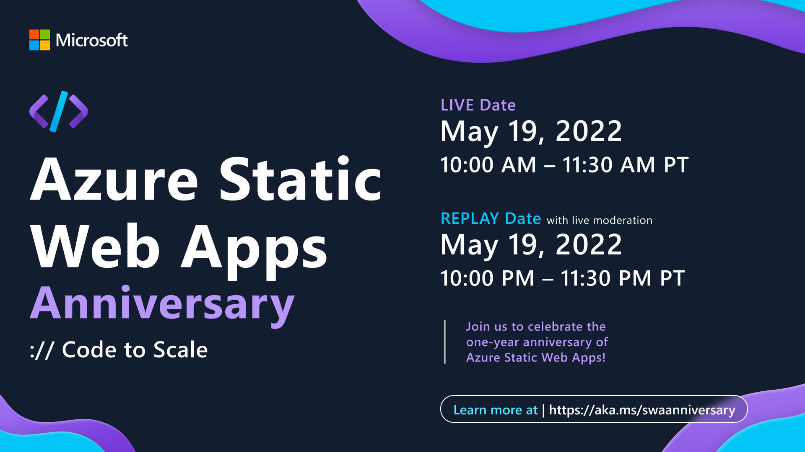
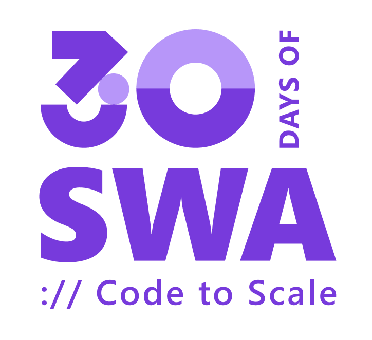

:::info SWA ANNIVERSARY SCHEDULE & SPEAKERS
View the latest Schedule & Speaker Lineup at [https://aka.ms/swaanniversary](https://aka.ms/swaanniversary)
:::

---

On May 12, 2021, the [Azure Static Web Apps](https://docs.microsoft.com/en-us/azure/static-web-apps/overview?WT.mc_id=30daysofswa-61155-cxall) service hit a significant milestone - [becoming generally available](https://azure.microsoft.com/en-us/updates/azure-static-web-apps-is-now-generally-available/?WT.mc_id=30daysofswa-61155-cxall) with support for many of the popular [front-end frameworks and static site generators](https://docs.microsoft.com/en-us/azure/static-web-apps/front-end-frameworks) used for modern web app development.

On May 12, 2022, Azure Static Web Apps will make the first-year anniversary of that milestone - making this the perfect time to look back on all the progress made, and look ahead to what's in store next.

## Celebrate with #SWAanniversary

On May 19, 2022, join us live on [Learn TV](https://docs.microsoft.com/en-us/learn/tv/?WT.mc_id=30daysofswa-61155-cxall) for a 2-hour celebration with some of our favorite speakers and guests from both Microsoft and the larger developer community. Can you tell we're excited for this birthday?

<iframe width="560" height="315" src="https://www.youtube.com/embed/OGlM5CgCwwc" title="YouTube video player" frameborder="0" allow="accelerometer; autoplay; clipboard-write; encrypted-media; gyroscope; picture-in-picture" allowfullscreen></iframe>

Check out [the Event page](https://docs.microsoft.com/en-us/events/learntv/swa-anniversary-may-2022/?WT.mc_id=30daysofswa-61155-cxall) to learn more about the speakers and topics on the agenda. Add the event to your calendar, and join us live - or bookmark this page and revisit it for links to relevant resources and video replays.

## Learn with #30DaysOfSWA

But there's more! _Are you new to Azure Static Web Apps?_ Do you want to get a beginner-friendly tour of the core concepts, usage examples, developer tools, and best practices involved in building and deploy modern web applications with this service?

**You're in luck!**

Watch this space for an update on a new content series that will help you jumpstart that learning journey! Throughout the month of May, we'll bring together a diverse group of technologists to share short articles with resources and insights on a curated tour of Static Web Apps - taking you from **code to scale**.

## How Can You Participate?

Some actions you can take today to get ready for a fun month of learning:
 
  * Bookmark this Series page or [**Subscribe to the RSS feed**](https://aka.ms/30DaysOfSWA/rss)
  * Follow the [**#staticwebapps tag on dev.to**](https://dev.to/t/staticwebapps) - and consider making a post there!
  * Introduce yourself on [**our Discussions Forum**](https://github.com/orgs/staticwebdev/discussions/categories/-30daysofswa) - tell us what you hope to learn!

## Self-Study Resources

Our goal is to help make this a beginner-friendly learning journey into Azure Static Web Apps. We hope we inspire you to keep going beyond #30Days - and wanted to share resources to motivate you to keep going. Here are three links to bookmark:

 * The [**Resources**](/resources) page - will be updated with links related to each article in the series, all through May! Use this to explore detours and deep dives.
 * The [**Microsoft Learn Path**](https://docs.microsoft.com/en-us/learn/paths/azure-static-web-apps/?WT.mc_id=30daysofswa-61155-cxall) - teaches you how to build your first Static Web Apps powered experience - with React, Angular, Vue and Blazor coding options.
 * The [**#30DaysOfSWA Collection**](https://docs.microsoft.com/en-us/users/nityan/collections/7d2ws6zd1mxmp6?WT.mc_id=30daysofswa-61155-cxall) - a Microsoft-specific collection of resources (from documentation to videos and code samples) that I will continue to update.
