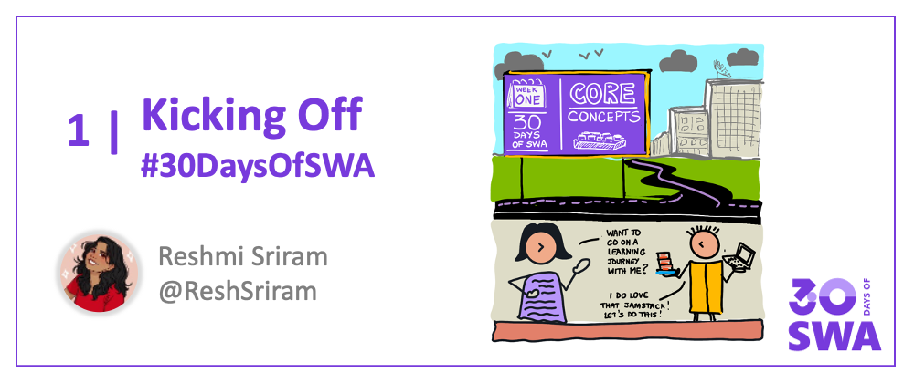
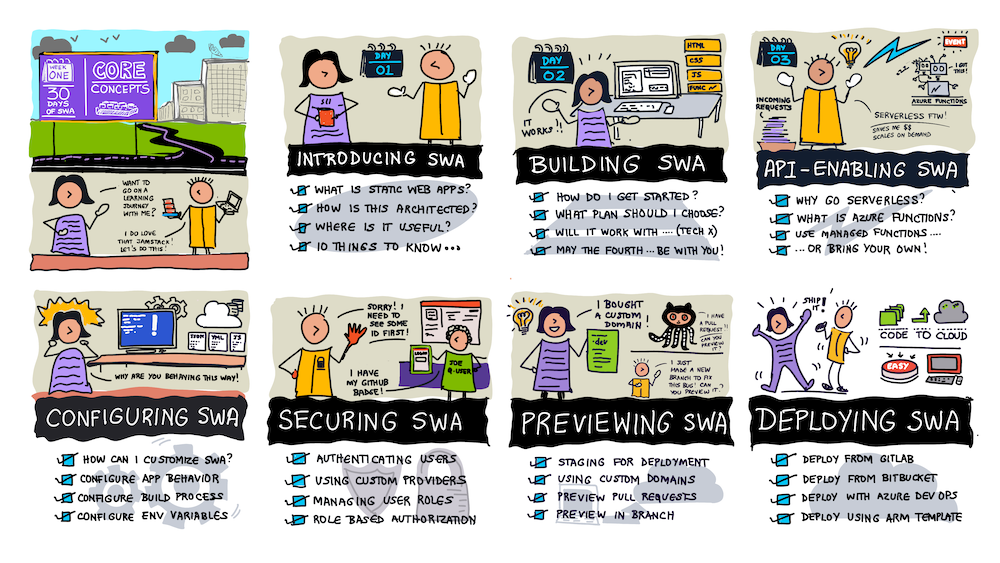
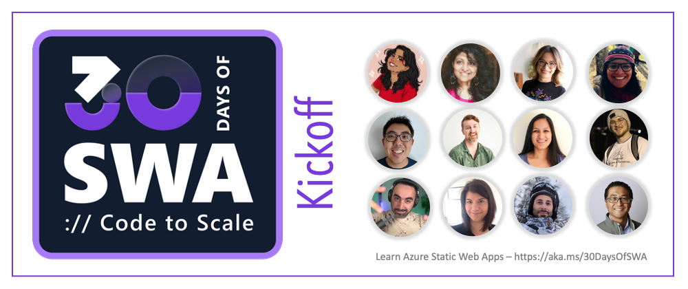

Welcome to the first day of **#30DaysOfSWA**!!

Thank you for joining us on this fun and functional tour of **Azure Static Web Apps**. Whether you're new to the technology, or an experienced user, we hope there's something that interests and motivates you to keep going.

## Hello #30DaysOfSWA

Simply put, it's a month-long series of blog posts that provides you a curated and structured tour through the universe of  [Azure Static Web Apps](https://docs.microsoft.com/en-us/azure/static-web-apps/overview?WT.mc_id=30daysofswa-61155-cxall). 

 * Each article will be 5 mins or less in reading time
 * Each ends with an activity to help reinforce the learning
 * Articles will follow a structured roadmap over 4 weeks

We've organized the journey into four stages, each building on the previous one in a way that mimics the developer experience with any new technology:
 * **Week 1:** Focus on Core Concepts, learning terminology and getting setup.
 * **Week 2:** Focus on Usage Examples with quickstarts & front-end technologies.
 * **Week 3:** Focus on Dev Tools to develop, debug, test, and deploy, the SWA!
 * **Week 4:** Focus on Best Practices, from services to end-to-end experiences.

## Week 1 Roadmap

We are kicking off week 1 with a focus on **Core Concepts** to get you familiar with the high-level architecture, fundamental components and basic terminology for Azure Static Web Apps. Want a sneak peek at the topics? Here's a visual guide to help you!

**By the end of week 1 you should know**:
 * What Azure Static Web Apps is, and its benefits
 * How to get started building SWA or using it for your existing apps
 * How to go serverless, adding API capability with Azure Functions
 * How to configure SWA - from app behavior to build process
 * How to secure SWA - from user authentication to role-based authorization
 * How to preview SWA - on pull requests or test branches
 * How to deploy SWA - using different code sources, or CI/CD options

By the end of the week you should be familiar with SWA terminology and developer workflows - and be ready to explore usage scenarios with various front-end frameworks or static site generators!

## Take The Journey

They say it takes 30 days to make a habit. It's our hope that doing short bursts of reading and activity with Azure Static Web Apps on a daily basis, will lead to better learning and development habits in general.

We want to make it easy for you to participate - here are options to follow along:
 * Bookmark [this site](https://aka.ms/30DaysofSWA) and visit daily
 * Subscribe to the [RSS Feed](https://aka.ms/30DaysOfSWA/rss) in your favorite Feed Reader
 * Visit the [dev.to Series Page](https://dev.to/nitya/series/17901) and like, comment on, or bookmark, the posts.

Want to really get the most from this? Try the exercises each day, and take a moment on a weekly basis, to write a blog post or capture your own notes on what your main takeaways were. As a fan of [visual storytelling](https://twitter.com/sketchthedocs) I know that writing things down helps improve your understanding and recall of the material!

## Provide Us Feedback

**We want to make this useful and beginner-friendly!** So if you have comments or questions that can help us improve this content, please drop us a note in our [Discussions](https://github.com/orgs/staticwebdev/discussions/categories/-30daysofswa) board!

## Meet The Authors

Articles are written by a multi-disciplinary team of contributors from across Microsoft and the community - including members of the Static Web Apps product group and Microsoft Developer Relations. 

We'll keep this page updated on a daily basis, to reflect the latest author whose post was published. We'll kick things off with the authors of this post.
 * **Nitya Narasimhan**, Senior Cloud Advocate @Microsoft
 * **Reshmi Sriram**, Static Web Apps PM @Microsoft
 * **Simona Cotin**, Principal PM @Microsoft 
 * **Glaucia Lemos**, JS Cloud Advocate @Microsoft
 * **Anthony Chu**, Senior Product PM @Microsoft
 * **Joseph Lin** Software Engineer @Microsoft, 
 * **Mitali Karmarkar**, Software Engineer @Microsoft
 * **Michail Shaposhnikov**, Software Engineer @Microsoft
 * **Chris Noring**, Senior Cloud Advocate @Microsoft
 * **Jen Looper**, Principal Cloud Advocate @Microsoft
 * _to be updated daily ..._

Each post will identify the authors by name, and link to a relevant online profile. This series is a labor of love, so if you like a post - show that author some love by providing feedback or saying hello on their identified profile!

---

## Let's Get Started!

I think that's all you need to know for now! Hope your're as excited as we are. Check back for the next post and ... **#LetsDoThis** !!

