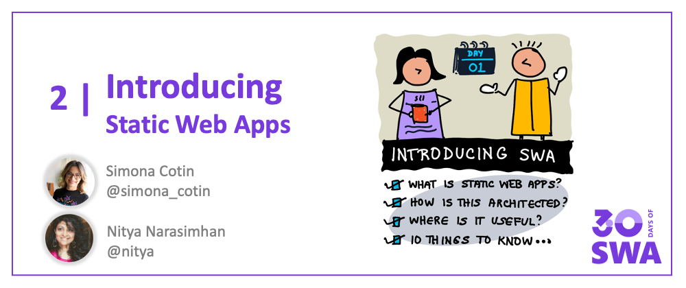
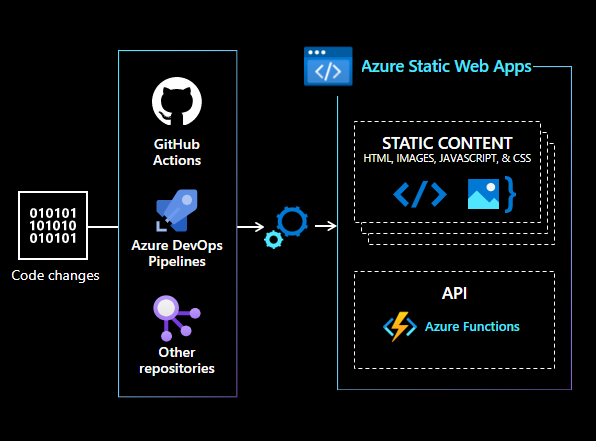

Welcome to `Week 1, Day 1` of **#30DaysOfSWA**!! 

This week, we'll focus on the **Core Concepts** behind Azure Static Web Apps, starting with an introduction to SWA and continuing on to building, enhancing, and deploying, your SWA for users to experience. Let's get started today by _Introducing Static Web Apps_.

## What We'll Cover
 * What is Azure Static Web Apps?
 * How is it architected?
 * Where can I use it?
 * 10 Key Features to know
 * **Exercise:** Explore SWA Examples!
 * **Resource:** [Static Web Apps Overview](https://docs.microsoft.com/en-us/azure/static-web-apps/overview)

## What is Azure SWA?

[Azure Static Web Apps](https://docs.microsoft.com/en-us/azure/static-web-apps/overview) is a cloud-based service that **automatically** builds and deploys full-stack web apps to Azure **directly from your code repository**. The service works with popular code sources like GitHub, GitLab and BitBucket by default. Look for the _Deploying SWA_ post later this week where we walk through the details here.

The benefit to you as a developer is that it **simplifies your developer experience**. Just commit changes to your application source code into the repository and step back. The SWA service monitors the codebase for changes, automatically rebuilding and redeploying your app to the hosted endpoint. Look for a _Previewing SWA_ post later this week where we'll talk about built-in support for previewing apps in non-main branches, or in pull requests, that make it easier to manage apps with multiple contributors.

Prefer a 5-minute video overview? We have you covered!

<iframe width="560" height="315" src="https://aka.ms/docs/player?show=azure-tips-and-tricks-static-web-apps&ep=what-is-azure-static-web-apps-and-what-can-it-be-used-for-1-of-16--azure-tips-and-tricks-static-web-"  frameborder="0" ></iframe>

## How is it Architected?

Static Web Apps can be built using popular front-end frameworks including React, Angular, Vue, Svelte, or Blazor. These apps typically consist of a collection of **static content assets** (HTML, JS, CSS and media files) coupled with a **dynamic API endpoint** to handle client interactions in real time.

Traditional web application deployments use a _single web server_ to serve both the static assets and the API endpoint. This can make scaling these services sub-optimal in terms of global availability and runtime costs.

With Static Web Apps, we **separate static assets from API endpoints**, allowing each to be scaled using the technology best equipped to do this in a cost-effective manner.
 * Static assets get served from geographically-distributed content servers worldwide, distributing the load and speeding up access to users nearby.
 * API endpoints are hosted using a [serverless architecture](https://docs.microsoft.com/en-us/azure/azure-functions/functions-overview), spinning up compute resources (to execute functions) only as needed, in response to trigger events.

This architecture - with static content servers, serverless backends, and automated CI/CD workflows - simplifies your development workflow **allowing you to focus your attention on the application logic and user experience** components of your modern web application.

## Where can I use it?

That's a great question!! You can use Static Web Apps to:
 * Build modern web apps with front-end frameworks (like Angular, React, Vue etc.)
 * Publish static web sites (using Gatsby, Hugo, Astro, Docusaurus, VuePress etc.)
 * Deploy web apps with frameworks like Next.js and Nuxt.js.

You can [**configure your existing application**](https://docs.microsoft.com/en-us/azure/static-web-apps/front-end-frameworks) to use Azure Static Web Apps using an IDE like VS Code, or using Command-line tools (like Azure CLI and SWA CLI), or through the browser (using the Azure Portal). Look for two posts later this week that dive into this in detail:
 * _Building SWA_ (tomorrow) on getting started with using SWA in your app.
 * _Configuring SWA_ (later) on customizing app behaviors and build process.

But wait - there's one more thing. 

**Keep an eye out for an announcement later in the series** where we'll be debuting a new [Community Showcase](/showcase) page - here's a sneak preview. You can filter it to see examples from popular front-end technologies, select "open source" to see the repository for inspiration - **and consider adding your own project** at the end of your journey!

## 10 Things To Know!

We've talked about what SWA is, how it's architected, and where you can use it. But what are the key features that make it powerful? [**Read the Documentation**](https://docs.microsoft.com/en-us/azure/static-web-apps/overview#key-features) for the detailed list - or scan the visual guide below for a summary!

## Exercise:

That was a lot to digest right?  It helps to see some of these ideas in action. So here's two things you can do before we dive into the quickstart tomorrow:

 * Visit the [Showcase Gallery](https://github.com/microsoft/static-web-apps-gallery-code-samples) repository to see some examples of SWA in Action.
 * Follow the [#staticwebapps](https://dev.to/t/staticwebapps) tag to see community-posted articles on usage.