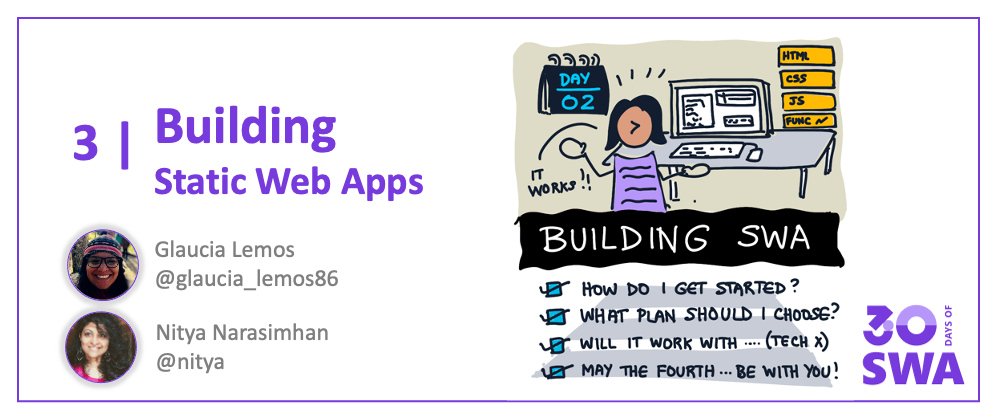
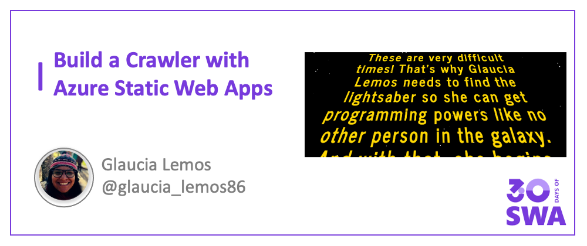

Welcome to `Week 1, Day 2` of **#30DaysOfSWA**!! 

Yesterday we got a quick introduction to Azure Static Web Apps (what it is, how it's architected, and 10 features that make it useful to modern web developers). Today, it's time to dive to dive into _Building Static Web Apps_.

## What We'll Cover
 * How can I get started with SWA?
 * Using SWA with personal and production projects.
 * Building & Deploying your first SWA
 * **Tutorial** Let's Build a Classic Movie Crawler!
 * **Exercise** Your turn! And `#MayThe4thBeWithYou`
 * **Resources:** [Static Web Apps Quickstarts](https://docs.microsoft.com/en-us/azure/static-web-apps/getting-started?tabs=vanilla-javascript)

## 1. Getting Started 

The Azure Static Web Apps service makes it easy to publish your modern web application directly from its codebase. Let's walk through that process for a basic web application (HTML, CSS, JS) first, to understand the development workflow and configuration options.

### 1.1 Requirements

To do this quickstart, you'll need 
 * a [GitHub account](https://github.com/) - you can [signup](https://github.com/signup) for a free one if needed.
 * an [Azure account](https://portal.azure.com) - you can [signup](https://azure.microsoft.com/en-us/free/) for a free account to start.
 * [Visual Studio Code](https://code.visualstudio.com/) and [this VS Code Extension](https://marketplace.visualstudio.com/items?itemName=ms-azuretools.vscode-azurestaticwebapps) - if you favor IDEs.

This approach assumes you favor using an IDE for development, and want to streamline build/deploy into that workflow. I'm a fan of Visual Studio Code so I'll use this approach. If you prefer to use the command line, or a browser, we have you covered! 
 * [Quickstart: With Azure CLI](https://docs.microsoft.com/en-us/azure/static-web-apps/get-started-cli?tabs=vanilla-javascript) - for commandline-driven workflow.
 * [Quickstart: With Azure Portal](https://docs.microsoft.com/en-us/azure/static-web-apps/get-started-portal?tabs=vanilla-javascript&pivots=github) - for browser-driven workflow.

### 1.2 Final Outcome

The goal is to take this basic HTML/CSS/JS application and configure it for automatic build/deploy to Azure Static Web Apps. We'll be using this **[official quickstart](https://docs.microsoft.com/en-us/azure/static-web-apps/getting-started?tabs=vanilla-javascript)** which comes with a  [vanilla-JS application starter template](https://github.com/staticwebdev/vanilla-basic/generate) that provides our base application. Feel free to be adventurous and follow these steps with your own vanillaJS codebase.

We'll clone that starter first - making **GitHub** our default code-hosting provider. Azure Static Web Apps has flexible deployment options so look at tutorials for **[BitBucket](https://github.com/staticwebdev/vanilla-basic/generate), [GitLab](https://docs.microsoft.com/en-us/azure/static-web-apps/gitlab?tabs=vanilla-javascript) or [Azure DevOps](https://docs.microsoft.com/en-us/azure/static-web-apps/get-started-portal?tabs=vanilla-javascript)** if preferred. Watch for the _Deploying SWA_ post later this week for more details.

So what does that vanilla-JS starter app do? Not much - it's just a simple title on a blank webpage as shown above. Here's what you'll end up with when done:

 - **Hosted SWA**: See the [live-deployment here](https://witty-desert-019fd800f.1.azurestaticapps.net/) 
 - **Codebase**: See the [code source repo here](https://github.com/fearlessly-dev/my-first-swa)

Ready to do this? Let's go!

### 1.3 Build Process

The process is captured in [this quickstart document](https://docs.microsoft.com/en-us/azure/static-web-apps/getting-started?tabs=vanilla-javascript) and has the following steps:
 
 * [**Click**](https://github.com/login?return_to=/staticwebdev/vanilla-basic/generate) to generate your vanilla-js app from the template.
 * [**Clone**](https://docs.microsoft.com/en-us/azure/static-web-apps/getting-started?tabs=vanilla-javascript#clone-the-repository) the repo to your local machine. Open in Visual Studio Code.
 * [**Install**](https://docs.microsoft.com/en-us/azure/static-web-apps/getting-started?tabs=vanilla-javascript#install-azure-static-web-apps-extension) the Azure Static Web Apps extension in VS Code (if not present)
 * [**Select Azure**](https://docs.microsoft.com/en-us/azure/static-web-apps/getting-started?tabs=vanilla-javascript#create-a-static-web-app) in the Activity Bar to view Azure Extensions window. You will be prompted to log into Azure and GitHub during this workflow if needed.
    1. Select the Static Web Apps section and click "+" to start SWA setup
    2. Select the relevant Azure subscription to use
    3. Select the region to deploy to (close to you)
    4. Select the "Custom" preset - use `/src` as app location, leave build empty
    5. Press Enter. Watch for a pop-up notification of build status.
 
Once deployment completes (you should see the success notification), visit the Azure Extensions window again.Look for the project in the Static Web Apps section and right-click for options. Here are three key ones to know:
 1. `Browse Site` - click to see the [live-deployed site](https://witty-desert-019fd800f.1.azurestaticapps.net/)
 2. `Edit Workflow` - click to see automated [GitHub Actions](https://github.com/fearlessly-dev/my-first-swa/blob/main/.github/workflows/azure-static-web-apps-witty-desert-019fd800f.yml) setup for the SWA.
 3. `Open in Portal` - click to manage the SWA in the Azure Portal.

**That's it!! You just deployed your first Static Web App with just a few clicks and configuration inputs!** 🎉

### 1.4 Let's Unpack

So what happened under the hood? 

If you look at your [codebase](https://github.com/fearlessly-dev/my-first-swa) you'll see **one key change** - the Azure SWA service [sets up the GitHub Actions workflow](https://github.com/fearlessly-dev/my-first-swa/commit/1441e25149f1573a7010682e0a431263fbd89cb6) for you, directly in the repo using your GitHub credentials. No manual steps needed from you!

The workflow automates the build/deploy process on both code commit (`push`) and contribution (`pull request`) events. So when you make changes to your application code, it triggers the workflow to automatically rebuild and deploy the updated Static Web App. 🙌🏽

### 1.5 Video Tutorial

Want to see a video walkthrough of the process? Check out this 2-minute [Azure Static Web Apps: Tips & Tricks](https://docs.microsoft.com/en-us/shows/azure-tips-and-tricks-static-web-apps/) video from 2021. It features a different vanilla-JS application but follows the same "Quickstart with Visual Studio Code" steps so you can see them in action! 

<iframe width="560" height="315" frameborder="0" src="https://aka.ms/docs/player?show=azure-tips-and-tricks-static-web-apps&ep=how-to-deploy-your-first-azure-static-web-apps-3-of-16--azure-tips-and-tricks-static-web-apps"></iframe>

## 2. "There is No Try!"

You realize today is May 3rd, right? That means tomorrow is May 4 - and what better way to celebrate our favorite movie call-to-action (`MayTheFourthBeWithYou`) than to pay homage with our own custom crafted movie banner sharing our origin story. 

Try out this 3-part tutorial to take the basic HTML/CSS/JS application to the next level - and recreate the iconic introduction from the classic [Star Wars](https://en.wikipedia.org/wiki/Star_Wars) franchise. Just do the thing! 

 1. [Part 1: Create basic page and style it with HTML/CSS](https://dev.to/azure/building-star-wars-crawler-with-azure-static-web-apps-part-1-3o39) 
 2. [Part 2: Bring moving banner to life with JS](https://dev.to/azure/building-star-wars-crawler-with-azure-static-web-apps-part-2-3hc0)
 3. [Part 3: Use Visual Studio Code to deploy to Static Web Apps](https://dev.to/azure/building-star-wars-crawler-with-azure-static-web-apps-part-3-41ip)

**Please Note:** The tutorial is meant only to illustrate the creation of the banner with CSS/JS/HTML and celebrate an iconic movie on an iconic date! The movie logo, music and other iconic elements remain the property of relevant copyright holders and should not be used without permission. 

## 3. Let's Talk Plans!

The Azure Static Web Apps service comes with [two plans](https://docs.microsoft.com/en-us/azure/static-web-apps/plans) - a **Free** plan that is perfect for Personal projects, and a **Standard** (paid) plan that is more appropriate for apps deployed in production. Check out the [Features Comparison](https://docs.microsoft.com/en-us/azure/static-web-apps/plans#features) to judge what plan is best for you.

My personal experience is that, as an individual developer, the free tier is sufficiently generous to explore ideas and host prototypes (for real-world users) or demos (for validating ideas). The free tier also comes with Managed Functions support (to integrate a serverless API capability) out of the box. You will need the Standard plan if you want to "Bring your own functions" instead. For the most part, you should be able to try out all the Exercises in #30DaysOfSWA using the Free tier.

## 4: Exercise

If you followed along with the quickstart, you should have setup and deployed your first Azure Static Web App using a vanilla-JS starter. Now, time to challenge yourself by trying out one (or both) of these options:

 * **Complete the other quickstart tutorials** - using [Azure CLI](https://docs.microsoft.com/en-us/azure/static-web-apps/get-started-cli?tabs=vanilla-javascript) and [Azure Portal](https://docs.microsoft.com/en-us/azure/static-web-apps/getting-started?tabs=vanilla-javascript) - to get a sense of how the workflows differ. And join the [#SWAanniversary](2022-04-30.md) event to learn more about [SWA CLI](https://docs.microsoft.com/en-us/azure/static-web-apps/local-development) for local development.
 * **Build your own movie crawler** - follow Glaucia's tutorial to have the default banner running on Azure Static Web Apps - then customize the words to suit _your origin story_ and share it on May 4th ([StarWars Day](https://www.starwars.com/star-wars-day)) - and `MayThe4thBeWithYou!`.