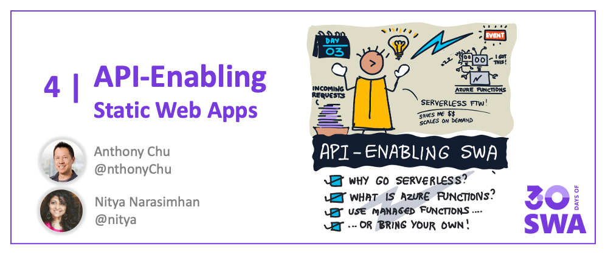

Welcome to `Week 1, Day 3` of **#30DaysOfSWA**!! 

Yesterday, we built and deployed our first Static Web App (using a vanillaJS template) from a GitHub repo. We used the VS Code Extension and, with just a few clicks, it setup automated GitHub Actions (CI/CD) workflows for us transparently. Today - we learn how we can add **serverless API endpoints** to our application using Azure Functions, helping us scale APIs more effectively with demand.

## What We'll Cover
 * Why go Serverless with SWA?
 * Add API with Azure Functions
 * Quickstart: Use Managed Functions
 * Bring Your Own Functions
 * **Example:** Bring [Azure-SWAG](https://github.com/sinedied/azure-swag/) to May 4!
 * **Exercise:** Try it out yourself!

## Why Go Serverless?

When [Introducing SWA](2022-05-02.md), we talked about how static web apps are architected to separate **static content assets** and **dynamic API endpoints** into separate components that can be served and scaled independently.

In yesterday's post we looked at a basic Static Web App with just content assets (no API). Deploying it with SWA helped us take advantage of Azure's globally-distributed content servers for fast and cost-effective access. Today, we want to add an API endpoint to support dynamic requests from clients. So what does serverless mean, and how do we implement serverless API endpoints?

In this context, [Serverless](https://docs.microsoft.com/en-us/azure/architecture/reference-architectures/serverless/web-app) is about using an event-driven architecture to allocate our compute resources on-demand. So, our API server will scale as demand grows, but be cost-effective when demand drops.

[Azure Functions](https://docs.microsoft.com/en-us/azure/azure-functions/functions-overview) makes implementing your serverless solutions easier. Event handling is implemented with _functions_ (code blocks) that run on compute resources that are dynamically-allocated. Resources can spin up as API requests grow, and spin down as demand drops. [**Try this learning path**](https://docs.microsoft.com/en-us/learn/paths/create-serverless-applications/) for a deep-dive into using Azure Functions.

## Use Azure Functions

Static Web Apps and Azure Functions are integrated seamlessly, enabling key features with respect to security (user data) and routing integrations:

 * **[User data access](https://docs.microsoft.com/en-us/azure/static-web-apps/user-information?tabs=javascript#api-functions)** - API functions can directly access user authenticaton and role-based authorization data when handling requests.
 * **[API Route access](https://docs.microsoft.com/en-us/azure/static-web-apps/configuration?#routes)** - the application can access the `/api` route securely, without requiring custom CORS rules.
 
But it gets better. Your SWA can be configured for Azure Functions in two ways:
 
* **Managed Functions** - where the Azure Static Web Apps service configures and manages your Azure Functions deployment.
* **Bring Your Own Functions** - where you use a pre-existing Azure Functions application and manage the deployment yourself.

The Free plan supports only the Managed Functions option. It has [some limitations](https://docs.microsoft.com/en-us/azure/static-web-apps/apis) - e.g., supports only HTTP triggers and lacks support for [Durable Functions](https://docs.microsoft.com/en-us/azure/azure-functions/durable/durable-functions-overview) etc. - but is quick to setup and seamless to use. We'll explore this option today but look for a post in Week 4 that will discuss the _[Bring Your Own Functions](https://docs.microsoft.com/en-us/azure/static-web-apps/functions-bring-your-own)_ approach in detail.

## Adding the API

Want to get some hands-on experience with adding an API endpoint to your Static Web Apps deployment? Check out this [Quickstart](https://docs.microsoft.com/en-us/azure/static-web-apps/add-api?tabs=vanilla-javascript) tutorial that builds on the vanilla-JS application you deployed previously. The key steps are:

**1. Setup Azure Functions for SWA**
 * Install the [Azure Functions Extension](https://marketplace.visualstudio.com/items?itemName=ms-azuretools.vscode-azurefunctions) for VS Code.
 * Open your application root folder ("/") - create an "api" subfolder
 * Select "Azure Static Web Apps: Create HTTP Function" through Command Palette or select the lightning bolt option in Azure extension menu.
 * Enter required configuration information (language="JavaScript", function name="message"), and confirm.

_Sit back and wait till the process completes setup._ This populates the `/api` directory with configuration files (*.json) in the root folder, and a `/api/message` subfolder that contains 2 files:

 * _function.json_ - defines this function's trigger, bindings and [other settings](https://docs.microsoft.com/en-us/azure/azure-functions/functions-reference?tabs=blob#function-code).
 * _index.js_ - implements an async function (accessed at `/api/message`)

**2. Update the index.js file to implement your function** - making sure it returns a desired response given the incoming API request and context (input parameters).

**3. Update your application code to invoke the API** - you can do this by calling `fetch('/api/message')` directly - the seamless Azure Functions integration ensures that the API routing happens automagically.

**4. Test the integration locally with the SWA CLI**.
The Azure Static Web Apps CLI (SWA CLI) is a tool to support local development for Static Web Apps by emulating required services where needed. Follow [these steps](https://docs.microsoft.com/en-us/azure/static-web-apps/add-api?tabs=vanilla-javascript#run-the-frontend-and-api-locally) to install the tools and run/test your app and API together in your local development environment. Look for a detailed 2-part post in Week 3 ("Developer Tools") where we cover the SWA CLI capabilities, configuration, and usage, in more detail.

**5. Update the GitHub Actions workflow with API location**

This is the key step to make sure the Azure Static Web Apps deployment workflow also picks up the new API function.
 * Open the default GitHub Actions workflow file for your SWA and update the `api_location` property to "api".
 * Save and commit changes to trigger rebuild and deploy.

**Want to see API in action?** Scroll down to the `Exercise` section where we walk through a quick activity you can do to build and deploy a Static Web App with GitHub (SWAG) _and celebrate #StarWars Day_ in the process!

**Prefer a video tutorial?** Check out this [Azure Static Web Apps: Tips & Tricks](https://docs.microsoft.com/en-us/shows/azure-tips-and-tricks-static-web-apps/) that walks through the process from a _react-starter_ template, and showcases the use of remote [development container](https://code.visualstudio.com/docs/remote/create-dev-container) for Visual Studio Code that further streamlines your development experience.

<iframe width="560" height="315" frameborder="0" src="https://aka.ms/docs/player?show=azure-tips-and-tricks-static-web-apps&ep=how-to-add-an-api-to-your-azure-static-web-app-7-of-16--azure-tips-and-tricks-static-web-apps"></iframe>

## Exercise: SWAG!

Today is May 4 - Star Wars Day! Wouldn't it be nice if we could celebrate this with our favorite Star Wars quotes? Thankfully, [my colleague Yohan](https://www.twitter.com/sinedied) has a great [Azure-SWAG](https://dev.to/sinedied/the-easy-way-to-serverless-web-apps-and-apis-with-azure-swag-2heb) template that combines images from [Unsplash](https://unsplash.com) with a pre-defined set of quotes in an API function ("/api/quote") 

**So I created a version for my [May 4 homage](ttps://github.com/nitya/may4-swag)**. Here's what that looks like when deployed. Refresh the SWA to get a new image and quote each time (from the API).

 * See the [Code Repository](https://github.com/nitya/may4-swag)
 * See the [Deployed SWA](https://agreeable-tree-0a216f70f.1.azurestaticapps.net/)

Your assignment: follow [these steps](https://github.com/nitya/may4-swag#steps) to replicate my project, then explore the [index.js](https://github.com/nitya/may4-swag/blob/main/api/quote/index.js) code to see how the `/api/quote` function is implemented and review the [`app.js`](https://github.com/nitya/may4-swag/blob/main/app.js) code to see how that API is invoked within the application.

## Useful Resources
- [API Support in SWA](https://docs.microsoft.com/en-us/azure/static-web-apps/apis)
- [Add API with Managed Functions](https://docs.microsoft.com/en-us/azure/static-web-apps/add-api?tabs=vanilla-javascript)
- [Bring Your Own Functions](https://docs.microsoft.com/en-us/azure/static-web-apps/functions-bring-your-own)
- [May4-Swag Demo](https://github.com/nitya/may4-swag)