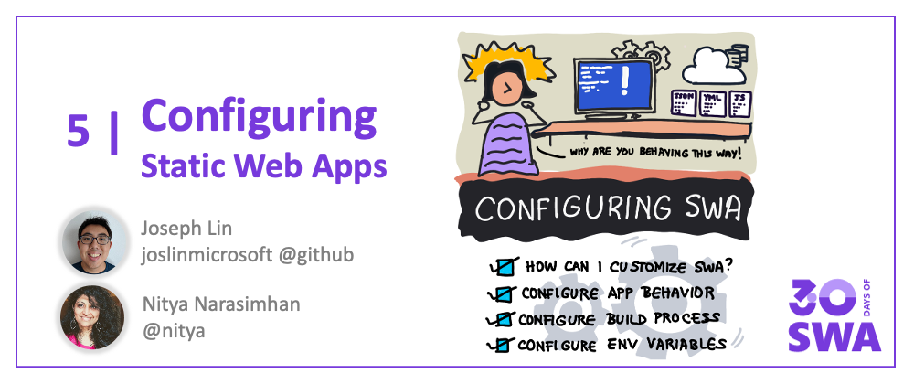

Welcome to `Week 1, Day 4` of **#30DaysOfSWA**!! 

In the past two days we've seen how the Azure Static Web Apps services sets up default CI/CD actions (to automate build/deploy workflows) and transparently configures application to access the API with minimal input from us during setup. But what if we want to _customize_ the build process or application behavior? That's where knowing SWA _configuration options_ can help.


## What We'll Cover
 * Configuration: Concepts & Files
 * Customize: Application Behavior
 * Customize: Build Process
 * Customize: Environment Settings
 * **Exercise:** Explore an open source app to see these in action!
 * **Resource(s):** Links for deeper-dives into the topic




## Concepts & Files

When we think of configuring the Static Web App, we have three potential targets we can customize:
 * **Application**: Use the `staticwebapp.config.json` file (located in the folder specified for `app_location`) to define rules and properties that customize application behaviors like routing, authentication, networking and more. 
 * **Build**: Static Web Apps automates your build/deploy workflow using GitHub Actions or Azure Pipelines, configurable via the relevant YAML files. For example, this would be the `.github/workflows/azure-static-web-apps-xxx.yml` file in your repo, for GitHub Actions.
 * **Environment:** Sometimes configuration values may only be known at runtime - e.g., database connection strings. By using environment variables, you can update the _values_ at runtime without having to change the application code that uses them. Environment variables can be set in the Azure Portal (for production) or in _local settings files_ (for development.)

Let's take a quick look at what each of these provides, along with resource links for deeper dives that you can explore on your own. Check out the [example scenarios](https://docs.microsoft.com/azure/static-web-apps/configuration-overview#example-scenarios) to get a better understanding of which file (or concept) you need to focus on, for specific scenarios.

## Config: Application

Application behavior is configured using the _staticwebapp.config.json_ file located in the folder defined by `app_location`. Here are a _subset_ of the properties and their purpose:

 * [**"routes"**](https://docs.microsoft.com/azure/static-web-apps/configuration#routes) - are an array of "route" objects that can each be associated with access rules ("allowedRoles"), actions ("redirect", "rewrite") - and request ("methods") and response ("headers","statusCode") properties.
 * [**"navigationFallback"**](https://docs.microsoft.com/azure/static-web-apps/configuration#fallback-routes) supports applications that rely on client-side routing by providing a server-side fallback route which serves the required page, with filters to control usage.
 * [**"responseOverrides"**](https://docs.microsoft.com/azure/static-web-apps/configuration#response-overrides) allows you to return a custom response instead of default HTTP error codes, for more user-friendly experiences.
 * [**"platform"**](https://docs.microsoft.com/azure/static-web-apps/configuration#platform) sets platform-specific configurations like _apiRuntime_ for API language runtime version.

 There are also configuration properties for authentication, networking, global headers, custom MIME types and more. Check out the [documentation](https://docs.microsoft.com/azure/static-web-apps/configuration#file-location) for the complete list and scan this **example** [staticwebapp.config.json](https://docs.microsoft.com/azure/static-web-apps/configuration#example-configuration-file) to understand how these are defined.

```json
{
  "routes": [
    {
      "route": "/profile*",
      "allowedRoles": ["authenticated"]
    },
    {
      "route": "/admin/index.html",
      "allowedRoles": ["administrator"]
    },
    {
      "route": "/images/*",
      "headers": {
        "cache-control": "must-revalidate, max-age=15770000"
      }
    },
    {
      "route": "/api/*",
      "methods": ["GET"],
      "allowedRoles": ["registeredusers"]
    },
    {
      "route": "/api/*",
      "methods": ["PUT", "POST", "PATCH", "DELETE"],
      "allowedRoles": ["administrator"]
    },
    {
      "route": "/api/*",
      "allowedRoles": ["authenticated"]
    },
    {
      "route": "/customers/contoso*",
      "allowedRoles": ["administrator", "customers_contoso"]
    },
    {
      "route": "/login",
      "rewrite": "/.auth/login/github"
    },
    {
      "route": "/.auth/login/twitter",
      "statusCode": 404
    },
    {
      "route": "/logout",
      "redirect": "/.auth/logout"
    },
    {
      "route": "/calendar*",
      "rewrite": "/calendar.html"
    },
    {
      "route": "/specials",
      "redirect": "/deals",
      "statusCode": 301
    }
  ],
  "navigationFallback": {
    "rewrite": "index.html",
    "exclude": ["/images/*.{png,jpg,gif}", "/css/*"]
  },
  "responseOverrides": {
    "400": {
      "rewrite": "/invalid-invitation-error.html"
    },
    "401": {
      "redirect": "/login",
      "statusCode": 302
    },
    "403": {
      "rewrite": "/custom-forbidden-page.html"
    },
    "404": {
      "rewrite": "/404.html"
    }
  },
  "globalHeaders": {
    "content-security-policy": "default-src https: 'unsafe-eval' 'unsafe-inline'; object-src 'none'"
  },
  "mimeTypes": {
    ".json": "text/json"
  }
}
```


## Config: Build

Azure Static Web Apps build workflows are powered either by GitHub Actions (in a file named something like `.github/workflows/azure-static-web-apps-xxx.yml`) or by Azure Pipelines (using the `azure-pipelines.yml` file). 

The main settings you need to be familiar with are:
 * `app_location` - folder for application source code
 * `api_location` - folder with API functions source code
 * `output_location` - where are build files generated
 * `app_build_command` - custom app build command (for Node.js apps)
 * `api_build_command` - custom api build command (for Node.js apps)
 * `skip_app_build` - flag to skip app build step (if true)
 * `skip_api_build` - flag to skip api build step (if true)
 * `build_timeout_in_minutes` - defaults to 15 (customize to extend)

Read [**this document**](https://docs.microsoft.com/azure/static-web-apps/build-configuration?tabs=azure-devops#environment-variables) to learn how each of those properties can be customized and used effectively.


## Config: Environment

Your application behavior configuration values may change based on the runtime context. By setting values in _environment variables_, you can decouple definition of values from their usage within application code. We refer to these environment variables as [**application settings**](https://docs.microsoft.com/azure/static-web-apps/application-settings) which are copied to both staging and production environments. 

But where are they _defined?_ That depends on the development stage:

 * **[Local Development:](https://docs.microsoft.com/azure/static-web-apps/application-settings#configure-api-application-settings-for-local-development)** When developing your app, you can use a local settings file that is not tracked by GitHub so sensitive information is not leaked. **Azure Functions** uses the `api/local.settings.json` file to store relevant app settings - and watch out for a special 2-part series of posts in Week 3 where we cover the local settings file used by the [**Static Web Apps CLI**](https://github.com/Azure/static-web-apps-cli) for a simpler, unified local development experience.
 * [**Staging/Production:**](https://docs.microsoft.com/azure/static-web-apps/application-settings#configure-application-settings) You can define and configure these application settings in the [Azure Portal](https://portal.azure.com/) via the browser, or by using the [Azure CLI](https://docs.microsoft.com/cli/azure/) (see the [`az staticwebapp appsettings`](https://docs.microsoft.com/cli/azure/staticwebapp/appsettings?view=azure-cli-latest) documentation), to create and manage your application settings. These will be encrypted, and copied to staging and production environments.

Learn more about how you can configure application settings in [the documentation](https://docs.microsoft.com/azure/static-web-apps/application-settings#configure-application-settings).

## How-Tos: Watch It!

Want to see how application behavior configuration in action? Check out these two videos from the [Azure Static Web Apps: Tips & Tricks](https://docs.microsoft.com/shows/azure-tips-and-tricks-static-web-apps/) series.

<iframe width="560" height="315" frameborder="0"  src="https://aka.ms/docs/player?show=azure-tips-and-tricks-static-web-apps&ep=how-to-configure-routing-in-azure-static-web-apps-6-of-16--azure-tips-and-tricks-static-web-apps"></iframe>

<iframe width="560" height="315" frameborder="0" src="https://aka.ms/docs/player?show=azure-tips-and-tricks-static-web-apps&ep=how-to-configure-authorization-in-azure-static-web-apps-9-of-16--azure-tips-and-tricks-static-web-ap" ></iframe>


## Exercise: Explore It!

The [SWA Bank](https://github.com/sinedied/swa-bank) is a Static Web App application developed as a solution for one of the projects in the [Web Dev For Beginners](https://github.com/microsoft/Web-Dev-For-Beginners) curriculum. 

It was recently updated to reflect best practices. Explore the configuration files in the project - and see if you understand how they customize the application behavior and build process. **Then revisit it in week 3 when we discuss developer tools** to understand how local settings are configured and used with the Static Web Apps CLI (`swa`) tool for local development 

## Useful Resources

 1. [Configuration Overview](https://docs.microsoft.com/azure/static-web-apps/configuration-overview)
 2. [Application Configuration: staticwebapp.config.json](https://docs.microsoft.com/azure/static-web-apps/configuration)
 3. [Build Configuration: Actions or Pipelines YAML](https://docs.microsoft.com/azure/static-web-apps/build-configuration?tabs=github-actions)
 4. [Environment Configurations: For Backends](https://docs.microsoft.com//azure/static-web-apps/application-settings)
 5. [Configure Application Settings](https://docs.microsoft.com/azure/static-web-apps/application-settings)
 6. [SWA Bank Repo](https://github.com/sinedied/swa-bank) - a Static Web Apps project to explore and learn from.

