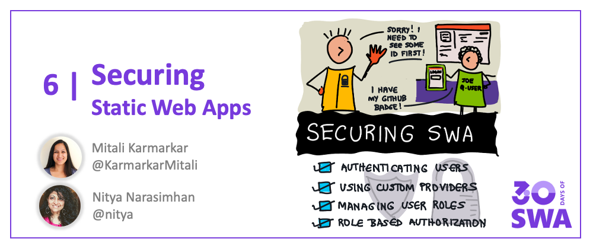

Welcome to `Week 1, Day 5` of **#30DaysOfSWA**!! 

So far, we've learnt to build/deploy a basic web app, add a serverless API endpoint and customize the configuration settings for both application behaviors and build workflows. But we forgot one thing - the **user**! To create _differentiated_ experiences for users, we need ways to **identify them** and **understand their role** in the application context. We can then use that information to **manage user access to application features** (role-based authorization) as well as **application access to user information** (once authenticated).

Thankfully, Azure Static Web Apps makes this fairly painless. Let's see how.


## What We'll Cover
 * How do we secure a SWA?
 * Managed authentication
 * Custom authentication
 * Managing user roles
 * Role-based authorization
 * Accessing user information




## Securing SWA

What does it mean to _secure_ a Static Web App? It's three things:
 * **Knowing User Identity** - Having a way to determine the identity of the user using an authentication service or provider.
 * **Knowing User Roles** - Understanding what persona the user is taking on when (using the application), and customizing the experience accordingly.
 * **Managing User Access** - Making sure the authenticaton information is seamlessly accessible to all SWA components, allowing them to enforce rules that allow only authorized users or roles to access resources.

Let's dive into the three concepts that tackle these needs: **Authentication**, **Role Assignment** and **Role-Based Authorization**.

## Managed Auth

Azure Static Web Apps comes with a default **streamlined authentication experience** that supports:
 * _pre-configured providers_: Twitter, GitHub, Azure Active Directory
 * _pre-assigned roles_: anonymous (guest) or authenticated (on login)
 * _customizable rules_: defined for routes, in `staticwebapps.config.json`

All pre-configured providers are active by default, with their own pre-defined API endpoints for [Login](https://docs.microsoft.com/en-us/azure/static-web-apps/authentication-authorization?tabs=invitations#login), and a shared API endpoint for [Logout](https://docs.microsoft.com/en-us/azure/static-web-apps/authentication-authorization?tabs=invitations#logout). 
 * Want to block a specific pre-configured provider? Just [add a blocking rule](https://docs.microsoft.com/en-us/azure/static-web-apps/authentication-authorization?tabs=invitations#block-an-authentication-provider) to their login route to ensure no user is allowed access to it.
 * Want to send users to custom pages after successful or failed login attempts? Use [query parameters and route rules](https://docs.microsoft.com/en-us/azure/static-web-apps/authentication-authorization?tabs=invitations#post-login-redirect) to make this work.

This is the default _managed authentication_ experience. 

## Custom Auth 

But what if you want more flexibility with the registration process (used by a pre-configured provider) or want to add a new one (custom provider)?
This is where _custom authentication_ options come in, allowing you to override the defaults.

You can [configure one or more custom providers](https://docs.microsoft.com/en-us/azure/static-web-apps/authentication-custom?tabs=aad#configure-a-custom-identity-provider) for this purpose. Azure Static Web Apps has **[built-in support](https://docs.microsoft.com/en-us/azure/static-web-apps/authentication-custom?tabs=apple#configure-a-custom-identity-provider) for custom authentication using: _Apple, Facebook, Google, Twitter, GitHub - and AAD_!** You can also configure custom providers that support [OpenID Connect](https://openid.net/connect/) standard. 

By configuring at least one custom provider, you are effectively disabling pre-configured provider options. To configure custom providers, add config information to the `auth` section of the `staticwebapps.config.json` file. This is also a good place to use _Application Settings_ (environment variables) to store potentially sensitive configuration data in a privacy-preserving way.

Azure Static Web Apps makes custom registrations easy by providing standard route patterns for [_Login_, _Logout_ and _User Profile_](https://docs.microsoft.com/en-us/azure/static-web-apps/authentication-custom?tabs=apple#authentication-callbacks) requests, as well as [redirect URLs](https://docs.microsoft.com/en-us/azure/static-web-apps/authentication-custom?tabs=apple#authentication-callbacks) for authentication callbacks (from the custom provider) on login/logout.

## User Roles

There are three key concepts you need to know in this context:
 * Every Static Web Apps user has one or more roles assigned to them.
 * There are 2 built-in roles ("anonymous" and "authenticated")
 * Define custom roles & assign users **[by invitation](https://docs.microsoft.com/en-us/azure/static-web-apps/authentication-authorization?tabs=invitations#add-a-user-to-a-role)** or **[by-function](https://docs.microsoft.com/en-us/azure/static-web-apps/authentication-authorization?tabs=function#add-a-user-to-a-role)**.

Let's review these quickly. 

 * All users accessing a Static Web App are in an _anonymous_ role (guest) until authenticated by a pre-configured or custom provider.
 * Once authenticated, they have an _authenticated_ role but can now be _assigned custom roles_ by invitation (proactive) or by function (reactive)
 * **Proactive invitations** can be configured and sent from the Azure Portal, using provider-specific email addresses for the user. Users now click on the invite link to login with that custom role assigned automatically.
 * **Reactive functions** defer assignment to post-login, using an Azure Function that dynamically returns an assigned role (or roles) to the user on being given the authenticated user details.

The latter approach offers more flexibility, allowing you to use the function handler to invoke another service (like [Microsoft Graph](https://developer.microsoft.com/graph)) to make the role-assignment decision for you. Read [**Role Management**](https://docs.microsoft.com/en-us/azure/static-web-apps/authentication-authorization?tabs=function#role-management) for more details - including steps to update role assignments or remove users from a role.


## Role-Based Auth

Once the user has been assigned a role, _managing user access_ based on that assignment becomes easy using the built-in support for [routing rules](https://docs.microsoft.com/en-us/azure/static-web-apps/configuration#routes) based on the **allowedRoles** property attached to each `route`. For example, the following configuration setting (in `staticwebapps.config.json`) would restrict access to all routes that start with `/profile*` to _only authenticated users_.
)

```
{
  "route": "/profile*",
  "allowedRoles": ["authenticated"]
}
```

Read more about [securing routes with rules](https://docs.microsoft.com/en-us/azure/static-web-apps/configuration#securing-routes-with-roles) to understand various usage scenarios and configuration settings to enforce them.

## Access User Info

One of the benefits of Azure Static Web Apps' seamless integration of application and API capabilities is that [authenticated user information can be accessed transparently](https://docs.microsoft.com/en-us/azure/static-web-apps/user-information?tabs=javascript) in two ways:
 * Using a [direct access endpoint](https://docs.microsoft.com/en-us/azure/static-web-apps/user-information?tabs=javascript#direct-access-endpoint) at `/.auth/me` that is automatically provisioned with the user's information when authenticated.
 * Using [API functions](https://docs.microsoft.com/en-us/azure/static-web-apps/user-information?tabs=javascript#api-functions) with a `fetch` call to the `/api/xxx` endpoint, where `xxx` is a named function you implement to return user information. 


---

## How-Tos: Watch It!

Prefer a Video Walkthrough to understand the process? We have you covered with the [Azure Tips And Tricks: Static Web Apps](https://docs.microsoft.com/en-us/shows/azure-tips-and-tricks-static-web-apps/) series. Check out the following videos:

<iframe  width="560" height="315" frameborder="0" src="https://aka.ms/docs/player?show=azure-tips-and-tricks-static-web-apps&ep=how-to-integrate-authentication-in-azure-static-web-apps-8-of-16--azure-tips-and-tricks-static-web-a"></iframe>

<iframe  width="560" height="315" frameborder="0" src="https://aka.ms/docs/player?show=azure-tips-and-tricks-static-web-apps&ep=how-to-configure-authorization-in-azure-static-web-apps-9-of-16--azure-tips-and-tricks-static-web-ap"></iframe>

---

## Exercise: Try it!

One popular feature that modern web apps often support is the ability to assign a custom role to an authenticated user (based on some identifiable context) and then regulate their access to various routes or features in the application based on that assigned role. **How can we make that happen in Static Web Apps?**

There's a [**tutorial**](https://docs.microsoft.com/en-us/azure/static-web-apps/assign-roles-microsoft-graph) that teaches you how! 
 * Authenticate the user using the managed [Azure Active Directory](https://docs.microsoft.com/en-us/azure/active-directory/fundamentals/active-directory-whatis) API endpoint.
 * Query [Microsoft Graph](https://developer.microsoft.com/graph) to determine their Active Directory group membership.
 * Use that membership to assign them a custom role.

**Challenge Yourself!** 

Update the application behavior in the `staticwebapp.config.json` file to restrict user access to specific routes by specifying `allowedRoles` for those routes. Test what happens when the custom role above is added, and then removed, from the collection of allowedRoles.

---

## Useful Resources

1. [Authentication and Authorization in SWA](https://docs.microsoft.com/en-us/azure/static-web-apps/authentication-authorization?tabs=invitations)
2. [Accessing authenticated user information in SWA](https://docs.microsoft.com/en-us/azure/static-web-apps/user-information?tabs=javascript)
3. [Implement custom authentication in SWA](https://docs.microsoft.com/en-us/azure/static-web-apps/authentication-custom?tabs=aad)
4. Tutorial: [Assign custom roles using Microsoft Graph and AAD](https://docs.microsoft.com/en-us/azure/static-web-apps/assign-roles-microsoft-graph)
5. Video Series: [Azure Tips And Tricks - Static Web Apps](https://docs.microsoft.com/en-us/shows/azure-tips-and-tricks-static-web-apps/)
