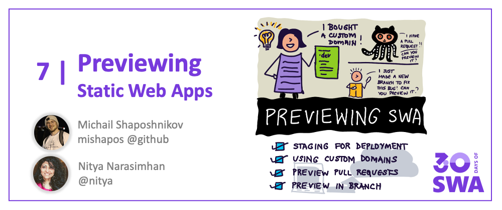

Welcome to `Week 1, Day 6` of **#30DaysOfSWA**!! 

We're almost at the end of week 1!! 🎉 

So far, we've learned how we can use the _static assets hosting_ (Azure Static Web Apps) and _serverless API_ (Azure Functions) capabilities to build and deploy a web application in a scalable and cost-effective way. And we learned to _configure_ and _secure_ our Static Web App to suit our needs. So what else do we need to talk about?

**Deployment** options? Let's do it!! We've talked about the default experience so far: deploy from a _production_ branch, using _GitHub_ Actions for CI/CD. But how do we handle **previewing** the Static Web App before production deploys? Let's talk about previewing SWA in pull requests, on non-production branches, and in pre-configured named environments that make our staging workflows more productive.


## What We'll Cover
 * What types of deployment does SWA support?
 * _Previewing_: in Pull Requests
 * _Previewing_: in Non-Production Branches
 * _Previewing_: in Named Environments
 * _Deploying_: to Custom Domains
 * **Exercise:** [Review PR using SWA Preview Capability](https://docs.microsoft.com/en-us/azure/static-web-apps/review-publish-pull-requests)



## Deployment Types

When we think about deployment, we are typically thinking of two kinds of environments: _production_ which serve as the primary endpoint for real world use, and _staging_  that can be used for internal testing, early validation of preview releases.

Azure Static Web Apps has built-in support for four types of environments:

 * _Production_: This is the real world deployment endpoint that is **indexed by search engines**, and associated with the custom domain (if configured).
 * _Pull Request (PR)_: This is a **temporary** environment setup for a Pull Request, and torn down when that PR is closed.
 * _Branch_: This is a environment you can set up for non-production branches, at a **stable** URL for the lifetime of the branch.
 * _Named_: The above environments have URLs that reflect their PR (number) or branch (name). You can also configure a **stable** preview environment with a fixed name, associated with some deployment context (e.g., an interim release)

Production deploys have URLs like `<DEFAULT-HOSTNAME>-<NUMBER>.azurestaticapps.net` where the `DEFAULT-HOSTNAME` is unique for each application. 

With _preview_ environments, the URL looks like: `<DEFAULT_HOSTNAME>-<BRANCH_OR_ENVIRONMENT_NAME>.<LOCATION>.azurestaticapps.net` where the `LOCATION` reflects the deployment region, and the `BRANCH_OR_ENVIRONMENT_NAME` can also take the form of a branch name, a named environment, or a number in the case of pull requests.

Let's take a brief look at each of these.


## Pull Requests

Currently Pull Request _preview environments_ are available for projects hosted in GitHub, and configured to use GitHub Actions by Azure Static Web Apps:
  * Every PR to a _watched branch_ gets a dedicated but **temporary** pre-production staging environment that is torn down when the PR is closed.
  * Use it to validate changes, perform sanity checks, etc.
  * The environment is automatically rebuilt and deployed if new commits are made to the branch associated with an active PR.
  * The staged environment is _publicly visible_ event if your GitHub repo is private - though the URL is not easily discoverable (i.e., not indexed by search engines) by default.

Learn how to [preview Pull Requests in Azure Static Web Apps](https://docs.microsoft.com/en-us/azure/static-web-apps/review-publish-pull-requests).


## Branches

Preview environments for branches will have **stable** URLs. Configure them in the relevant _GitHub Actions_ or _Azure Pipelines_ workflow files as [shown in this example](https://docs.microsoft.com/en-us/azure/static-web-apps/branch-environments?tabs=github-actions#example). 

For example, in a GitHub Actions context, this involves two steps:
 * set the `production_branch` property to the branch you want to use as the source for that production deployment.
 * list all other branches that you want preview environments for under `trigger` (Azure Pipelines) or `push: branches` (in GitHub Actions).

You can use a wildcare (`**` for GitHub Actions, `*` for Azure Pipelines) if you want to track _all_ branches for preview environment support. 

Here's an example GitHub Actions config file - the **production** environment is built from the _main_ branch, and separate **preview** environments are built for the other listed branches (_dev_ and _staging_).

Learn how to [create branch preview environments in Azure Static Web Apps](https://docs.microsoft.com/en-us/azure/static-web-apps/branch-environments?tabs=github-actions).
 
```
name: Azure Static Web Apps CI/CD

on:
  push:
    branches:
      - main
      - dev
      - staging
  pull_request:
    types: [opened, synchronize, reopened, closed]
    branches:
      - main

jobs:
  build_and_deploy_job:
    ...
    name: Build and Deploy Job
    steps:
      - uses: actions/checkout@v2
        with:
          submodules: true
      - name: Build And Deploy
        id: builddeploy
        uses: Azure/static-web-apps-deploy@v1
        with:
          ...
          production_branch: "main"
```


## Named Envs

Sometimes, you want to have a non-production preview environment that is at _stable_ URL (not tied to a specific PR number or branch name), and that gets rebuilt on commits to _all tracked branches_ in the configuration file. 

Just like with branches, this requires a manual change to your default configuration file (GitHub Actions or Azure Pipelines) as [shown in this example](https://docs.microsoft.com/en-us/azure/static-web-apps/named-environments?tabs=github-actions#configuration).

In the GitHub Actions case, the steps are:
 * Set the `deployment_environment` property (in the relevant build job) to be the **name** you want to use for this preview environment
 * List the branches you want associated with this named environment under `push: branches` - commits to those will result in rebuild/deploy to this environment.

Here's an example GitHub Actions configuration file - this sets up a named environment called **release** which gets updated when changes are made to **any** branch (reflected by the `**` wildcard), and deployed to a site with a URL like `<DEFAULT_HOST_NAME>-release.<LOCATION>.azurestaticapps.net`.

Learn about [named preview environments in Azure Static Web Apps](https://docs.microsoft.com/en-us/azure/static-web-apps/named-environments?tabs=github-actions)

```
name: Azure Static Web Apps CI/CD

on:
  push:
    branches:
      - "**"
  pull_request:
    types: [opened, synchronize, reopened, closed]
    branches:
      - main

jobs:
  build_and_deploy_job:
    ...
    name: Build and Deploy Job
    steps:
      - uses: actions/checkout@v2
        with:
          submodules: true
      - name: Build And Deploy
        id: builddeploy
        uses: Azure/static-web-apps-deploy@v1
        with:
          ...
          deployment_environment: "release"
```


## Custom Domains

You may have noticed that default deployment URLs - in the form `XXX.azurestaticapps.net` for production environments or `XXX.<LOCATION>.azurestaticapps.net` for preview environments - are not exactly user friendly for use and recall. 

Adding a custom domain helps. Azure Static Apps makes that easy with options to also configure **subdomains** and an **apex domain**! Here, given a domain like `www.azure.com`, `azure.com` is the apex domain and `www` is the relevant subdomain.

So how do you configure these? You have two options:
* Use an **external DNS Provider** (if your domain registrar supports it)
* Use **Azure DNS** (to manage your DNS domain, even if purchased elsewhere)

To keep this post short, we won't go into details for each of these options. Instead check out these links based on the direction you want to go in:
 * Setup Apex Domain - with [Azure DNS](https://docs.microsoft.com/en-us/azure/static-web-apps/apex-domain-azure-dns) | with [External Provider](https://docs.microsoft.com/en-us/azure/static-web-apps/apex-domain-external)
 * Setup Subdomain - with [Azure DNS](https://docs.microsoft.com/en-us/azure/static-web-apps/custom-domain-azure-dns) | with [External Provider](https://docs.microsoft.com/en-us/azure/static-web-apps/custom-domain-external)

---

## How-Tos: Watch It!

Prefer a Video Walkthrough to understand the process? We have you covered with the [Azure Tips And Tricks: Static Web Apps](https://docs.microsoft.com/en-us/shows/azure-tips-and-tricks-static-web-apps/) series. Check out this video to understand how you can setup a custom domain for your Static Web App!

<iframe   width="560" height="315" frameborder="0"  src="https://aka.ms/docs/player?show=azure-tips-and-tricks-static-web-apps&ep=how-to-set-up-a-custom-domain-name-in-azure-static-web-apps-10-of-16--azure-tips-and-tricks-static-w"></iframe>

---

## Exercise: Try it!

**Pull Requests** are critical to having a productive open source or multi-contributor project, so it's important to know how Azure Static Apps works in setting up **pre-production** environments for validating the changes proposed in a pull-request, before merging it for production deployment.

Get hands-on experience with the process by completing [this tutorial](https://docs.microsoft.com/en-us/azure/static-web-apps/review-publish-pull-requests) on an existing Azure Static Web Apps project. 

_At present, the staged pre-production environment for Pull Requests is available only for GitHub Actions deployments - so make sure you pick a GitHub-hosted SWA project that already had the default workflows set up_.

---

## Useful Resources

1. [Preview environments in Azure Static Web Apps](https://docs.microsoft.com/en-us/azure/static-web-apps/preview-environments)
2. [Pull-Request Preview Environments](https://docs.microsoft.com/en-us/azure/static-web-apps/review-publish-pull-requests)
3. [Branch Preview Environments](https://docs.microsoft.com/en-us/azure/static-web-apps/branch-environments)
4. [Named Preview Environments](https://docs.microsoft.com/en-us/azure/static-web-apps/named-environments)
5. Video Series: [Azure Tips And Tricks - Static Web Apps](https://docs.microsoft.com/en-us/shows/azure-tips-and-tricks-static-web-apps/)
6. [About Custom Domains](https://docs.microsoft.com/en-us/azure/static-web-apps/custom-domain)
