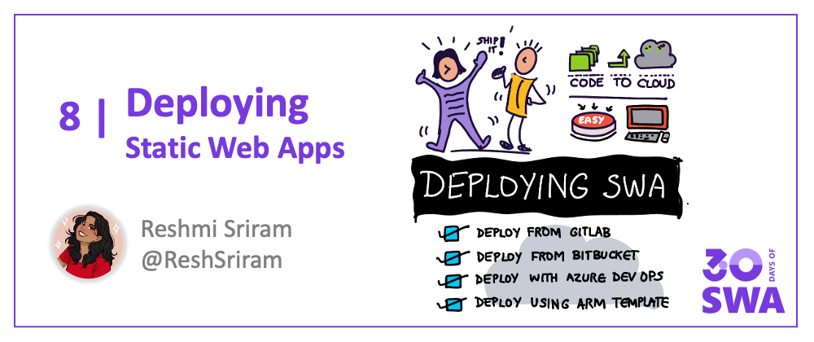

Welcome to `Week 1, Day 7` of **#30DaysOfSWA**!! 

You made it this far! Give yourself a pat on your back already! 😊  

By now, we have learnt what Static Web Apps is, and how to build, add APIs and configure the application. We’ve also deployed a couple of fun apps as a tribute to Star Wars! But we’ve so far explored deploying using the Github Actions path. 
 * What if we want some other CI/CD tool? 
 * What if our project resides safely in an Azure DevOps repository? 
 * What if we don’t want a CI/CD solution AT ALL? 
 
Fear not! Because today we’re gonna explore other ways of deploying a Static Web App on Azure 😊 

## What We'll Cover
 * Deploy With Azure DevOps  
 * Deploy From GitLab and BitBucket 
 * Deploy Using ARM Template 
 * **Exercise**: Explore the [ARM Tools VS Code Extension](https://docs.microsoft.com/en-us/azure/azure-resource-manager/templates/quickstart-create-templates-use-visual-studio-code?tabs=CLI)

 
## Deploy with Azure DevOps 

Deploying using Azure pipelines CI/CD has never been easier! 

Static Web Apps supports projects which are stored in Azure repos and helps in creating a smooth CI/CD pipeline to automatically trigger the changes on every commit to the main branch. What more? With the latest changes checked in for Azure DevOps, we can now [set up the azure pipeline via Portal with a single click](https://docs.microsoft.com/en-us/azure/static-web-apps/get-started-portal?tabs=vanilla-javascript&pivots=azure-devops)! Here’s a quick video demonstrating how to use DevOps as a pipeline, as well as touching on the numerous other enhancements brought in off-late, such as stable staging environments, password protected websites, build and deploy split, and lots more! 😊 

<iframe  width="560" height="315" frameborder="0" src="https://www.youtube.com/embed/4JkfeZp7aDk" title="YouTube video player" frameborder="0" allow="accelerometer; autoplay; clipboard-write; encrypted-media; gyroscope; picture-in-picture" allowfullscreen></iframe>

 
## Deploy via GitLab and BitBucket 

But what if we wanted a third-party Provider? Static Web Apps as of today [officially supports](https://azure.microsoft.com/en-us/updates/public-preview-static-web-apps-now-supports-gitlab-and-bitbucket-for-cicd/) CI/CD pipelines from GitLab and BitBucket! We just have to follow a few simple steps as discussed in the documentation for both [GitLab](https://docs.microsoft.com/en-us/azure/static-web-apps/gitlab?tabs=vanilla-javascript) and [BitBucket](https://docs.microsoft.com/en-us/azure/static-web-apps/bitbucket?tabs=vanilla-javascript), and voila! We’ll have a beautifully configured pipeline which takes care of the automatic trigger on commits for us. Isn’t this beautiful? 😊 

 
## Deploy using ARM Template 

For the CLI lovers out there, we can also deploy in Static Web Apps [using ARM Templates](https://docs.microsoft.com/en-us/azure/static-web-apps/publish-azure-resource-manager?tabs=azure-cli)! The ARM - or [Azure Resource Manager Template](https://docs.microsoft.com/en-us/azure/azure-resource-manager/templates/overview) - is used in preparing the workflow template. On deploying the ARM Template to Azure Static Web Apps, it triggers the Github Actions, which further takes care of our CI/CD needs. Do check out the exercise later in the blog for a quick hands-on using ARM Templates!  

But what about .. **deploying without a CI/CD??** 

Suppose we want a one-time deployment solution? Or we don’t want to depend on a CI/CD tool at all! No worries! We have you covered! Wonder how that is supported? Stay tuned to the #30DaysOfSWA series and **discover the new upcoming features** to enable this! 😉 <3<3  

## Resources

Now that we’ve explored the alternatives we have, let’s go have some fun with it!! Here are a few quickstarts you can try out!

1. [Deploy using BitBucket](https://aka.ms/swabitbucketsupport) 
2. [Deploy using GitLab](https://aka.ms/swagitlabsupport) 
3. [Deploy using Azure DevOps and Portal Quickstart](https://aka.ms/static-web-apps-publish-devops)  
4. [Use an ARM template quickstart](https://docs.microsoft.com/en-us/azure/static-web-apps/publish-azure-resource-manager?tabs=azure-cli) 

 

 