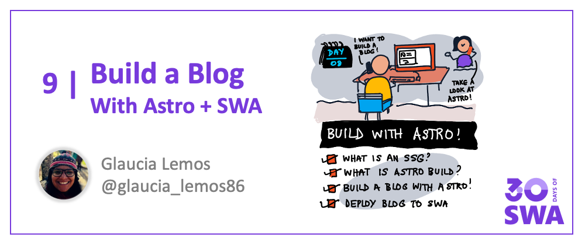
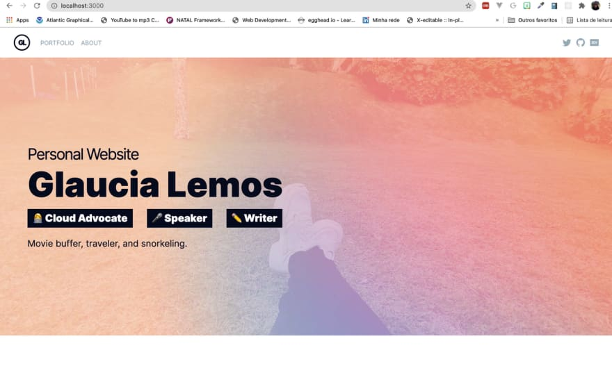

Welcome to `Week 2, Day 1` of **#30DaysOfSWA**!! 

In Week 1 we covered core concepts for Azure Static Web Apps - from development to API-enablement, security, configuraton and deployment.

Today, we kick off Week 2 with a focus on seeing SWA in action - using popular web development frameworks and static site generators to build and deploy different kinds of applications. We kick things off with a look at [Astro](https://astro.build) - a modern static site generator with a BYOF ("Bring your own framework") approach.

## What We'll Cover
 * What is a static site generator?
 * What is Astro?
 * Build & Deploy a Personal Blog with Astro
 * **Exercise:** Try the tutorial to deploy **your** personal blog!

## Static Site Generators

The term "static site generators" (SSG) refers to tools that automatically build static webpages for you, populating a chosen template with your custom content or data. The code generation is transparent to you, making it possible for even non-developers to setup custom static websites quickly. 

Static site generation is a growing trend for fast, flexible website creation. But it requires an external service to handle hosting and build/deploy workflows. **This is where Azure Static Web Apps comes in!** Check out the [SWA documentation](https://docs.microsoft.com/en-us/azure/static-web-apps/publish-gatsby) for tutorials featuring popular SSGs like Hugo, Jekyll and Gatsby. We'll explore some other examples later this week.

## Hello, Astro!

Today's post will however focus on [Astro](https://astro.build/blog/introducing-astro), one of the [rising stars of JavaScript](https://risingstars.js.org/2021/en#section-ssg) in the _Static Sites_ category. Astro is a static site builder that works _like an SSG_ but with some [novel features](https://astro.build/blog/introducing-astro) that set it apart. 
 * Bring your own framework (React, Vue, Svelte, web components)
 * Compose your website using that framework's UI components
 * Astro now renders a fully-static (all HTML, no JavaScript) website

Astro emphasizes **fast performance** with **less JavaScript** - and takes a [partial hydration](https://www.patterns.dev/posts/progressive-hydration/) approach that allows it to load the minimal required amount of JavaScript, if and when absolutely necessary. Here's a quick overview of Astro.

<iframe  width="560" height="315" frameborder="0" allowfullscreen src="https://www.youtube.com/embed/dsTXcSeAZq8" title="YouTube video player" frameborder="0" allow="accelerometer; autoplay; clipboard-write; encrypted-media; gyroscope; picture-in-picture" ></iframe>

## Astro + SWA

In **[today's tutorial](https://dev.to/azure/building-applications-with-astro-build-azure-static-web-apps-cli-a20)**, we walk through the steps required to:
 * create an astro-powered blog (using [this template](tttps://github.com/glaucia86/astro-swa-demo))
 * test it locally using the Azure Static Web Apps CLI (`swa`)
 * deploy it using the [Visual Studio Code Extenstion for SWA](https://marketplace.visualstudio.com/items?itemName=ms-azuretools.vscode-azurestaticwebapps) 

The end result will look like this. 

Here are the key links to know:
 *  Visit **[this page](https://dev.to/azure/building-applications-with-astro-build-azure-static-web-apps-cli-a20)** for the step-by-step tutorial.
 * Check **[this repository](tttps://github.com/glaucia86/astro-swa-demo)** for the source code (demo app template)
 * **[See this site](https://yellow-grass-008f2c710.azurestaticapps.net/)** for the deployed version of the app.

Then check back tomorrow for a new usage example and tutorial - this time, with a focus on React - as we continue to explore Azure Static Web Apps in action!

## Exercise

Here are a couple of options to try, to get more hands-on experience:

* Clone the [template project](https://github.com/glaucia86/astro-swa-demo.git) and follow the [tutorial](https://dev.to/azure/building-applications-with-astro-build-azure-static-web-apps-cli-a20) to build and deploy **your** personal blog.
* Visit the [Astro Themes](https://astro.build/themes/) page and try using a different starter project, then deploying it to Azure Static Web Apps.

## Resources

Check out these other tutorials using more traditional static site generators:
 * Publish a [Gatsby site](https://docs.microsoft.com/en-us/azure/static-web-apps/publish-gatsby) to Azure Static Web Apps
 * Publish a [Hugo site](https://docs.microsoft.com/en-us/azure/static-web-apps/publish-hugo) to Azure Static Web Apps
 * Publish a [Jekyll site](https://docs.microsoft.com/en-us/azure/static-web-apps/publish-jekyll) to Azure Static Web Apps
 * Publish a [VuePress site](https://docs.microsoft.com/en-us/azure/static-web-apps/publish-vuepress) to Azure Static Web Apps