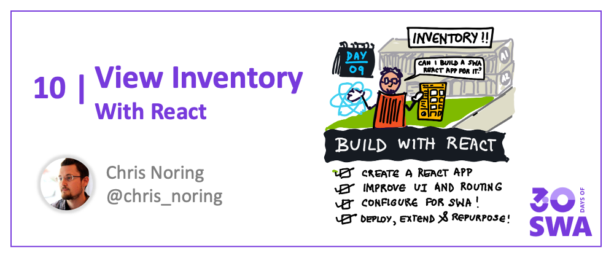

Welcome to `Week 2, Day 2` of **#30DaysOfSWA**!! 

Yesterday we looked at using a static site builder (namely [Astro](https://astro.build)) to create a personal blog and host it with Azure Static Web Apps. Over the next two days, we switch gears and look at using Azure Static Web Apps with some popular _front-end frameworks_ - starting today with [React](https://reactjs.org/).

## What We'll Cover
 * Why Learn React?
 * React + SWA: Quickstart
 * Build: Inventory Management App
 * **Exercise:** Build & Deploy a basic React SWA.

## Why Learn React?

React describes itself as [a JavaScript library for building user interfaces](https://reactjs.org/) that targets single-page application (SPA) development with a declarative and component-based approach. Today, it's one of the most popular technologies used for web development, leading the [2021 rising stars of JavaScript](https://reactjs.org/) section for front-end frameworks. Whether you're new to web development, or an experienced developer, it's a technology worth learning.

New to React? Here are a couple of resources:
 * [Official Tutorial: Intro to React](https://reactjs.org/tutorial/tutorial.html)
 * [Creating your first web apps with React](https://docs.microsoft.com/en-us/learn/paths/react/) - on Microsoft Learn
 * [Web Dev For Beginners](https://github.com/microsoft/Web-Dev-For-Beginners) - project-based curriculum

`
## SWA Quickstart

Once you have a simple React application scaffolded, configuring it to use Azure Static Web Apps is easy. In week 1, we covered the three different approaches (using Visual Studio Code, using Azure Portal, using Azure CLI) to build and deploy a vanillaJS app.

Want to try building and deploying a basic React starter app? The Azure Static Web Apps documentation has **Quickstarts** to help! 

The following tutorials use the [react-basic](https://github.com/staticwebdev/react-basic) starter template bootstrapped using [create-react-app](https://github.com/facebook/create-react-app). Pick an option based on your preferred development environment:
 * SWA Quickstart: [Using Visual Studio Code](https://docs.microsoft.com/en-us/azure/static-web-apps/getting-started?tabs=react)
 * SWA Quickstart: [Using Azure CLI](https://docs.microsoft.com/en-us/azure/static-web-apps/get-started-cli?tabs=react)
 * SWA Quickstart: [Using Azure Portal](https://docs.microsoft.com/en-us/azure/static-web-apps/get-started-portal?tabs=react&pivots=azure-devops)

This should help you setup and validate the basic tooling required for developing Azure Static Web Apps. Now, let's think about building something a little more functional!

## Inventory Mgmt

Today, I'm publishing the first of a _multi-part tutorial_ on how you can build an inventory management app with Azure Static Web Apps and React.

[**Read Part 1 of the Tutorial Here**](https://dev.to/azure/build-an-inventory-management-app-with-azure-static-web-apps-with-react-part-1-2l2e):
 > In this series, I'll take you from the very beginning on generating a React app and deploying it within 5 minutes. In the upcoming parts, I'll keep building on the same app, and add things like backend and other things.

In this tutorial you'll learn about:
 * Options to scaffold your React App
 * Use the `Snowpack` option to scaffold your project
 * Use VS Code to configure & deploy the app to SWA.

Check out the [deployed SWA](https://happy-wave-036ec970f.1.azurestaticapps.net/) at this stage of the tutorial. In the next part of the series, we'll improve UI and add routing support.

[**Revisit this series page tomorrow**](https://dev.to/azure/build-an-inventory-management-app-with-azure-static-web-apps-with-react-part-1-2l2e) to continue with the tutorial.

## Exercise: Try It!

This is the perfect time to make sure you have your development environment setup and ready to follow along. Try the quickstart option, then follow along with the tutorial series.

## Resources

Here are the key resources we shared in this article:
 * SWA Quickstart: [Using Visual Studio Code](https://docs.microsoft.com/en-us/azure/static-web-apps/getting-started?tabs=react)
 * SWA Quickstart: [Using Azure CLI](https://docs.microsoft.com/en-us/azure/static-web-apps/get-started-cli?tabs=react)
 * SWA Quickstart: [Using Azure Portal](https://docs.microsoft.com/en-us/azure/static-web-apps/get-started-portal?tabs=react&pivots=azure-devops)
 * [Official Tutorial: Intro to React](https://reactjs.org/tutorial/tutorial.html)
 * [Creating your first web apps with React](https://docs.microsoft.com/en-us/learn/paths/react/) - on Microsoft Learn
 * [Web Dev For Beginners](https://github.com/microsoft/Web-Dev-For-Beginners) - project-based curriculum