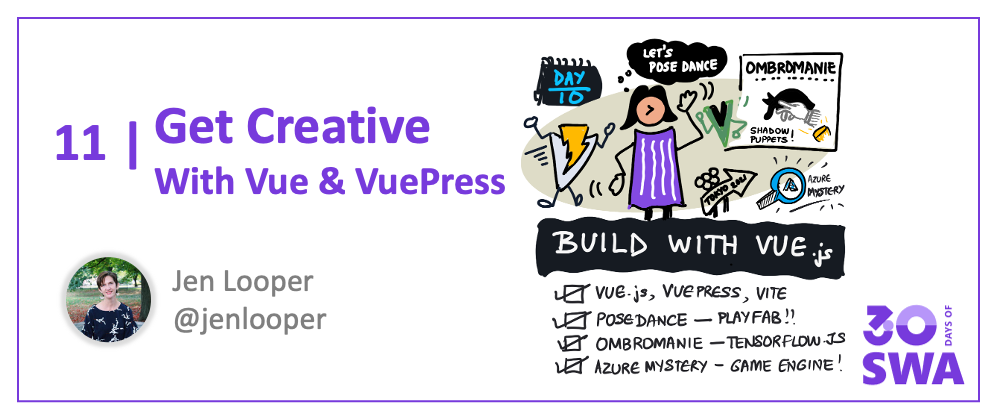
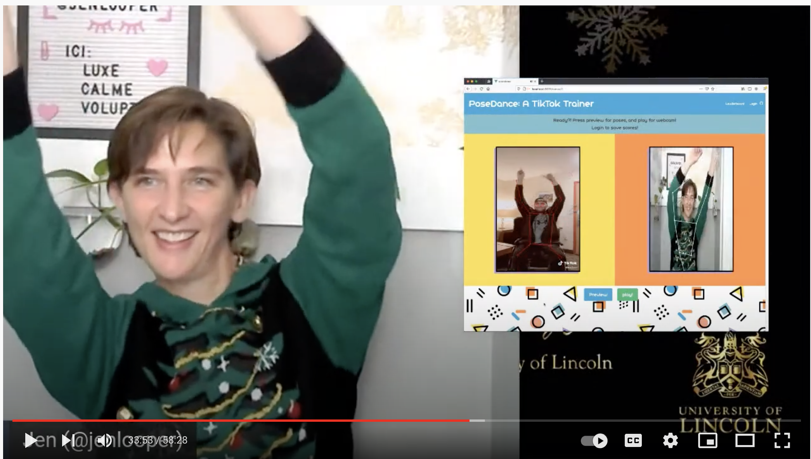
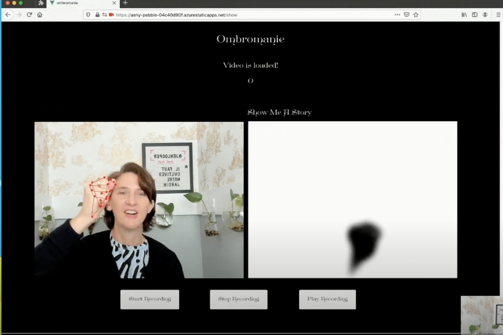
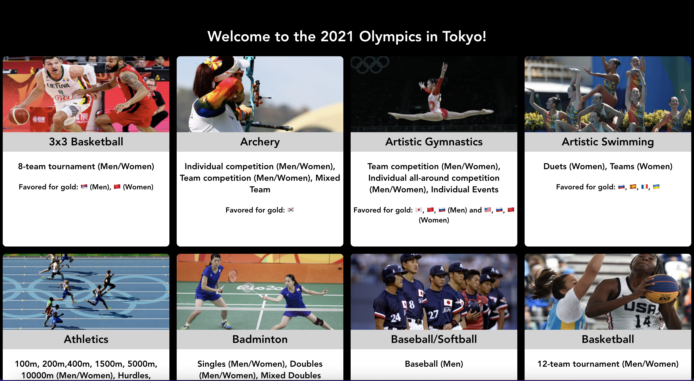
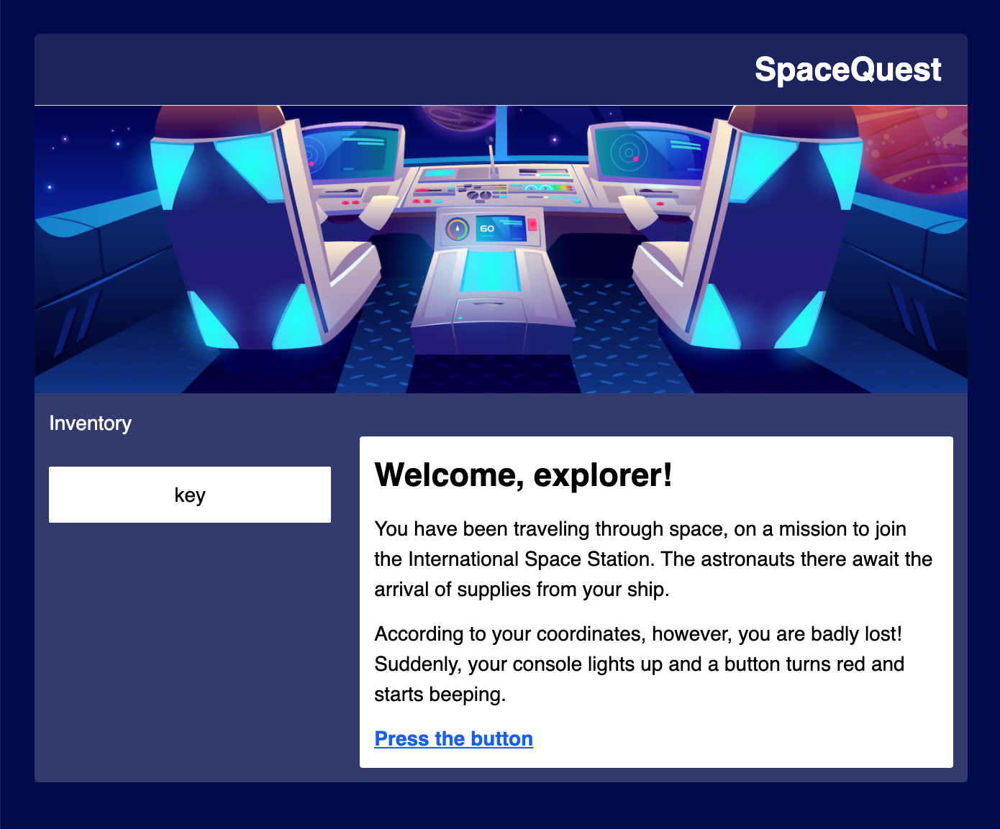

Welcome to `Week 2, Day 3` of **#30DaysOfSWA**!! 

Vuelievers, rejoice! Today we'll explore several examples of how you can build a Static Web App with [the Vue.js framework](https://vuejs.org/) 

In this article, I'll give several examples of sites I've created using Vue and [VuePress](https://vuepress.vuejs.org/), a popular way to build static sites with Vue. I'll also walk through a game engine we created in VuePress that you can deploy as a SWA, and touch on the use of [Vite.js](https://vitejs.dev/), a lightning-fast toolkit you can use to build all types of applications, built by the masterminds behind the Vue.js projects.

## What We'll Cover
Let's explore some creative application usage examples:

 * **PoseDance:** with PlayFab
 * **Ombromanie:** with TensorFlow.js
 * **Olympic App**:  with Vite.js
 * **Azure Mysteries**: a static Game Engine
 * **Exercise**: Build a game with VuePress, deploy to SWA!

In this article, I'll describe the following projects, which are more fully explained on their README files in their respective repositories. 
The first apps I'd like to showcase are PoseDance and Ombromanie. Both were developed as conference talks and have become interesting case studies in how to use TensorFlow.js in web apps, specifically focusing on body poses and hand poses for innovative user experiences.

## 1. PoseDance 

PoseDance is your friendly TikTok trainer: watch a TikTok dance video, learn the dance, then enter a side-by-side view of the original dance with a 'skeleton' imposed on it to the left, with your own video on the right. Try to make your body poses match that of the dancer, and win a high score!

PoseDance offers a full view of SWA capabilities, including an API buildout so that the user can login and save their high scores. To save scores, it also uses [PlayFab](https://playfab.com/) in the backend. In addition this repo has a Code Tour! 

[Code Tour](https://marketplace.visualstudio.com/items?itemName=vsls-contrib.codetour) is a neat little Visual Studio Code extension that, if installed locally, will allow you to walk through the codebase in a guided manner, to learn the rationale behind code architecture. Install that extension in VS Code and give it a try! 

**Explore: PoseDance**
 * Watch the [video](https://www.dropbox.com/s/ccog8uz0tzk10mv/posedance.mp4?dl=0) about the making of PoseDance. 
 * Walk through the conference [slides](https://github.com/jlooper/posedance/blob/master/posedance.pptx). 
 * Explore the [codebase](https://github.com/jlooper/posedance)
 * Visit the [deployed site]( https://wonderful-ocean-007be220f.1.azurestaticapps.net/) and _Dance with us!_

## 2. Ombromanie

Ombromanie is a demo I built for a different conference talk that was described as _"un peu OVNI"_ ("a little UFO-like"). In this demo, mimic the hand shadows that you used to make using just a candle and a dark room, to freak out and entertain your siblings. 

Like PoseDance, this app is also built using Vue.js, and leverages TensorFlow.js and bodyposing - this time focusing on hand poses, which are actually more complex than body poses, as there are more bendable joints in play. 

Use the Ombromanie app to record a video of your special hand shadow story, coupled with voice-to-text transcription of your story, and then share it. 

**Explore: Ombromanie**

 * Read the [blogpost](https://dev.to/azure/ombromanie-creating-hand-shadow-stories-with-azure-speech-and-tensorflow-js-handposes-3cln)
 * Watch the conference [talk](https://www.youtube.com/watch?v=8Aow0rkp1Lw&ab_channel=MTGFrance)
 * Walkthrough the conference [slides](https://github.com/jlooper/ombromanie/blob/main/ombromanie.pptx)
 * Visit the [deployed SWA](https://brave-river-00627910f.1.azurestaticapps.net/) and _Create Hand Shadow Stories!_

## 3. 2021 Olympics

For the [Microsoft Build](https://mybuild.microsoft.com/) conference in 2021, I wanted to demonstrate how to use Vite.js to build a simple 'card flipping' app. Since it was close to the Summer Olympics, I featured all the Olympic sports in this interesting interface. Building with Vite is similar to building with Vue, although the location of the files is different. _But deployment as a SWA is just as straightforward._

**Explore: Olympics App**

 * Visit the [deployed SWA](https://kind-mushroom-0f7f4200f.1.azurestaticapps.net/) to see it in action.
 * Watch this [video](https://www.youtube.com/watch?v=Xpl-KukvEmM&ab_channel=MicrosoftDeveloper) and build the app with me!
 * Explore the [source](https://github.com/jlooper/olympic-app ) and build it yourself!

To build it, start on the student branch and build up the app following the video instructions, or just look at the entire complete codebase.

## 4. Azure Mysteries

Finally, and something really different, I'd like you to meet **SpaceQuest**, a game engine that I developed with inspiration and help from my colleague [Chris Noring](https://github.com/softchris). SpaceQuest is a game engine you can use to build your own games, and deploy as a SWA, in the tradition of text-based point and click adventure games.

 We used this engine as the core to build the **Azure Maya Mystery** and the **Azure Space Mystery** experiences, all deployed as SWAs to great acclaim. Learn more about these adventures here:

**Explore: Azure Maya Mystery**

 * [Introducing Azure Maya Mystery](https://dev.to/azure/unraveling-the-azure-maya-mystery-and-building-a-world-4pp2)
 * [The Making of Azure Maya Mystery](https://dev.to/azure/azure-maya-mystery-the-inner-workings-of-a-static-web-app-hkp)
 * [The Mysterious Cenote](https://dev.to/azure/azure-maya-mystery-part-ii-the-mysterious-cenote-3j57)
 * [Ascent to the Summit](https://dev.to/azure/azure-maya-mystery-part-iii-ascent-to-the-summit-41hi)

**Explore: Azure Space Mystery**
 * [Introducing Azure Space Mystery](https://dev.to/azure/blast-off-with-azure-advocates-presenting-the-azure-space-mystery-mdd)

SpaceQuest had a very special purpose, other than being the seed code of the mysteries, however. We used it in a series of workshops with Autistic students to teach them how to build their own games, in partnership with the National Museum of Computing at Bletchley Park. 

 * Learn about [this work](https://dev.to/azure/making-games-with-autistic-students-a-partnership-between-the-national-museum-of-computing-track-org-and-azure-advocates-3c1e). It was a tremendous honor to work with these talented students!
 * Try the [deployed SWA](https://zealous-mushroom-04674420f.1.azurestaticapps.net/)
 * Explore the [source](https://github.com/jlooper/static-game-engine)

Then build a mystery of your own by forking the codebase and building up your storyline - and share it with us!

## Resources
1. [Vue.js](https://vuejs.org/) - The Progressive JavaScript Framework
2. [Vite](https://vitejs.dev/) - Next Generation Frontend Tooling
3. [VuePress](https://vuepress.vuejs.org) - Vue-powered Static Site Generator
4. [Get Started with Vue](https://docs.microsoft.com/en-us/learn/modules/vue-get-started/) - on Microsoft Learn
5. [Publish a Vue App with Azure Static Web Apps](https://docs.microsoft.com/en-us/learn/modules/publish-app-service-static-web-app-api/) - on Microsoft Learn
6. [Tutorial: Publish a VuePress Site to SWA](https://docs.microsoft.com/en-us/azure/static-web-apps/publish-vuepress) 