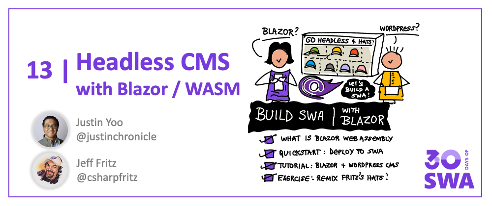
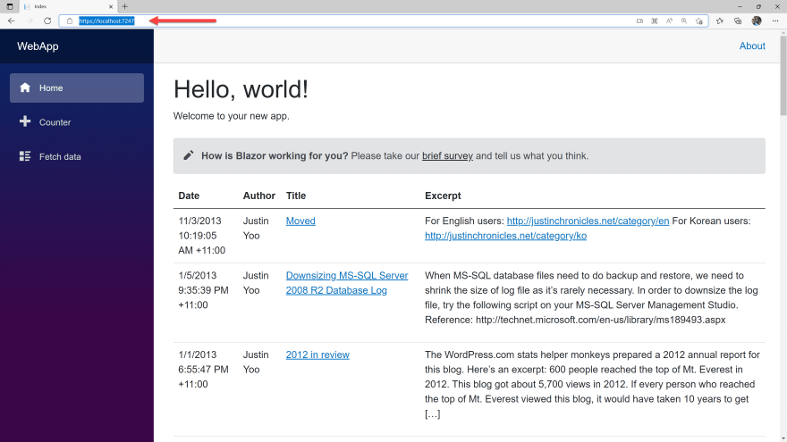

Welcome to `Week 2, Day 5` of **#30DaysOfSWA**!! 

Over the last few days we've been exploring JavaScript-based frameworks for building web apps. Today, we switch our attention to our amazing .NET community and talk about building Static Web Apps with [Blazor](http://blazor.net)

## What We'll Cover
 * Introduction: Blazor WebAssembly
 * Quickstart: Simple Blazor SWA
 * Advanced: Blazor SWA + Wordpress CMS
 * **Exercise**: Remix Fritz's Hat Collection!

## Blazor WebAssembly

When we think about web applications, we typically think of developing with JavaScript, HTML, and CSS. In fact, many of you reading this series may identify yourselves as JavaScript developers when discussing modern web apps.

What if I told you that was not always the case? What if you could **write web applications in C#**, running in a .NET runtime inside the browser! Turns out you can - thanks to [Blazor](https://blazor.net).

**What is Blazor?**

Blazor is a [framework for building interactive client-side web UI with .NET](https://docs.microsoft.com/en-us/aspnet/core/blazor). Developers can build interactive web applications using C# (instead of JavaScript) - and extend experiences to hybrid desktop and mobile apps with .NET capabilities.

**What is Web Assembly?** 

Running .NET code inside web browsers is made possible by [WebAssembly](https://webassembly.org/)(`wasm`) - a binary instruction format and open web standard that is designed as a _portable compilation target_ for programming languages. It provides a sandboxed runtime that can be implemented _inside_ JavaScript virtual machines (like those in modern web browsers) to support web apps.

**How does Blazor WebAssembly Work?**

[Blazor WebAssembly](https://docs.microsoft.com/en-us/aspnet/core/blazor/) is a framework for building single page app (SPA) that works with all modern web browsers, including mobile versions. Blazor apps are written using [Razor](https://docs.microsoft.com/en-us/aspnet/core/blazor/components/?view=aspnetcore-6.0) components in a .NET runtime. The .NET code is then executed via WebAssembly in the browser's JavaScript sandbox. WebAssembly uses JavaScript interoperability to get full access to browser features. Learn how [Blazor web apps work](https://docs.microsoft.com/en-us/aspnet/core/blazor/).

## Simple Blazor SWA

Want to learn how you can deploy a simple Blazor application to Azure Static Web Apps? We have you covered! Follow [this tutorial](https://docs.microsoft.com/en-us/azure/static-web-apps/deploy-blazor) to learn how to deploy an **existing Blazor app** to Azure Static Web Apps.

The end result will look something like this - a single page Blazor web application that displays weather data _returned from a serverless API_ - beginning with [this starter app](https://github.com/login?return_to=/staticwebdev/blazor-starter/generate),

---

## Blazor SWA and Wordpress

Want to try a more complex example? Check out [this advanced tutorial](https://dev.to/azure/blazor-webassembly-for-headless-cms-on-azure-static-web-apps-412c) (from Justin Yoo). Here's a brief introduction:

> One of the most popular scenarios to build a static website is to run a blog site for myself or my organisation. WordPress is the most popular service for this purpose. Now, you want to migrate your WordPress blog site to a static website, but it doesn't look easy.

> What if you still want to use the WordPress site to write content but only want to refresh the UI outside the site? What if you can even use C# for it through Blazor WebAssembly? You are now able to use the existing WordPress site as the data source of truth and build a UI in a separate instance with your preferred method. Does that sound attractive?

Join Justin as he walks through the steps required to: 
 * use the serviced Wordpress instance as a headless CMS
 * build the Blazor WebAssembly app using Wordpress
 * host the completed app on Azure Static Web Apps

The end result issomething like this. 
 **[Read the blog post behind this!!](https://dev.to/azure/blazor-webassembly-for-headless-cms-on-azure-static-web-apps-412c)**.

---

## Exercise: Remix Fritz's Hats!

Hopefully you're ready to try something fun that will reinforce what you learned today. 

**Say Hello to (Jeff) Fritz's Really Cool Hats**

[Fritz's Really Cool Hats](https://hats.csharpfritz.com/) is an open-source static web site built with Blazor WebAssembly, incorporating C# Azure Functions and Azure Storage, and deployed using Azure Static Web Apps. The project was created by **Jeff Fritz** - the face behind many Twitch livestreams and the popular [Beginners Series To Blazor](https://docs.microsoft.com/en-us/shows/beginners-series-to-blazor/).

[**Visit The Deployed Site**](https://hats.csharpfritz.com/)

For this exercise:

* [Fork the repository](https://github.com/csharpfritz/Fritz.HatCollection) and clone it locally.
* Open project in Visual Studio - press F5 to launch (app and api).
* Configure [your Azure Storage account](https://github.com/csharpfritz/Fritz.HatCollection#data-storage) to add your own images
* Use the [quickstart](https://aka.ms/blazor-swa/quickstart) to deploy to Azure Static Web Apps.

Explore the source and the GitHub Actions files in the original repository to understand how the app is structured. Then share your deployed project with us by tagging a tweet with #30DaysOfSWA.

---

## Resources

Here are some resources to get you started with your Blazor journey into 

 * [Blazor: Build Client Web Apps With C#](https://blazor.net)
 * [Beginner's Series to: Blazor](https://docs.microsoft.com/en-us/shows/beginners-series-to-blazor/)
 * [Tutorial: Build a Static Web App with Blazor](https://docs.microsoft.com/en-us/azure/static-web-apps/deploy-blazor)
 * [Fritz.HatCollection - Source](https://github.com/csharpfritz/Fritz.HatCollection), Jeff Fritz
 * [Headless CMS Example - Source](https://github.com/justinyoo/blazor-wasm-azfunc-aswa), Justin Yoo