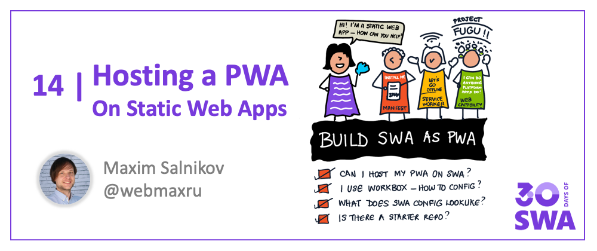
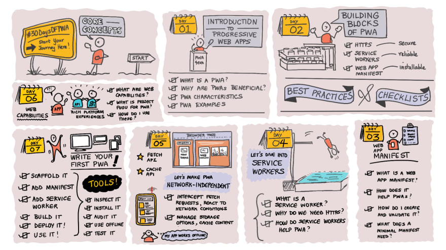
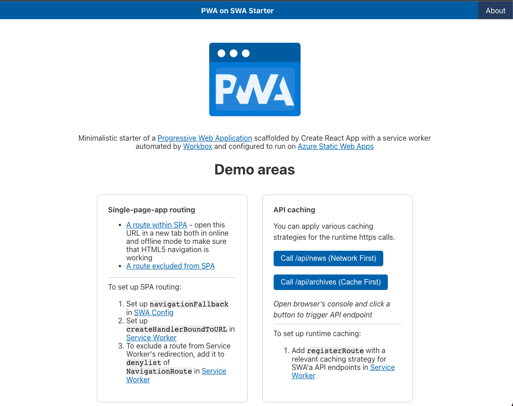

Welcome to `Week 2, Day 6` of **#30DaysOfSWA**!! 

Yesterday we talked about deploying Blazor apps on Static Web Apps. Let's continue today with one more type of the projects you can successfully host on SWA - Progressive Web Apps (PWAs).

## What We'll Cover
 * How do I start with building a PWA?
 * Optimized PWA-on-SWA configuration
 * Advanced techniques for better user experience
 * **Exercise:** [Deploy your PWA on SWA, run offline, and install it](https://github.com/webmaxru/pwa-on-swa)



## Progressive Web Applications

A **Progressive Web App (PWA)** is a web frontend application that is progressively enhanced using open web technologies, to make sure it delivers the best possible experience on every device, based on available capabilities. The "baseline" for your app to have a title "progressive" is its installability and offline-readiness. We skip the "served with https" requirement because it became a baseline for any web app these days.



This chapter of #30DaysOfSWA assumes that you are familiar with the basic concepts of a Service Worker API and automating your service worker with the Workbox library. If you wish to learn about these technologies, you are welcome to go through the Core Concepts part of the **[#30DaysOfPWA](https://aka.ms/30DaysOfPWA)** project (see roadmap above) to learn about PWA fundamentals and to watch **[Automating a service worker with the Workbox 6](https://www.youtube.com/watch?v=LILGt_pHk9M&ab_channel=NDCConferences)** video for quickstart with Workbox.

## Is hosting a PWA on Azure Static Web Apps different from "classic" apps?

A Progressive Web Application is still a web frontend app so the initial scaffolding of your SWA resource is the same - you have learned how to deploy and configure various types of web apps from the previous chapters of the #30DaysOfSWA. But to make sure that your "PWA on SWA" works as intended both online & offline to provide the best possible user & developer experiences, you might need to pay special attention to some implementation details and fine-tune some configuration options. We'll go through the following points in this chapter:

- Building your service worker as a part of the overall app build
- Setting up HTML5 routing - for the Single-Page Application (SPA) use-case
- Applying caching strategies for SWA-hosted APIs
- Showing custom error pages
- How to deal with authentication in PWA

**Sample project**

I created a **[PWA on SWA Starter](https://github.com/webmaxru/pwa-on-swa)** project with all the best practices implemented. The app is [hosted on SWA](https://aka.ms/pwa-on-swa) as shown below. Let's explore it!



**Technical stack:**

- A React application scaffolded by the [create-react-app](https://reactjs.org/docs/create-a-new-react-app.html) tool. A simple SPA with a few routes and the possibility to call API endpoints. Note that the approaches described are applicable for any web frontend application: **framework-based** (including your custom frameworks) or **"vanilla" JavaScript**. We use React only for getting closer to the real-world scenario of the modern frontend app development when you have to perform some operations with your source code ("build the app") before the deployment.
- A [service worker](https://github.com/webmaxru/pwa-on-swa/blob/main/src/sw/service-worker.js) powered by the [Workbox](https://workboxjs.org) library.
- Two API endpoints created within SWA resource - to emulate "dynamic" (`/api/news`) and "conservative" (`/api/archives`) data sources.

## Building your service worker as a part of the overall app build

The service worker file we have in the `src/sw` folder of the application is not ready for the deployment. We have to

1. **[Process it](https://github.com/webmaxru/pwa-on-swa/blob/main/scripts/sw-build.js)** by the `workbox-build` module to populate with the resources to precache (to provide offline-readiness)
2. **Bundle it**
3. **Choose** production or development mode
4. **Minify** for deployment

This is why in `package.json`'s `scripts` we have `"build-sw": "node scripts/sw-build.js && npx rollup -c"` command that is building a service worker file and copies it into the app distribution folder.

By default, Azure Static Web Apps runs `npm run build` command to build your application. So do not forget to add a service worker build command there. The resulting  command will be:

```
"build": "react-scripts build && npm run build-sw"
```

Instead of `react-scripts build`, there might be a command to build an application using a framework/bundler of your choice. **Important**: Keep this order - you always build a service worker _after_ the main application because the distribution folder will be scanned to list the files to precache based on the [pattern](https://github.com/webmaxru/pwa-on-swa/blob/main/scripts/sw-build.js#L5) you provided.

## Setting up HTML5 routing - for the Single-Page Application (SPA)

For having correct navigation in your single-page application, you have to "ask" the webserver to redirect all navigation requests to `index.html` - to run the application and let it do the routing. In SWA, you have to have something like this in the [configuration file](https://github.com/webmaxru/pwa-on-swa/blob/main/staticwebapp.config.json):

```
"navigationFallback": {
  "rewrite": "index.html",
  "exclude": ["/images/*.{png,jpg,gif}", "/static/*"]
}
```

**Best practices**:

- Always "exclude" as much as possible in `navigationFallback` - it will help you to identify and fix "resource not found" errors.
- Do not copy `staticwebapp.config.json` to the app distribution folder - SWA will find it in any location within the app source code.

In case of PWA, there is an extra layer of this fallback: the first in a row to handle navigation requests is a service worker. In the [service-worker.js](https://github.com/webmaxru/pwa-on-swa/blob/main/src/sw/service-worker.js) we have to have the following block for correct routing in SPAs:

```
const navHandler = createHandlerBoundToURL('/index.html');
const navigationRoute = new NavigationRoute(navHandler, {
  denylist: [
    new RegExp('^/images/'),
    new RegExp('^/static/'),
  ],
});
registerRoute(navigationRoute);
```

The above configuration will work fine for opening both root url and "deep links" like `/about` both in online and offline modes. 

## Showing custom error pages

It's a best practice to create and show custom error pages (for example for 404 Not Found) instead of the ones built-in in the browsers. And it makes sense to keep these pages as simple as possible - without running a SPA itself. To set up custom error pages, you add the following block to the [SWA config](https://github.com/webmaxru/pwa-on-swa/blob/main/staticwebapp.config.json)

```
"responseOverrides": {
  "400": {
    "rewrite": "/400.html"
  },
  "404": {
    "rewrite": "/404.html"
  }
}
```

These pages will be excluded from SWA's navigation fallback automatically because these two html are in the app distribution folder. But for the Workbox and explicit directive needed - just add these addresses to the same `denylist` we met with the HTML5 navigation section.


## Applying caching strategies for SWA-hosted APIs

With Workbox, runtime caching is simple: you specify a url pattern to "listen" and intercept, and a caching strategy to apply. There are [5 strategies](https://developer.chrome.com/docs/workbox/modules/workbox-strategies/) available and you can always create a custom one. By default, all API urls start with `/api`. Then in a [service worker](https://github.com/webmaxru/pwa-on-swa/blob/main/src/sw/service-worker.js), we'll add this block for caching responses from our two API endpoints using different strategies:

```
registerRoute(
  ({ url }) => url.pathname.startsWith('/api/news'),
  new NetworkFirst()
);

registerRoute(
  ({ url }) => url.pathname.startsWith('/api/archives'),
  new CacheFirst()
);
```

Now, the data from APIs, once fetched, is also available offline!

**Mini-exercise**: Open the [hosted PWA on SWA Starter](https://aka.ms/pwa-on-swa), open the Network tab of DevTools, and click on two buttons in the "API caching" demo area. What difference do you see in the network request/response patterns for these two strategies?

## How to deal with authentication in PWA

A couple of **important** rules here:

1. Explicitly exclude the `.auth` system folder of SWA from Workbox's navigation fallback (use `denylist`) and never set up runtime caching for it
2. Never runtime-cache all data users fetch from restricted API endpoints (served by SWA or external)

And it's a **best practice** to never precache and always exclude from the service worker's navigation fallback all urls related to the user authentication and restricted parts of your application. [Have a look](https://github.com/webmaxru/pwa-on-swa/blob/main/src/sw/service-worker.js#L27) at the resulting `denylist` of our sample application.

## Exercise: Deploy your PWA on SWA, run offline, and install it!

Hopefully, you're ready to try something fun that will reinforce what you learned today. 

For this exercise:

* [Fork the PWA on SWA Starter repository](https://github.com/webmaxru/pwa-on-swa) and deploy it to Azure Static Web Apps using the skills you gained in the previous chapters of the #30DaysOfSWA
* Open the url you received after the SWA resource was created
* Now, go offline (disconnect from the Internet or emulate offline mode in the DevTools) and reload the page - it still works!
* Using the "App available" icon on the right-hand side of the desktop browser's address bar, install the application on your laptop - now it behaves like a native one!

---

## Resources


Here are some resources to get you started with your Progressive Web App journey into 

 * [PWA on Microsoft Docs](https://aka.ms/learn-pwa)
 * [#30DaysOfPWA](https://aka.ms/30DaysOfPWA)
 * [Workbox library](https://workboxjs.org)
