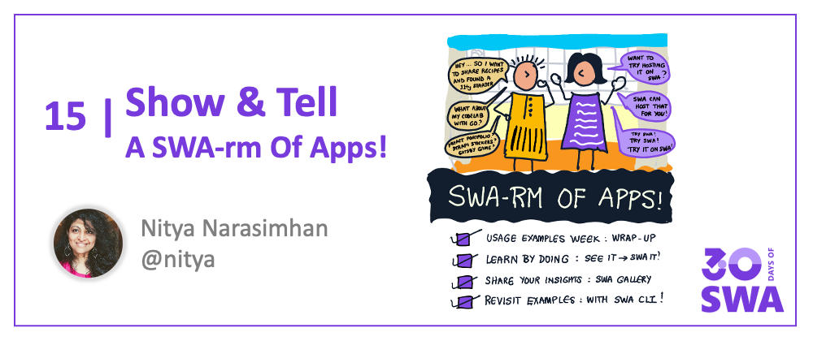
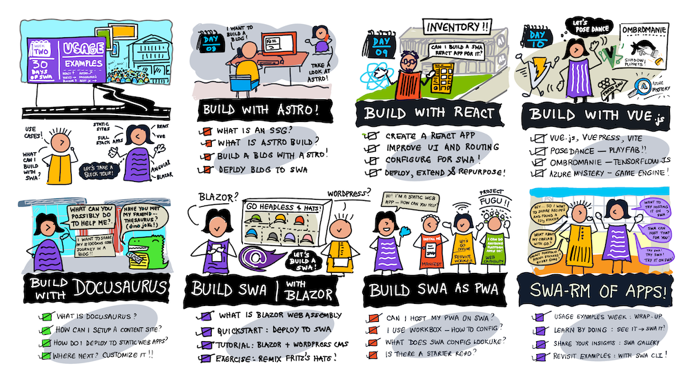
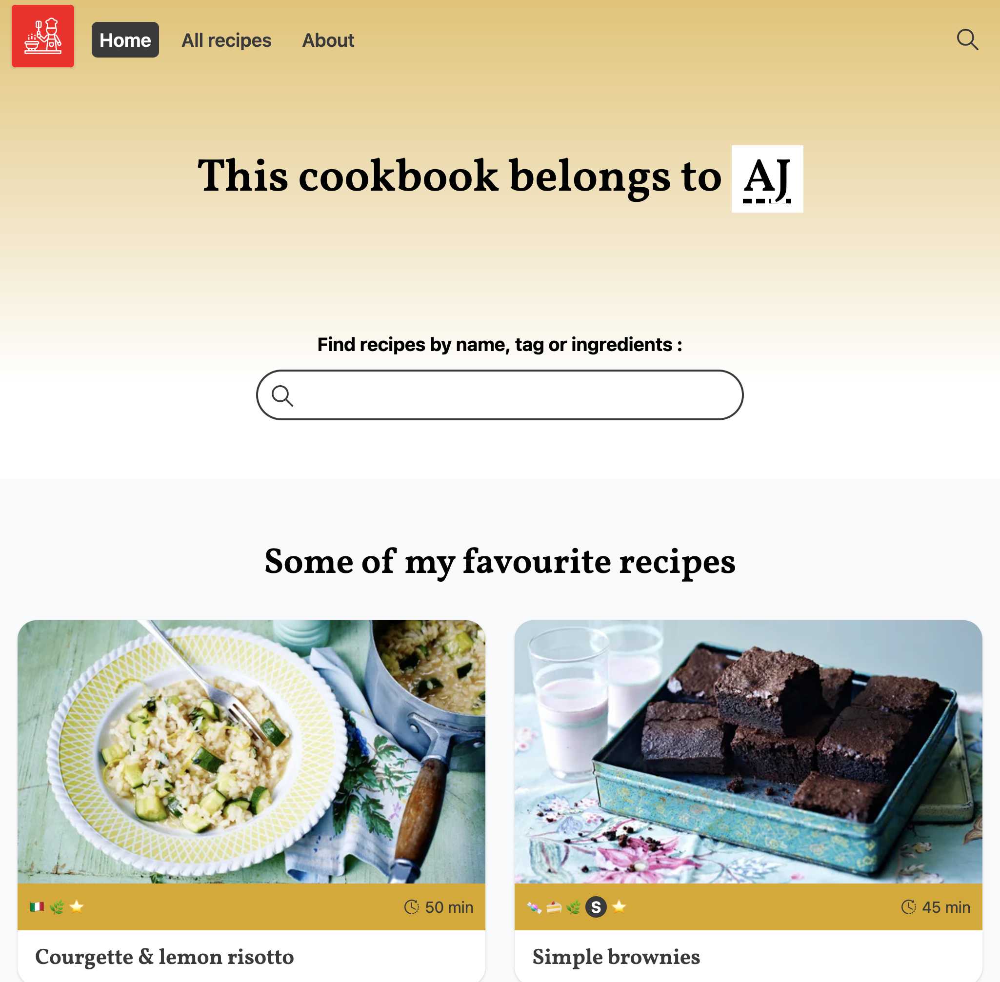
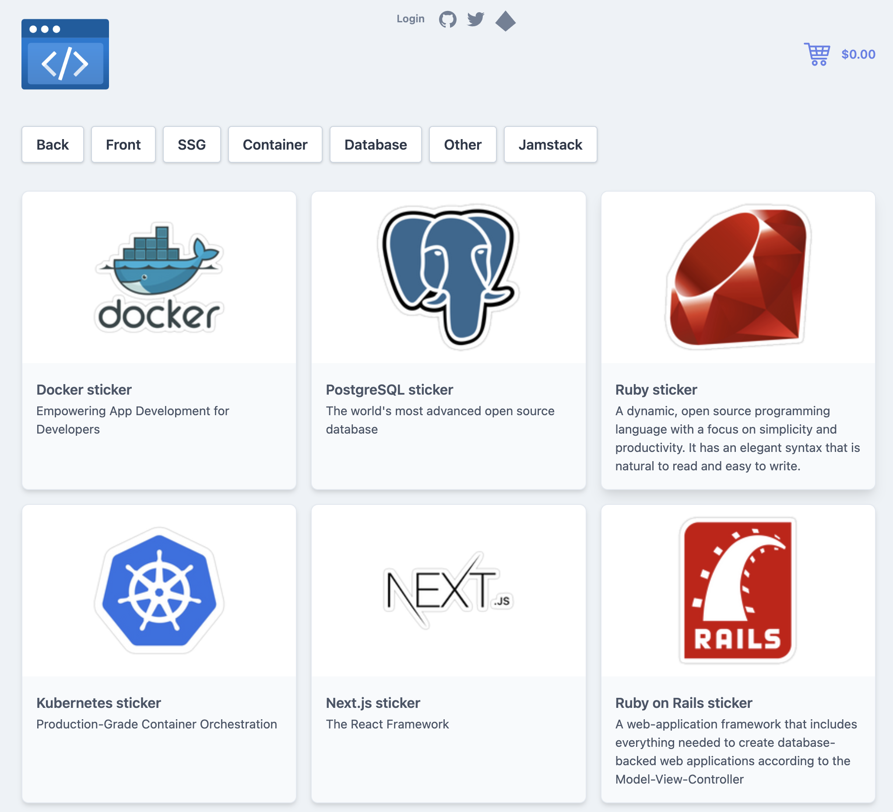
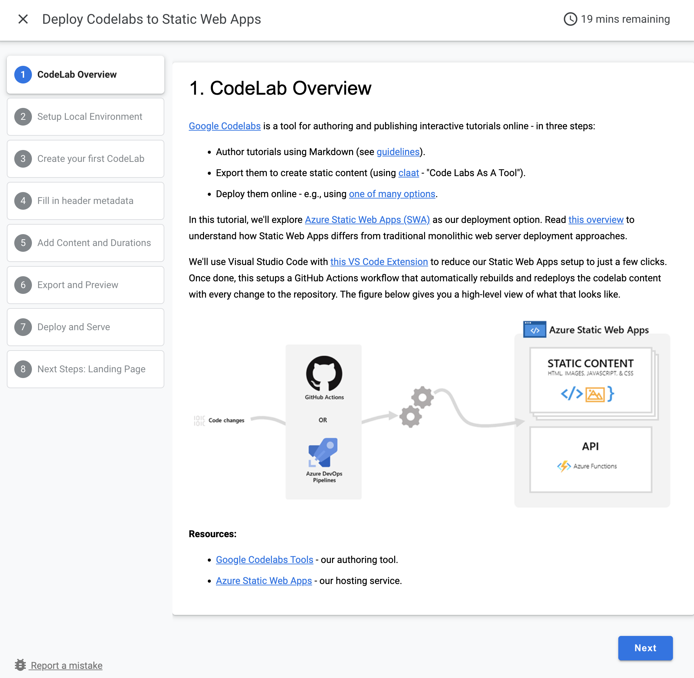
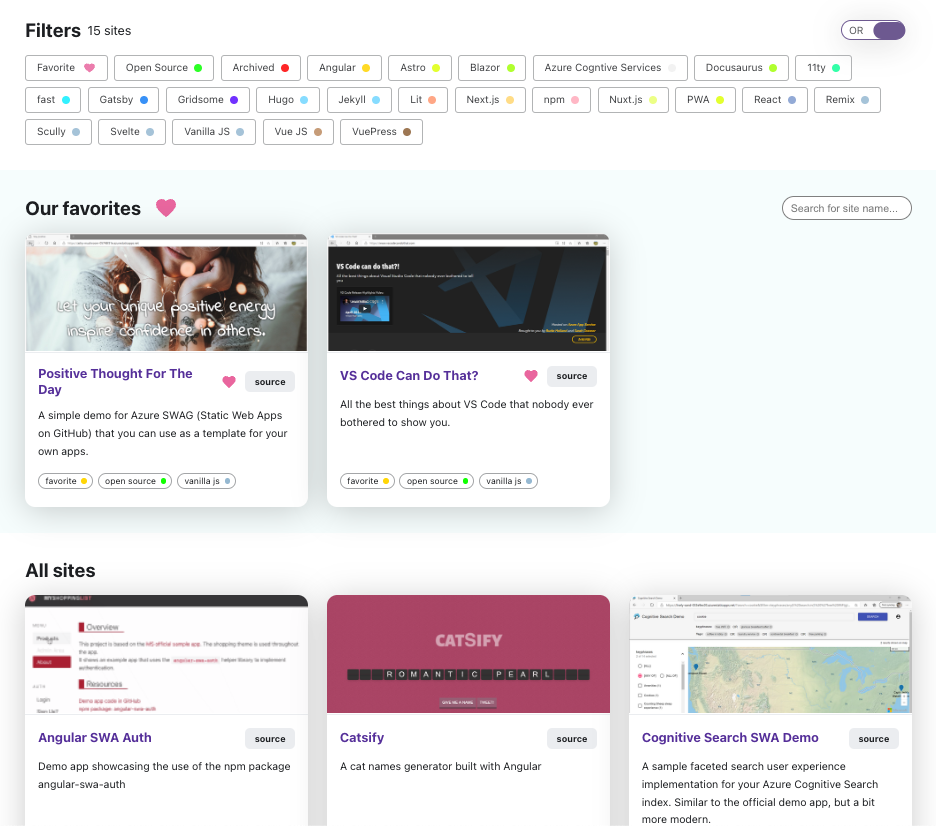

Welcome to `Week 2, Day 7` of **#30DaysOfSWA**!! 

We made it to the end of Week 2!! **Let's give ourselves a round of applause!**

In the last week we walked through a subset of usage examples featuring diverse applications, static site generators and front-end frameworks. And that's still just a small slice of what is possible. So how do you make this journey more actionable and _learn by doing_?

That's what I'll try to answer in today's post. Also **bookmark this one** because we will revisit it at the end of next week ("Dev Tools") and try to replicate some of these tutorials using the more streamlined experience provided by the [**Azure Static Web Apps CLI**](https://aka.ms/swa-cli) (a command-line tool for local development).

## What We'll Cover
 * **Recap**: Usage Examples Week
 * **Build**: How to Get Project Ideas
 * **Share**: Contribute to the Gallery
 * **Simplify**: Using Static Web Apps CLI!
 * **Exercise**: Build, Deploy, and Customize, some starter app.x

## Week 2 Recap

This week was packed with different usage scenarios and front-end technologies. Let's take a quick look at what was covered:

 * **Monday:** We built a [personal blog](https://dev.to/azure/08-build-a-blog-with-astro-1lb2) using [Astro](https://astro.build/).
 * **Tuesday:** We built an [inventory management](https://dev.to/azure/09-manage-inventory-with-react-39lc) app using [React](https://reactjs.org/)
 * **Wednesday:** We [got creative](https://dev.to/azure/10-get-creative-with-vuejs-33k1) with [Vue](https://vuejs.org/), ML and Game Engines!
 * **Thursday:** We [published content](https://dev.to/azure/11-share-content-with-docusaurus-azure-static-web-apps-30hc) using [Docusaurus](https://docusaurus.io/)
 * **Friday:** We explore [headless CMS](https://dev.to/azure/12-headless-cms-swa-built-with-blazor-1e2d) examples using [Blazor WebAssembly](http://blazor.net/)
 * **Saturday:** We learned to make SWA a more [progressive web app](https://dev.to/azure/13-hosting-pwa-on-static-web-apps-16la)

The visual roadmap gives you a sense of what was covered each day. But this is just the tip of the iceberg. JavaScript developers have a wide variety of front-end frameworks and static site generators to work with. And, as we saw with Blazor WebAssembly, non-JavaScript developers have other frameworks they use to develop modern web applications. So, how can you continue the learn-by-doing journey? Read on for some ideas.

## Project Ideas

### 1. Static Sites

The easiest way to get started is to use one of many [static site generators](https://jamstack.org) available today. Most of these provide templates you can start with, and customize just by bringing your own content (data, media assets etc.). Need some inspiration? Take a look at the recently released [Rising Stars Of JavaScript: Static Sites](https://risingstars.js.org/2021/en#section-ssg) list and see if any of those projects have starters you can repurpose.

**Example: My "Recipe Me" Project**. 

Earlier this week, we covered examples with Astro (#2), Docusarus (#3) and VuePress (#9) in our usage examples. Today we look at [Eleventy](https://www.11ty.dev/) (#7).

Earlier this year I ran [#30DaysOfPWA](https://dev.to/azure/07-developing-progressive-web-apps-hfb), a similar series focused on Progressive Web Apps. And I wanted a demo! I've always wanted to have a recipe blog, and I found [this Eleventy starter](https://github.com/maeligg/my-online-cookbook) that was perfect. I customized it to add the features and code required to make it PWA-compliant. And I configured it for hosting on Azure Static Web Apps. **Bonus:** I learned a lot in the process about the framework, and the configuration changes for SWA!

 

**Related Resources:**

 * [Read the Tutorial](https://dev.to/azure/07-developing-progressive-web-apps-hfb)
 * [Browse the Source](https://github.com/fearlessly-dev/recipe-me)
 * [Visit the Website](https://white-rock-036691f0f.1.azurestaticapps.net/)

### 2. Frameworks

The next step up from this is to look at existing application starter-kits or tutorials that target popular front-end and full-stack frameworks. Unlike static site generators (which are content-centric) these apps let you explore advanced user interactions that can benefit from SWA concepts like serverless API and authentication support. Need some inspiration? Take a look at the recently released [Rising Stars Of JavaScript: Front-end Frameworks](https://risingstars.js.org/2021/en#section-framework) list and see if any of those projects have starters you can repurpose.

**Example:  Simona's "Sticker Shop" Project**. 

Check out this example from Simona Cotin (currently a Principal PM on the Static Web Apps team) which forked the [Strapi e-commerce starter](https://strapi.io/blog/strapi-starter-nuxt-js-e-commerce) and adapted it for deployment on Azure Static Web Apps. The Strapi [tutorial](https://strapi.io/blog/strapi-starter-nuxt-js-e-commerce) talks you through the setup and structure of the application - making it a perfect place to explore just adding SWA integrations. **Bonus:** Simona's deployment also takes advantage of SWA's _custom domain_ support, making the app accessible at the [https://aswa.cloud](https://aswa.cloud) domain.

 

**Related Resources:**

 * [Read the Tutorial](https://strapi.io/blog/strapi-starter-nuxt-js-e-commerce)
 * [Browse the Source](https://github.com/simonaco/sticker-shop)
 * [Visit the Website](https://www.aswa.cloud/)

### 3. OSS Apps

Sometimes, you find the right application not because of the framework - but because its a use case that really resonates with you - even if you are not necessarily familiar with the underlying technology. These projects are great because your interest in the end result makes you more curious to dig under the hood, improving your understanding of new applicaton architectures and tooling. Need some inspiration? My favorite starting point is the [awesome](https://github.com/sindresorhus/awesome) repo which is a directory of `awesome-XYZ` lists for a given technology `XYZ`. Many of these lists identify tutorials, open-source projects and starter template repos that can be the basis for your experiments!

**Example:  My "Google Codelabs" Project**. 

If you've attended any Google Developer events or community conferences, chances are you'll have encountered their [Codelabs](https://codelabs.developers.google.com/) site - a repository of step-by-step tutorials that cover a wide range of technologies. But did you know that they [open-sourced the codelabs management and hosting tools](https://github.com/googlecodelabs/tools)? 

The underlying tooling uses Golang but the actual content is written in Markdown, and converted into the required static files by [`claat`](https://github.com/googlecodelabs/tools/tree/main/claat), the "Code Labs As A Tool" utility. Follow along to create your own codelabs - and host them on Azure Static Web Apps. **Bonus:** The hosted app *is* the tutorial for how it was created. Isn't that meta?

 

**Related Resources:**

 * [Read the Tutorial](https://medium.com/@zarinlo/publish-technical-tutorials-in-google-codelab-format-b07ef76972cd)
 * [Browse the Source](https://github.com/nitya/swa-googlecodelabs)
 * [Visit the Website](https://agreeable-bush-016b49e0f.1.azurestaticapps.net/#0)

## Share: Gallery

We've talked about Project ideas that help **you** learn by repurposing the open-source projects, tutorials or templates generated by others. Now let's talk about paying it forward by **sharing** your project to inspire others.

That is the purpose of the [Static Web Apps Showcase](/showcase) that we will be debuting before the end of May. You can see a sneak preview of what the app gallery looks like, allowing developers to search for projects that have _live_ deployments and _open source_ codebases, and use one of the listed front-end technologies. **Bookmark this post or track the _Showcase_ link on this site, to know when the Showcase feature goes live!** Be the first to submit a project for some of the more recent technologies added to that list!

 

## Simplify: SWA CLI

One last thing. In all the usage examples and tutorial so far, we've typically emphasized either the **IDE** option (using the Visual Studio Code SWA extension) or the **Azure Portal** option (activated by the `Deploy to Azure` button configured on repo README). 

But what if you could do everything from the command-line - from initializing your project configuration, to building and testing your application locally, to deploying it to the cloud in a production or preview environment? That's the promise behind the [Azure Static Web Apps CLI](https://aka.ms/swa-cli). **Join us May 19 for a special #SWAanniversary event** for some exciting announcements in this context.

Then bookmark and revisit this page later in May for an updated section where we discuss how we can further simplify and streamline our "learn by doing" projects with this tool!

## Exercise

We've looked at various resources you can start with, to scaffold a real-world application that you can then configure for SWA deployment and further customization. Go ahead and pick something and expand on the app to create something new. Then contribute it to [our upcoming Showcase](/showcase) project!

Need more inspiration? I'm a fan of React, but I've wanted to explore [Preact](https://preactjs.com/) as a performant alternative with a comparable API. The [Preact Demos](https://preactjs.com/about/demos-examples/) page has a rich set of examples - including this [Homepage Generator](https://thomaswood.me/) which is a perfect 1-page resume template you can customize for **your** profile. _Try it out!_