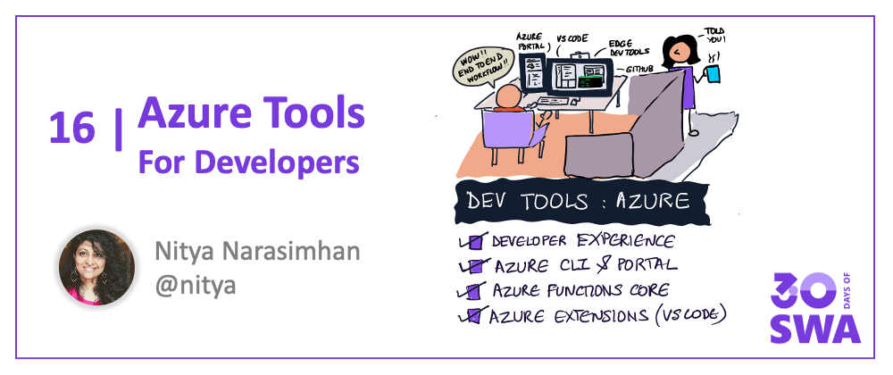
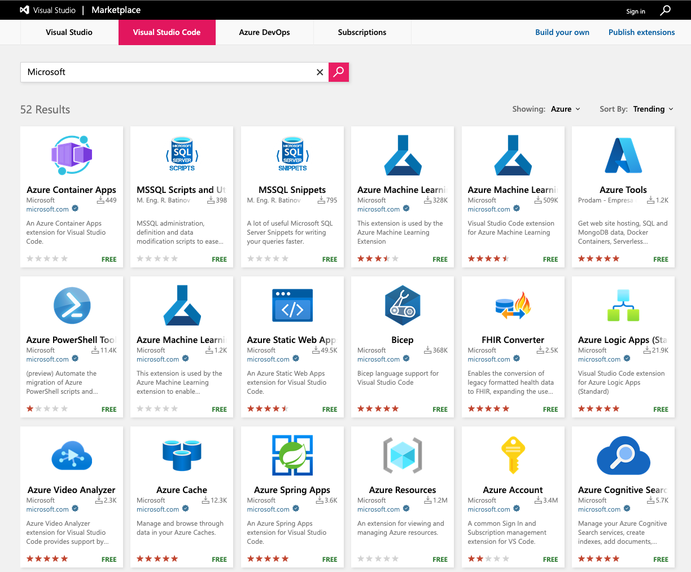

Welcome to `Week 3, Day 1` of **#30DaysOfSWA**!! 

We just crossed the halfway mark on #30DaysOfSWA! We covered core concepts in Week 1, and explored usage examples in Week 2. Today we kick off week 3 with a focus on **_Developer Tools_!** Let's dive in!


## What We'll Cover
 * What does the Developer Experience look like?
 * Explore: Azure CLI
 * Explore: Azure Portal
 * Explore: Azure Core Functions Tools
 * **Exercise:** Explore Azure Portal & CLI docs for SWA.



## Dev Experience

When we think about building a modern web application, we're also thinking about our _developer experience_. By [one definition](https://microsoft.github.io/code-with-engineering-playbook/developer-experience/#defining-end-to-end), developer experience refers to how easy or difficult it is for us, as developers, to perform the required tasks to implement the desired outcome. 

In the case of application development, the tasks often involve:
 * **Building** the project from source (after creating the codebase)
 * **Testing** project behaviors (to validate compliance with requirements)
 * **Deploying** the project (to staging or production environments)
 * **Debugging** the project (to fix issues, audit performance etc.)

Having the right **developer tools** can make all the difference between a productive developer workflow and a painful one. This week, we'll look at the many tools and services available, that make the Azure Static Web Apps Developer Experience more seamless.

 * **Azure Dev Tools |** What are the core tools for working with Azure?
 * **Playwright |** How can we implement end-to-end testing for our app?
 * **CI/CD|** How can we automate build/deploy workflows?
 * **Edge DevTools** How can we debug and profile apps in the browser?
 * **SWA CLI** How can we simplify local development for static web apps?
 * **Visual Studio Code** How can we supercharge our IDE-driven experience?

In today's post we'll look at the main tools that make it easy for modern web application developers to build static web apps on Azure:
 * [Azure CLI](https://docs.microsoft.com/en-us/cli/azure/) - a command-line interface to create and manage Azure resources
 * [Azure Portal](https://docs.microsoft.com/en-us/azure/azure-portal/) - a web-based unified console alternative to the Azure CLI.
 * [Azure SWA CLI](https://github.com/Azure/static-web-apps-cli) - a _local development tool_ for Azure Static Web Apps
 * [Azure Functions Core Tools](https://docs.microsoft.com/en-us/azure/azure-functions/functions-run-local) - a _local development tool_ for Azure Functions.
 * [Azure Extensions for Visual Studio Code](https://code.visualstudio.com/docs/azure/extensions) for seamless access from IDE.

We'll coverAzure SWA CLI and VS Code extensions in greater detail later this week. 

## New to Azure?

We assume you are familiar with cloud computing concepts like resources, resource groups, subscriptions and services. If not, that's okay. Now's a good time to take a detour and explore **[Azure Fundamentals](https://docs.microsoft.com/en-us/learn/paths/az-900-describe-cloud-concepts/)** - a 6-part learning series that will take you through the core concepts, services, solutions, security features, identity & governance aspects, and cost management features available on Azure. 

If you're a JavaScript or Node.js developer new to Azure, bookmark these links:
 * [Azure SDKs](https://azure.github.io/azure-sdk/releases/latest/js.html) for service integrations in your preferred programming language.
 * [Azure for JavaScript Developers](https://docs.microsoft.com/en-us/azure/developer/javascript/) for guides and samples
 * [Tools for JS Developers on Azure](https://docs.microsoft.com/en-us/azure/developer/javascript/node-azure-tools) with [configuration tips](https://docs.microsoft.com/en-us/azure/developer/javascript/core/configure-local-development-environment?tabs=bash)


## Azure CLI

Now that you're familiar with core Azure concepts, let's talk about how you can _create and manage_ your cloud resources on Azure. The **[Azure CLI](https://docs.microsoft.com/en-us/cli/azure/what-is-azure-cli)** is a _cross-platform_ command-line tool that connects you securely to Azure, to execute commands on Azure resources interactively (or via scripts) from a terminal.

The easiest way to familiarize yourself with the Azure CLI commands is to [install and run it in Azure Cloud Shell](https://docs.microsoft.com/en-us/cli/azure/get-started-with-azure-cli#install-or-run-in-azure-cloud-shell) **in your browser** - no local installation needed. Follow [these instructions](https://docs.microsoft.com/en-us/cli/azure/install-azure-cli) to then install it locally in your development environment. Validate your install by testing out the core `az` command.

```bash
az --version
```

There Azure CLI can manage most Azure Services out of the box. Here is **[list of supportred services](https://docs.microsoft.com/en-us/cli/azure/azure-services-the-azure-cli-can-manage)** along with links to quickstart documentation for each. As web developers, you may find the **[web-related subset of services](https://docs.microsoft.com/en-us/cli/azure/azure-services-the-azure-cli-can-manage#web)** worth exploring - everything from App Service and API Management, to Azure Static Web Apps.

Use the following command to get interactive help with supported commands and options in this context.

```
az staticwebapp --help
```

With the CLI you can manage app settings, create and delete static apps, manage the static app's environment and associated functions, oversee information related to identity, users and secrets associated with the app, and more.

 * Explore the **[az staticwebapp](https://docs.microsoft.com/en-us/cli/azure/staticwebapp?view=azure-cli-latest)** reference to learn relevant commands and options.
 * Then **[build your first static web app](https://docs.microsoft.com/en-us/azure/static-web-apps/get-started-cli?tabs=vanilla-javascript)** using the Azure CLI.

## Azure Portal

If you prefer a unified web-based console for managing your Azure resource interactions, the [Azure Portal](https://docs.microsoft.com/en-us/azure/azure-portal/) provides a **graphical user interface alternative to the Azure CLI**. The portal is designed for _continuous availability_. Here's a snapshot of what the Azure Portal layout looks like. Browse the following documents to get a deeper dive into its capabilities:

 * Understand the [components of the Azure Portal](https://docs.microsoft.com/en-us/azure/azure-portal/azure-portal-overview#getting-around-the-portal) in this document.
 * Then learn to [navigate the portal](https://docs.microsoft.com/en-us/learn/modules/tour-azure-portal/3-navigate-the-portal) in this tutorial.
 * Or follow the [Azure Quickstart Center](https://docs.microsoft.com/en-us/azure/azure-portal/azure-portal-quickstart-center) guided tour.
 
Then, try to  **[build your first static web app](https://docs.microsoft.com/en-us/azure/static-web-apps/get-started-portal?tabs=vanilla-javascript)** using the Azure Portal to get hands-on experience with the developer workflow from creation to deployment.


## Functions Core Tools

Azure Static Web Apps uses [Azure Functions](https://docs.microsoft.com/en-us/azure/azure-functions/) to support serverless API capability for the app. Learn more about this in our earlier post on [API-enabling SWA](./2022-05-04.md) where we talked about  _Managed Functions_ (created and managed by Azure Static Web Apps) and _Bring Your Own Functions_ (independently created and managed) options for adding serverless API support to your static web application.

The [Azure Functions Core Tools](https://docs.microsoft.com/en-us/azure/azure-functions/functions-run-local?tabs=v4%2Cmacos%2Ccsharp%2Cportal%2Cbash#install-the-azure-functions-core-tools) - aka `func` - supports **local development** with a command-line tool to create, test, and even deploy, your functions to Azure. Once installed, use the following to get interactive help with the supported commands and options for this tool:

```
func --help
```

You should see something like this **(some output abbreviated for clarity)** giving you a sense of the main operations you can perform from this CLI.

```
Azure Functions Core Tools
Core Tools Version:       4.0.3971 ...
Function Runtime Version: 4.0.1.16815

Usage: func [context] [context] <action> [-/--options]

Contexts:
azure       Commands to log in to Azure and manage resources
durable     Commands for working with Durable Functions
extensions  Commands for installing extensions
function    Commands for creating and running functions locally
host        Commands for running the Functions host locally
kubernetes  Commands for working with Kubernetes and Azure Functions
settings    Commands for managing environment settings for the local Functions host
templates   Commands for listing available function templates

Actions: 
start   Launches the functions runtime host  
    --port [-p]     Local port to listen on. 
                    Default: 7071
..
..
```


Explore the documentation to learn how you can:
 * [Install the Azure Functions Core Tools](https://docs.microsoft.com/en-us/azure/azure-functions/functions-run-local)
 * [Create a local Functions project](https://docs.microsoft.com/en-us/azure/azure-functions/functions-run-local?tabs=v4%2Cmacos%2Ccsharp%2Cportal%2Cbash#create-a-local-functions-project)
 * [Run and test Functions locally](https://docs.microsoft.com/en-us/azure/azure-functions/functions-run-local?tabs=v4%2Cmacos%2Ccsharp%2Cportal%2Cbash#start)
 * [Publish Functions to Azure](https://docs.microsoft.com/en-us/azure/azure-functions/functions-run-local?tabs=v4%2Cmacos%2Ccsharp%2Cportal%2Cbash#publish)

Later this week, we'll do a deep-dive into the **[Azure Static Web Apps CLI](https://github.com/Azure/static-web-apps-cli)** - a local development commandline tool for Azure Static Web Apps, that works seamlessly with the Azure Functions Core Tool, to deliver an unified developer experience for creating and testing your API-enabled Static Web Apps projects.

The combination of **Azure CLI** (to manage Azure resources from command line), **Azure Functions Core Tools** (to manage Azure Functions local development and deploy) and **Azure Static Web Apps CLI** (to manage SWA local development and deploy) provides a seamless command-line driven developer experience for web developers on Azure.

## Azure Extensions

But what if you prefer an IDE-based approach? Visual Studio Code has you covered. In a post Later this week, we'll look in depth at the key Visual Studio Code Extensions you can use, to supercharge your developer experience from code to cloud, right inside the IDE. For now, I'll leave you with these resources:

 * Read the [Azure Extensions](https://code.visualstudio.com/docs/azure/extensions) documentation to learn how to find, and install, relevant extensions in VS Code.
 * Explore the [Deploying Applications To Azure](https://code.visualstudio.com/docs/azure/deployment) page for hands-on tutorials for VS Code - including one for [Azure Static Web Apps](https://docs.microsoft.com/en-us/azure/static-web-apps/getting-started?tabs=vanilla-javascript) and one for [Azure Functions](https://docs.microsoft.com/azure/javascript/tutorial-vscode-serverless-node-01)
 * Search the [VS Code Marketplace](https://marketplace.visualstudio.com/search?term=Microsoft&target=VSCode&category=Azure&sortBy=Relevance) for relevant extensions from both Microsoft and the broader developer community.

Here is a snapshot of extensions currently published by **Microsoft** in the **Azure** category, sorted by **Trending** metrics. You can see the [Azure Static Web Apps Extension](https://marketplace.visualstudio.com/items?itemName=ms-azuretools.vscode-azurestaticwebapps) listed here -- we'll cover that in more detail in the final post of this week!




## Exercise
Wow - we covered a lot today!! But don't worry about having to remember all of it. The goal was to raise awareness of _which_ tool to use, _when_, and _why_. Your exercise today:

*  pick either **Azure Portal** or **Azure CLI** documentation for Azure Static Web Apps, and familiarize yourself with the many commands, settings and options available. 

 * Try the default quickstart for that option - then explore other commands with the deployed Static Web App to get a real sense of how this works.

## Resources
 * [Azure CLI](https://docs.microsoft.com/en-us/cli/azure/) documentation - with [Static Web Apps Quickstart](https://docs.microsoft.com/en-us/azure/static-web-apps/get-started-cli?tabs=vanilla-javascript)
 * [Azure Portal](https://docs.microsoft.com/en-us/azure/azure-portal/) documentation - with [Static Web Apps Quickstart](https://docs.microsoft.com/en-us/azure/static-web-apps/get-started-portal?tabs=vanilla-javascript)
 * [Azure SWA CLI](https://github.com/Azure/static-web-apps-cli) documentation
 * [Azure Functions Core Tools](https://docs.microsoft.com/en-us/azure/azure-functions/functions-run-local) documentation
 * [Azure SDKs](https://azure.github.io/azure-sdk/releases/latest/js.html) for JavaScript and other languages
 * [Azure Extensions for Visual Studio Code](https://code.visualstudio.com/docs/azure/extensions)