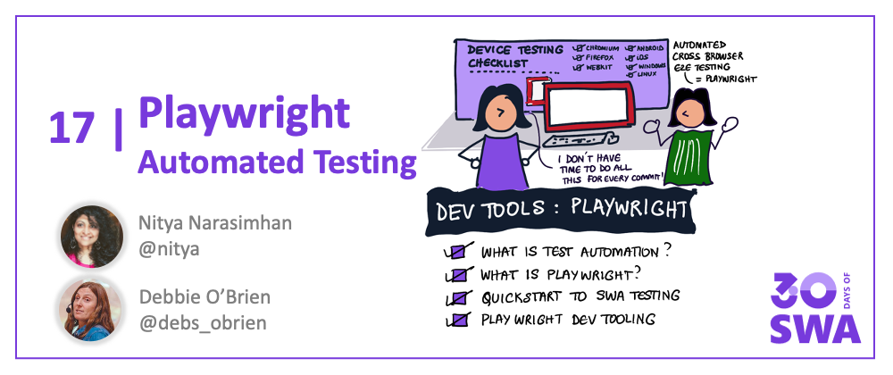
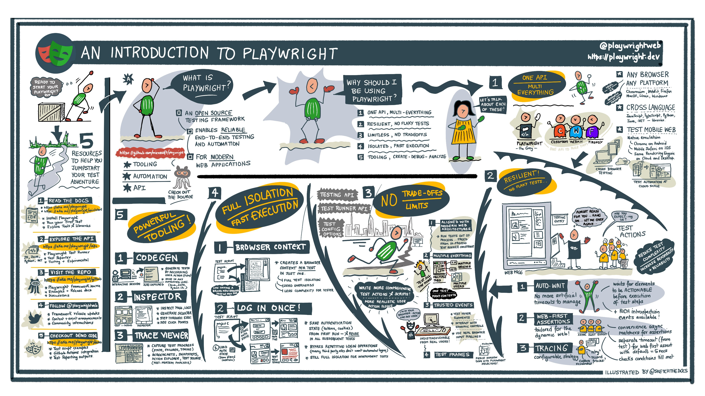
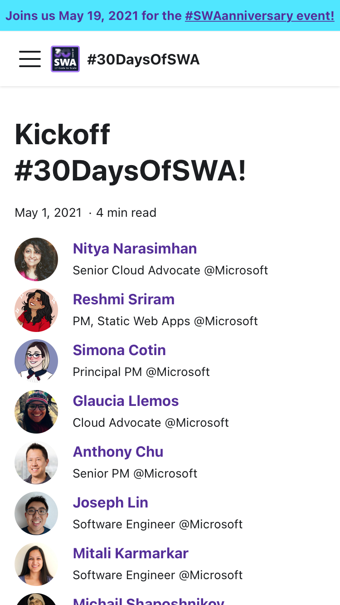

Welcome to `Week 3, Day 2` of **#30DaysOfSWA**!! 

Yesterday we kicked off "Developer Tools" week by talking about the end-to-end developer experience associated with building modern web applications. Today we focus on a key segment - **testing**. Let's look at what test automation means for modern web applications, and how [Playwright](https://www.playwright.dev) can help you automate end-to-end testing of your Azure Static Web App.

## What We'll Cover
 * Test Automation for Modern Web Apps
 * What is Playwright?
 * Get Started With Playwright
 * Explore Playwright Tools
 * Use Playwright with SWA
 * **Exercise**: Try the Tutorial with **your** deployed app.



## Test Automation

Modern mobile web applications have to work correctly and consistently across all modern browsers (like Chromium, Firefox or WebKit) and the device platforms they run on (with varying screen sizes, orientations). Testing your application UI/UX **manually** becomes difficult when we think about the granularity of tests across these combinations. Testing manually becomes impossible when we factor in the frequency at which testing needs to be done to validate these on every code commit or pull request. This is where test automation shines!

Test Automation is about executing tests **automatically** to validate software specs, then using the reported insights to improve software quality iteratively. For web apps, this requires tools that can _automate test actions in the browser_ (web automation) and support this consistently _across browsers_. **[This is where Playwright shines!](https://www.playwright.dev)**
 
## Playwright Overview

Playwright is an open-source framework for **reliable** end-to-end testing of modern web apps. It features a built-in [Playwright Test Runner](https://playwright.dev/docs/1.21/intro) for automating test execution, and supports a [Playwright Library](https://playwright.dev/docs/1.21/library) to simplify integration into third-party solutions.



This visual guide shows the key features of the framework ([downloadable hi-res version here](https://github.com/SketchTheDocs/cloud-skills/blob/main/gallery/Playwright-03-Overview.png)) with these useful features:
 * **Unified API** - you write tests once, they run on all browsers and devices.
 * **Mobile Web Testing** - rich set of device profiles, usable with native emulators.
 * **Multi-Language Support** -  write tests in Java, JS/TS, Python or C#.
 * **Reliable Testing** - no flaky tests thanks to auto-waiting and web-first assertions
 * **Powerful Tooling** - get help authoring, debugging, profiling, and reporting, tests.
 * **Full Isolation** - browser contexts (in just ms), options to parallelize tests

Check out the Playwright [documentation](https://playwright.dev/docs/1.21/intro) and [API](https://playwright.dev/docs/1.21/api/class-playwright) for more details. 

**What kinds of things can we test with Playwright?** 

 * Test if UI component behaviors work as expected (events)
 * Test if UI workflows are correct (navigation, inputs)
 * Test UX behaviors in different contexts (with fixtures)
 * Modify network traffic (auth, proxy etc.) for testing
 * Validate behaviors under network conditions (modified)
 * Validate behaviors for device contexts (emulated profiles)
 * Automate capture of evidence (videos, screenshots) in tests

Explore the **[Guides](https://playwright.dev/docs/1.21/library)** and **[Demo.Playwright](https://github.com/MarcusFelling/Demo.Playwright#run-playwright-example-tests)** for usage examples. And check out **[Debbie's playwright-testing](https://dev.to/debs_obrien/series/17445)** series for more examples of Playwright in action.

## Playwright Quickstart

It's time to get some hands-on experience with Playwright. Check out the [Getting Started](https://playwright.dev/docs/1.21/intro) guide on their site for reference. 

However, we'd like to walkthrough it with a real-world example in mind and figure out how to go from the boilerplate setup to the start of a basic script and configuration that sets us up to do more for testing our Azure Static App.

**#30DaysOfSWA Website Example: Step-by-Step Tutorial**: 

Check out [this repository](https://github.com/fearlessly-dev/30daysofSWA-testing) that I setup today, to use the quickstart guide as a basis for setting up end-to-end testing for the [#30DaysOfSWA](https://aka.ms/30DaysOfSWA) website! The [README](https://github.com/fearlessly-dev/30daysofSWA-testing) documents the following steps in detail:

 * [Setup Testing Repo](https://github.com/fearlessly-dev/30daysofSWA-testing#2-where-should-my-tests-be)
 * [Install Playwright](https://github.com/fearlessly-dev/30daysofSWA-testing#3-how-do-i-install-playwright)
 * [Explore Boilerplate (setup)](https://github.com/fearlessly-dev/30daysofSWA-testing#4-what-did-the-installation-do)
 * [Run Default Test](https://github.com/fearlessly-dev/30daysofSWA-testing#5-what-can-i-do-with-this)
 * [View Generated Test Report](https://github.com/fearlessly-dev/30daysofSWA-testing#6-what-does-the-report-show)
 * [Automate Tests with GitHub Actions](https://github.com/fearlessly-dev/30daysofSWA-testing#7-what-about-those-github-actions)
 * [View Actions-Generated Report Assets](https://github.com/fearlessly-dev/30daysofSWA-testing#8-viewing-actions-generated-reports)
 * [Customize Default Script/Config for *My* App](https://github.com/fearlessly-dev/30daysofSWA-testing/blob/main/README.md#9-lets-customize-the-script)
 * [The Joy Of Trace Logs!!](https://github.com/fearlessly-dev/30daysofSWA-testing/blob/main/README.md#the-joys-of-trace-logs)
 * **You Did It!**

By the end of this tutorial you should have:
 * A starter test script customized for **your** application
 * A test configuration file **with tracing on** to capture detailed profiling data
 * A GitHub Actions workflow that **automates test runs** with each codebase change.


At this point, you are now ready to build on this:
 * add more tests to your `example.spec.js` file => **see: [Playwright Test API](https://playwright.dev/docs/test-annotations)**
 * configure your test run in `playwright.config.js`. => **see:[Configuration Object](https://playwright.dev/docs/test-configuration)**

## Playwright Tooling

In the tutorial above, we mentioned some Playwright tools (CLI, TraceViewer, HTML Reporter, Codegen) in passing. Playwright has a really powerful set of tools that can streamline your end-to-end testing experience from _authoring_ to _reporting_. 

**Start by familiarizing yourself with the [Playwright CLI](https://playwright.dev/docs/cli)**. 

It's the main launching pad for all other command-line utilities. Using the CLI you can navigate to pages (_"open"_), install browser dependencies (_"install"_), take screenshots (_ "screenshot"_), launch the test runner (_"test"_), author tests (_"codegen"_), view traces (_"show-trace"_) and more. 

Launch the CLI as follows:

```
npx playwright <command> [options]
```
Use `npx playwright --help` for details on commands and options supported in your installed CLI version. Want a deeper dive?

 * Check out Nitya's **[Tool Talk Post](https://dev.to/azure/005-tool-talk-hello-command-line-faj)** for detailed coverage.
 * Download this handy **[hi-res visual guide](https://cloud-skills.dev/gallery/Playwright-01-CommandLine.png)** as a cheatsheet
 
**Usage Example**: 

Let's use the `screenshot` command to capture an image of the kickoff post from the #30DaysOfSWA website for an "iPhone 6" device profile. You can see the [named device profiles](https://github.com/microsoft/playwright/blob/f1307f4a4d92490d7d0e7ee5a6a7fe9a22804e86/packages/playwright-core/src/server/deviceDescriptorsSource.json) currently supported for reference.

```
npx playwright screenshot --device "iPhone 6" https://www.azurestaticwebapps.dev/blog/kickoff 30Days.png

Navigating to https://www.azurestaticwebapps.dev/blog/kickoff
Capturing screenshot into 30Days.png
```

| **Result:** This is what the saved image looks like. |
|:--|
|  |


**Then start exploring these tools**: 
 * [Inspector](https://playwright.dev/docs/inspector) - a GUI-based tool for debugging test execution
 * [TraceViewer](https://playwright.dev/docs/trace-viewer) - a GUI-based tool to explore recorded test traces
 * [Codegen](https://playwright.dev/docs/codegen) - an authoring tool to generate tests based on user interactions
 * [Debugging](https://playwright.dev/docs/debug) - additional tools to support runtime debugging
 * [Reporters](https://playwright.dev/docs/test-reporters) - built-in reporters of different types

---

## What's Next

We covered a lot today. 

At this point, you should know what Playwright its, and why it's useful for automating tests for  modern web applications. You should have a sense of the powerful developer tools it has, and understand how to setup and configure it for use with your Azure Static Web App. And you should have a clean basis for building up your test suite.

So where can we go next to skill up? We have you covered:
 * **[Watch this repository](https://github.com/fearlessly-dev/30daysofSWA-testing)** I setup today. I hope to continue adding more tests that can walk through various Playwright features with a deployed SWA,, and use that to explore both the Playwright capabilities and SWA-specific features or usage.
 * **Join us tomorrow** when we explore a "Multi-Stage Deployment with Azure DevOps" demo that shows you a full-stack application with Playwright tests integrated. Learn interesting aspects - like using SWA environment variables to define test parameters - that highlight best practices for test setup in SWA.
 * **Last but not least**, check out this talk from last year for more insights into End-to-End Testing for Playwright from the Azure Static Web Apps Team.

    <iframe  width="560" height="315" frameborder="0"  src="https://aka.ms/docs/player?ev=learn-tv-static-web-apps-code-to-scale&session=end-to-end-testing-with-playwright"></iframe>


## Exercise

Pick one of the apps you've built (or use) - preferably one that is currently deployed to Azure Static Web Apps so you can explore other scenarios later.

[Walk through the same steps](https://github.com/fearlessly-dev/30daysofSWA-testing) with **your** deployed app - then try adding one new test script that goes beyond the starter test case. Look at the [demo](https://github.com/MarcusFelling/Demo.Playwright) project for inspiration!