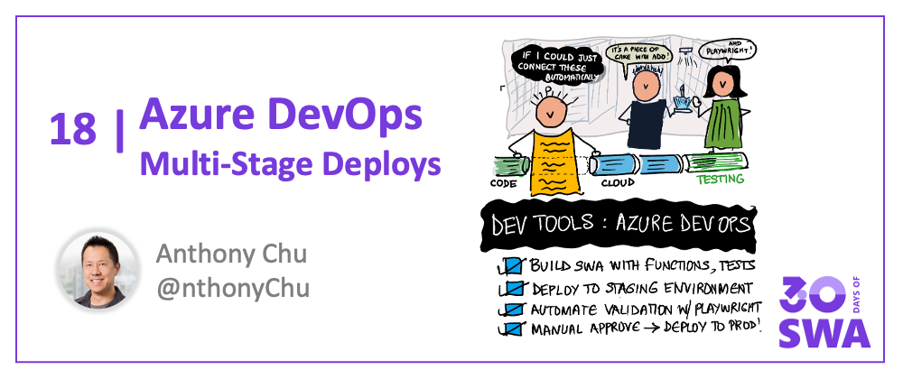

<head>
  <meta name="twitter:url" content="https://www.azurestaticwebapps.dev/blog/devtools-ado" />
  <meta name="twitter:title" content="#17: Multi-Stage Deployments With Azure DevOps" />
  <meta name="twitter:description" content="Join @nthonyChu on #30DaysOfSWA as he walks us through multi-stage deployments of @AzureStaticApps using @AzureDevOps - with @PlaywrightWeb testing integrated!" />
  <meta name="twitter:image" content="https://www.azurestaticwebapps.dev/assets/images/17-banner-2d8ecefdc1683370295255b3fa8a0df3.png" />
  <meta name="twitter:card" content="summary_large_image" />
  <meta name="twitter:creator" content="@nitya" />
  <meta name="twitter:site" content="@AzureStaticApps" /> 
  <link rel="canonical" href="https://techcommunity.microsoft.com/t5/apps-on-azure-blog/multi-stage-azure-static-web-apps-deployments-with-azure-devops/ba-p/3390625" />
</head>


Welcome to `Week 3, Day 3` of **#30DaysOfSWA**!! 

:::info From Microsoft Tech Community
Check out the canonical version of this post on the **[Apps On Azure](https://techcommunity.microsoft.com/t5/apps-on-azure-blog/multi-stage-azure-static-web-apps-deployments-with-azure-devops/ba-p/3390625)** Tech Community Blog along with other articles on the topic of **[Web Apps](https://techcommunity.microsoft.com/t5/apps-on-azure-blog/bg-p/AppsonAzureBlog/label-name/Web%20Apps)**
:::


## What We'll Cover
 * Build SWA with Azure Functions API + Playwright Tests
 * Deploy SWA to staging environment
 * Automate validation of staged app with Playwright
 * Wait for manual approval
 * Deploy to production
 * **Exercise.** Explore the [Demo Application Source](https://github.com/anthonychu/swa-devops-pipeline-demo) and try it out!



Azure Static Web Apps recently introduced the ability to automatically configure an Azure DevOps pipeline to build and deploy your app. It's a great way to get your app up and running quickly.

<iframe width="560" height="315" src="https://www.youtube.com/embed/4JkfeZp7aDk" title="YouTube video player" frameborder="0" allow="accelerometer; autoplay; clipboard-write; encrypted-media; gyroscope; picture-in-picture" allowfullscreen></iframe>

For production applications, it's common to first deploy an app to staging environment(s) prior to deploying to production. In this article, we'll walk through how to configure a robust Azure DevOps pipeline that will:

- Build an app, Azure Functions API, and Playwright tests
- Deploy the app to a staging environment
- Automatically validate the staging app with the Playwright tests
- Wait for a manual approval
- Deploy your app to production

## Sample application

We'll use a .NET 6 full-stack application. 

- Frontend: Blazor WebAssembly
- Backend: Azure Functions
- Tests: Playwright

To follow along, import the repository into your Azure DevOps project. You can use similar steps for a Node.js app.

:::info **Source Code Available**
Check out the code at: **[@anthonychu/swa-devops-pipeline-demo](https://github.com/anthonychu/swa-devops-pipeline-demo)**.
:::


## Create a static web app and deployment pipeline

Recently, Azure Static Web Apps added the ability to [generate an Azure DevOps pipeline](https://docs.microsoft.com/azure/static-web-apps/get-started-portal?pivots=azure-devops) to deploy your app.

You can create a static web app and the deployment pipeline in a single step.

1. In the Azure portal, search for and create a new static web app.

1. During the creation process, select "Azure DevOps" as the deployment source and select the DevOps repository and branch that contains the app.

    

1. In the build presets, select "Blazor". The pre-populates the app and API folder locations.

    

When you create the app, a new pipeline YAML file will be created in the repository. It'll automatically run. It takes a few minutes to build and deploy the app.


Open the pipeline YAML file in your browser or locally in an editor to see its contents. It contains a single `AzureStaticWebApp` task that automatically builds and deploys the app.

## Create Azure Pipelines environments

Azure Pipelines allows you to define environments. Environments are useful for adding manual approvals to your pipeline.

We'll create two environments — Staging and Production. They'll correspond to the two Azure Static Web Apps environments we'll deploy to.

To create a Pipelines environment, select "Environments" under Pipelines.


Create one named "Staging". Because you don't need a manual approval for this stage, you don't to configure anything else.

Next, create a new environment named "Production". Because we want to require a manual approval before deploying to production, you can configure the environment to require a manual approval.

1. In the environment's "Approvals and checks", select "Approvals".

1. Add yourself as an approver and create the approval policy.


The pipeline you'll update later will reference these environments.

## Protect Azure Static Web Apps environments with a password

Azure Static Web Apps provides preview environments to let you test out your app before deploying to production.

Preview environments were intially available for pull requests in GitHub. Recently, Static Web Apps introduced the ability to arbitrary define [named preview environments](https://docs.microsoft.com/azure/static-web-apps/named-environments). For instance, we can create an environment named "Staging".

Preview environments are public by default. This is great for open source projects, but sometimes we want to protect them from public access.

You can add password protection to your app's preview environments.

1. In the Azure portal, open your static web app.

1. In "Configuration", select the "General settings" tab.

1. Select "Protect staging environments only" and enter a password.

    

You also have the option to protect all environments. But in this app, we want the production environment to be accessible to the public.

## Configure the multi-stage pipeline

Now that we've configured the Azure Pipelines environments and password protection, we can configure the pipeline.

Open the pipeline YAML file in your browser or locally in an editor. Replace its contents the contents of [this file](https://github.com/anthonychu/swa-devops-pipeline-demo/blob/main/azure-pipelines.yml).

We'll walk through the different parts of the pipeline. It has 3 main stages: build, deploy to staging, and deploy to production.

### Stage 1: build the app

```yaml
trigger:
- main

pool:
  vmImage: ubuntu-latest

stages:

- stage: Build

  jobs:
  - job: build
    displayName: Build app

    steps:
    
    - task: UseDotNet@2
      displayName: Install .NET SDK
      inputs:
        packageType: 'sdk'
        version: '6.0.x'
        
    - script: |    
        dotnet publish -c Release -o "$(Build.ArtifactStagingDirectory)/frontend"
      displayName: Build Blazor frontend
      workingDirectory: $(System.DefaultWorkingDirectory)/Client
      
    - script: |  
        dotnet publish -c Release -o "$(Build.ArtifactStagingDirectory)/api"
      displayName: Build Azure Functions API
      workingDirectory: $(System.DefaultWorkingDirectory)/Api
      
    - script: |
        dotnet build -c Release -o "$(Build.ArtifactStagingDirectory)/tests"
      displayName: Build Playwright tests
      workingDirectory: $(System.DefaultWorkingDirectory)/PlaywrightTests

    - task: PublishBuildArtifacts@1
      displayName: Publish artifacts
      inputs:
        PathtoPublish: '$(Build.ArtifactStagingDirectory)'
        ArtifactName: 'drop'
        publishLocation: 'Container'
```

The pipeline triggers on any changes to the `main` branch. If your app uses a different branch, you can change it.

The pipeline then builds the app, Azure Functions API, and Playwright tests. It then outputs the artifacts. The same build artifacts are deployed to all environments. This ensures that the app you tested in other environments is the same one you're deploying to production.

### Stage 2: deploy to staging and run Playwright tests

```yaml
- stage: deploy_staging
  displayName: Deploy to staging

  jobs:
    - deployment: deploy
      displayName: Deploy and test
      environment: Staging
      variables:
      # Change the variable group name to match the one in the generated pipeline
      - group: Azure-Static-Web-Apps-calm-coast-0df39b910-variable-group
      strategy:
        runOnce:
          deploy:
            steps:

            - download: none
            - checkout: none

            - task: DownloadBuildArtifacts@1
              displayName: Download artifacts
              inputs:
                buildType: current
                downloadType: single
                artifactName: drop
                downloadPath: $(System.ArtifactsDirectory)

            - task: AzureStaticWebApp@0
              displayName: Deploy to staging environment
              inputs:
                app_location: frontend/wwwroot
                api_location: api
                skip_app_build: true
                skip_api_build: true
                verbose: true
                azure_static_web_apps_api_token: $(AZURE_STATIC_WEB_APPS_API_TOKEN_CALM_COAST_0DF39B910)
                deployment_environment: staging
                workingDirectory: $(System.ArtifactsDirectory)/drop

            - task: UseDotNet@2
              displayName: Install .NET SDK
              inputs:
                packageType: 'sdk'
                version: '6.0.x'

            - script: |
                chmod -R a+x $(System.ArtifactsDirectory)/drop/tests
                sudo --preserve-env=PLAYWRIGHT_BROWSERS_PATH pwsh $(System.ArtifactsDirectory)/drop/tests/playwright.ps1 install --with-deps chromium
                dotnet test $(System.ArtifactsDirectory)/drop/tests/PlaywrightTests.dll --logger trx
              displayName: Run Playwright tests on staging app
              env:
                PLAYWRIGHT_BROWSERS_PATH: $(Build.SourcesDirectory)/browsers
                LOGIN_PASSWORD: $(LOGIN_PASSWORD)
            
            - task: PublishTestResults@2
              condition: succeededOrFailed()
              inputs:
                testRunner: VSTest
                testResultsFiles: '**/*.trx'
```

This is the most complex stage. Note that it references the "Staging" environment we created in the Azure Pipeline. It also references the variable group that was automatically generated when the static web app was first created. Change its name to match the variable group in the generated pipeline.

This stage starts by downloading the artifacts from the build stage.

Next, it uses the `AzureStaticWebApp` task to deploy the app to the staging environment.

- `skip_app_build` and `skip_api_build` are set to `true` because the app and API artifacts were already built and don't need to be built again.
- `deployment_environment` is set to `staging` because we want to deploy to the staging environment.

After the app is deployed, the pipeline installs the .NET SDK and runs a script that installs the required dependencies for Playwright. Playwright is a testing framework that automates running tests in a browser.

After the dependencies are installed, the script runs the Playwright tests using the `dotnet test` command.

One thing to note is that we need to configure a secret variable named `LOGIN_PASSWORD`. This is the password that the user will enter when they log into the staging environment. The Playwright tests will use this password to log in when it runs tests on the staging environment.

The last step in the stage publishes the test results.

### Stage 3: deploy to production

```yaml
- stage: deploy_production
  displayName: Deploy to production

  jobs:
  - deployment: deploy
    displayName: Deploy
    environment: Production
    variables:
    # Change the variable group name to match the one in the generated pipeline
    - group: Azure-Static-Web-Apps-calm-coast-0df39b910-variable-group
    strategy:
      runOnce:
        deploy:
          steps:
          - download: none
          - checkout: none

          - task: DownloadBuildArtifacts@1
            displayName: Download artifacts
            inputs:
              buildType: current
              downloadType: single
              artifactName: drop
              downloadPath: $(System.ArtifactsDirectory)

          - task: AzureStaticWebApp@0
            displayName: Deploy to production environment
            inputs:
              app_location: frontend/wwwroot
              api_location: api
              skip_app_build: true
              skip_api_build: true
              verbose: true
              azure_static_web_apps_api_token: $(AZURE_STATIC_WEB_APPS_API_TOKEN_CALM_COAST_0DF39B910)
              workingDirectory: $(System.ArtifactsDirectory)/drop
```

This stage references the "Production" environment in the Azure Pipeline. Because we configured this environment to require approval, this will trigger a manual approval step before this stage is run.

Like the previous stage, this stage downloads the artifacts and deploys them with the `AzureStaticWebApp` task. This time, no `deployment_environment` is set because we want to deploy to the production environment of the static web app.

## Run the multi-stage pipeline

Now that the pipeline is set up, you can run it by saving the file. If you edited it locally, don't forget to push it to your Azure DevOps repo.

After the "Deploy to staging" stage is run, you should see that the Playwright tests have been run to validate the staging environment and the results are published.


The pipeline run is paused because the "Deploy to production" stage requires an approval. 


When you approve the pipeline, the pipeline will run again.

After approval, the app is deployed to production.

## A closer look

Before we end this article, we want to dive a bit deeper into the Static Web Apps environments and the Playwright tests.

### Azure Static Web Apps environments

To see the environments you've created, click your static web app's "Environments" tab in the Azure portal. You should see the production and staging environments.


### Playwright tests

The Playwright tests are located in the `PlaywrightTests` project and they're written in C#.

[Playwright](https://playwright.dev) can be used to automate testing of web apps using real browsers. The tests in the example use Chrome (Chromium), but Playwright also supports Firefox, WebKit, and Microsoft Edge.

This is an example of a Playwright test in C#. It navigates the browser to the app's homepage, clicks on the "Fetch data" link, and confirms that the data is fetched from the backend API and it is rendered successfully.

```csharp
[Test]
public async Task ShouldLoadWeather()
{
    await using var browser = await Playwright.Chromium.LaunchAsync();
    var page = await browser.NewPageAsync();
    await GoToHomePage(page);

    await page.ClickAsync("a[href='fetchdata']");

    var h1 = await page.QuerySelectorAsync("div#app main h1");
    var h1Text = h1 == null ? "" : await h1.TextContentAsync();
    Assert.AreEqual("Weather forecast", h1Text);

    var rowsSelector = "div#app main table tbody tr";
    // wait for table to have rows
    await page.WaitForFunctionAsync($"document.querySelectorAll('{rowsSelector}').length");
    var rows = await page.QuerySelectorAllAsync(rowsSelector);
    Assert.AreEqual(5, rows.Count);
}
```

The tests use the `AZURESTATICWEBAPP_STATIC_WEB_APP_URL` environment variable to determine the URL of the app to test. In an Azure Pipeline, this variable is set by the Azure Static Web Apps task after a successful deployment. Because the tests run in the pipeline after a deployment to the staging environment, the variable contains the URL of the staging Static Web Apps environment.

Another interesting aspect of the tests is the following code for navigating to the homepage:

```csharp
private async Task GoToHomePage(IPage page)
{
    await page.GotoAsync($"{siteBaseUrl}/");
    var homePageLocatorTask = page.Locator("text=Hello, world!").WaitForAsync();
    var passwordPageLocatorTask = page.Locator("text=Password protected").WaitForAsync();
    var isPasswordPage = (await Task.WhenAny(homePageLocatorTask, passwordPageLocatorTask)) == passwordPageLocatorTask;

    if (isPasswordPage)
    {
        System.Console.WriteLine("Found password page, logging in...");
        var passwordInput = await page.QuerySelectorAsync("input[type=password]");
        if (passwordInput == null)
        {
            throw new Exception("Could not find password input");
        }
        await passwordInput.TypeAsync(sitePassword);
        await page.ClickAsync("button");
        await page.Locator("text=Hello, world!").WaitForAsync();
    }
}
```

This code automatically logs in to the staging environment if the browser session is unauthenticated. At run-time, the `sitePassword` variable is set to the value of the `LOGIN_PASSWORD` secret variable.

## Summary

With the addition of features like named preview environments and automatic pipeline generation, it's now possible to configure complex, robust pipelines for building and deploying to Azure Static Web Apps from Azure DevOps.

---

## Exercise

The demo uses a .NET 6 full-stack application with a Blazor WebAssembly frontend, an Azure Functions backend, and integrated Playwright tests. 

 * Explore [the source code here](https://github.com/anthonychu/swa-devops-pipeline-demo).
 * Import the repository into your Azure DevOps project and follow the tutorial.


## Resources

* [Video](https://youtu.be/4JkfeZp7aDk): Multi-environment deployments with Azure DevOps & SWA
* [Repo](https://github.com/anthonychu/swa-devops-pipeline-demo) with source code for demo