<head>
  <meta name="twitter:url" content="https://www.azurestaticwebapps.dev/blog/devtools-msedge" />
  <meta name="twitter:title" content="#18: Debug with Edge DevTools" />
  <meta name="twitter:description" content="Join @patrickbrosset on #30DaysOfSWA to explore Debugging, Perf, #Accessibility for @AzureStaticApps using @MSEdgeDev #DevTools on @code" />
  <meta name="twitter:image" content="https://www.azurestaticwebapps.dev/assets/images/18-banner-3c83eb95b9d1aabe5f27d4282c5423ad.png" />
  <meta name="twitter:card" content="summary_large_image" />
  <meta name="twitter:creator" content="@nitya" />
  <meta name="twitter:site" content="@AzureStaticApps" /> 
  <link rel="canonical" href="https://www.azurestaticwebapps.dev/blog/devtools-msedge" />
</head>

Welcome to `Week 3, Day 4` of **#30DaysOfSWA**!!

:::info GLOBAL ACCESSIBILITY AWARENESS DAY
Did you know today is [Global Accessibility Awareness Day](https://accessibility.day/) - a day where we think about **digital accessibility** and what it means to make the web experience inclusive and friendly to everyone! 

Visit the [Accessbility in Microsoft Edge](https://docs.microsoft.com/en-us/microsoft-edge/accessibility/) documentation to learn best practices around designing, building, and testing, your modern websites for accessibility.
:::


As we'll learn in a post later this week (stay tuned!), using the [Azure Static Web Apps extension for VS Code](https://marketplace.visualstudio.com/items?itemName=ms-azuretools.vscode-azurestaticwebapps) makes it quick to create and manage your Web Apps directly from VS Code. 
_But what about the other aspects of your developer experience - like debugging your web app or profiling its performance in the browser?_

**As a web developer, it's important to minimize context switching.** 

The fewer tools you need to use to do your job, the better. This way you can stay focused on the tasks at hand more easily, without having to constantly deal with multiple tools and windows on your computer. You become more productive when the tools you rely on work better together.

## What We'll Cover

* Getting started with the **Edge DevTools** VS Code extension
* Seamless **debugging** experiences for your front-end app.
* Discovering some of the DevTools **accessibility** tools.
* Discovering some of the DevTools **performance improvement** tools.
* **Exercise:** Install the Edge DevTools VSCode Extension and try these features out!

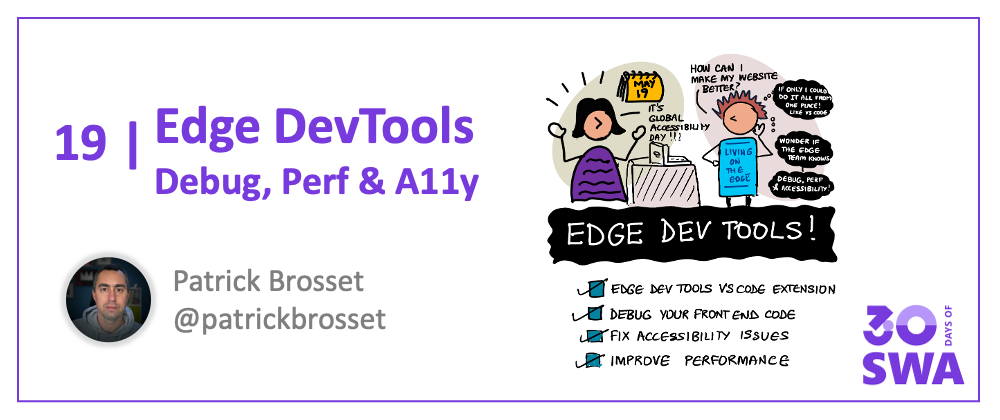

## Debug front-end code from VS Code

After you've created your SWA and have started adding more functionality to it, there will come a time when debugging your front-end code may become useful. Maybe you've added some JavaScript front-end logic that needs debugging, or maybe you've added new CSS layout code that needs inspecting.

The DevTools built in to your favorite browser come in very handy at this point. But, having to switch between your source files in your editor and your browser window to do the debugging can quickly become frustrating. It's also prone to errors as there aren't great solutions to move the tweaks you do in DevTools back to your editor.

One tool that can help a lot here is the **[Microsoft Edge Developer Tools extension for VS Code](https://marketplace.visualstudio.com/items?itemName=ms-edgedevtools.vscode-edge-devtools)**. This extension gives you DevTools in VS Code directly.

:::info Edge DevTools For Visual Studio Code v2 Just Released!
[**Read this post**](https://dev.to/codepo8/edge-devtools-for-visual-studio-code-v2-1bp3) to learn about improvements and new features like _Screencast with emulation support_, _Sourcemap support for styles_ and more!
:::

With this extension, the **Elements** and **Network** are embedded directly within VS Code, your **Console** messages appear in the VS Code console, issues detected by the Edge **Issues** panel are highlighted in your source code directly, and you get a live preview of your web app's front-end right in VS Code!

Finally, as you tweak your CSS code from within the **Styles** panel, your changes are automatically applied to your source files, even if you use a CSS pre-processor.

<!-- Insert Chris' video here -->

### Get started with Edge DevTools VS Code extension

First let's install the extension, right from VS Code.

1. In VS Code, open the **Extensions** sidebar, and search for "Edge Tools".
1. The **Microsoft Edge Tools for VS Code** extension should be listed. Click the **Install** button and wait for the process to end.

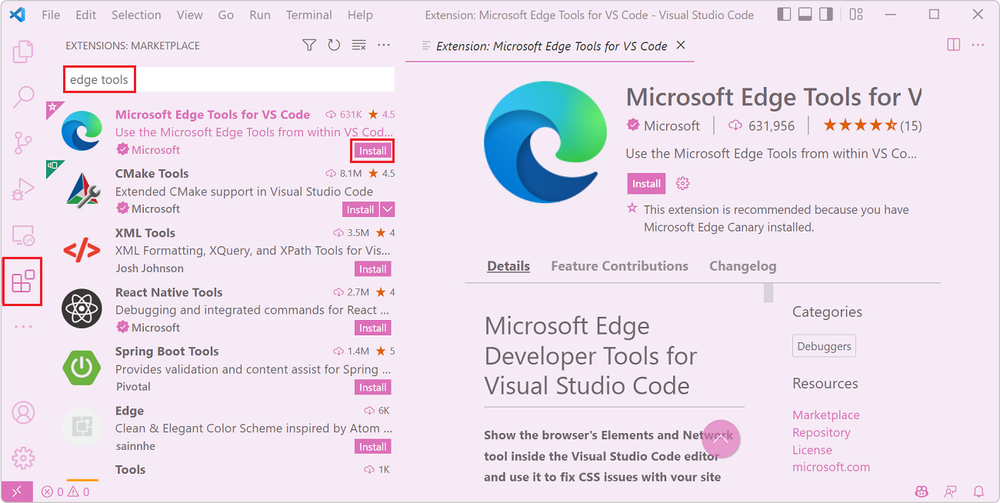

Once installed, the extension appears as a new icon in the **Activity bar** which gives you access to useful features. Let's jump straight in and make use of the most useful feature: generating a `launch.json` configuration file for your project.

1. Click the **Microsoft Edge Tools** extension icon in the **Activity bar**.
1. Click **Generate launch.json**. A file appears in VS Code with some useful configuration details we can tweak.

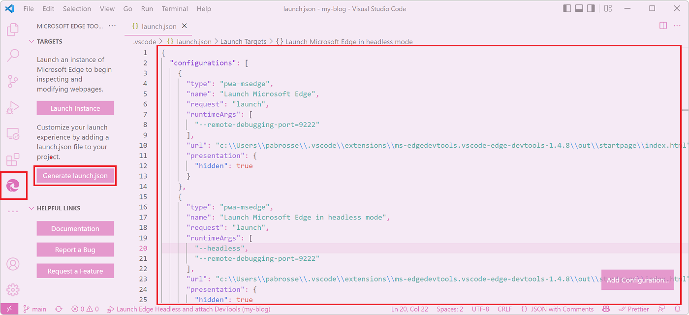

The most important configuration you should change now is the `url` and perhaps add a `preLaunchTask` if you need to.

I'll use my blog to illustrate the changes here. In this project, I have a build task configured that generates the HTML code for my blog from markdown, watches for changes in files, and serves the resulting site from HTTP port 8080.

So, in my case, I'll update the **Launch Microsoft Edge in headless mode** configuration in `launch.json` to this:

```json
{
  "type": "pwa-msedge",
  "name": "Launch Microsoft Edge in headless mode",
  "request": "launch",
  "runtimeArgs": [
    "--headless",
    "--remote-debugging-port=9222"
  ],
  "preLaunchTask": "npm: serve",
  "url": "http://localhost:8080",
  "presentation": {
    "hidden": true
  }
}
```

When this launch configuration is used, it will build my blog from source code, serve it on a local server, open the browser directly within VS Code, and the DevTools panels alongside it. Let's test it! Click on **Launch Project** in the **Microsoft Edge Tools** extension to get everything running.

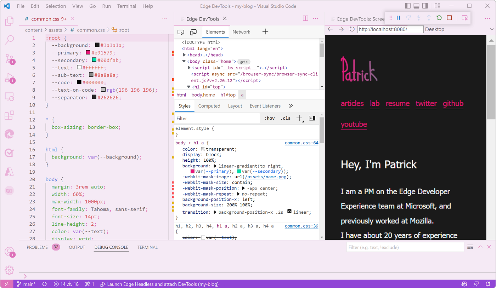

Now try to apply this to your own project, changing the configuration to match your needs. Next, we'll review the most useful features of the extension.

### Mirror CSS changes to source files

Tweaking CSS properties in DevTools is great because you get a live preview of your changes on the web page, and with the **Microsoft Edge Tools** extension, you also get mirroring of your changes right back to the corresponding source file. This way, you don't need to remember all of the changes you made and manually apply them to your editor. The extension is able to figure out the mapping between the live CSS code and the source files in your project.

Changing CSS code in the **Styles** panel automatically opens the corresponding source file and applies the same change.

Note that the extension does not save the CSS source file for you. You can keep on tweaking CSS in DevTools and, only once you're ready, save the changes made by the extension in the source file on your behalf.

You can learn more about CSS mirroring in the [Microsoft Edge DevTools extension docs](https://docs.microsoft.com/microsoft-edge/visual-studio-code/microsoft-edge-devtools-extension#syncing-live-changes-from-the-styles-tool-by-using-css-mirror-editing).

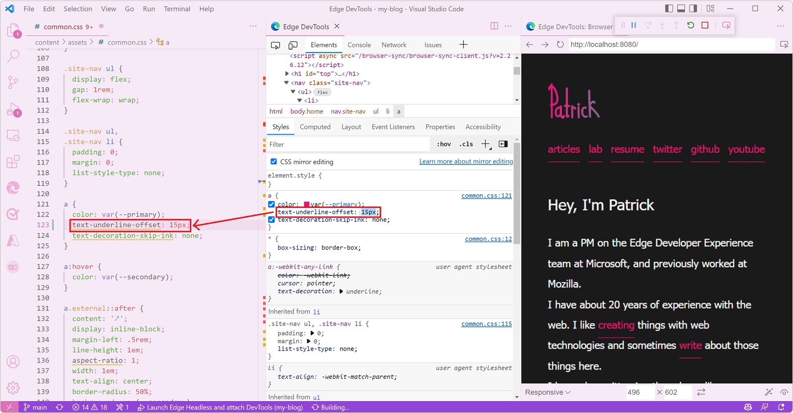

### Find issues with your code

Edge DevTools comes with a built-in **Issues** tool that provides useful information about the inspected web page. For example, it can report on browser compatibility, accessibility, or security issues.

The **Microsoft Edge Tools** extension in VS Code provides the same feature, but integrated right into your source code. For example, browser compatibility warnings are highlighted in your CSS source code with squiggly lines, and hovering over the highlight reveals more information about the issue.

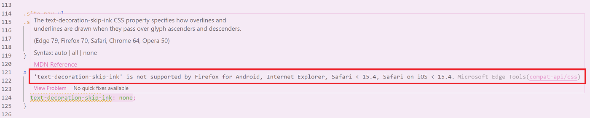

You can also review all issues at once by opening the **Problems** panel in VS Code's bottom drawer.

You can learn about other ways to find issues with your code in the [Microsoft Edge DevTools extension docs](https://docs.microsoft.com/microsoft-edge/visual-studio-code/microsoft-edge-devtools-extension#inline-and-live-issue-analysis).

### Get your console messages

The **Microsoft Edge Tools** extension in VS Code also integrates the very popular **Console** tool. People rely on the console all the time when debugging their code.

Because the extension also works with the built-in VS Code JavaScript debugger, that means you can debug your front-end JavaScript code in VS Code as normal, and see your console logs in DevTools right next to you.

## Learn about other DevTools features

As we've just seen, the **Microsoft Edge Tools** extension is very helpful. It caters for most web development tooling needs, while ensuring you have a seamless experience without having to leave VS Code.

But there's more to the Edge DevTools available in the browser (the tools you get when you press **F12**) that's not yet available within the VS Code extension version.

Building a great SWA means building a great web app first and foremost and while learning the ins and outs of SWA is very important, learning about how to build a performant and accessible web experience for all your users is also crucial.

Let's discover a few tools and features of DevTools that can help you with this.

### Fix accessibility issues

Every year the [WebAIM organization](https://webaim.org/) publishes a report of the most common website issues that create accessibility problems for people. Sadly, every year the result is quite depressing. You can read the [WebAIM Million 2022 report](https://webaim.org/projects/million/).

On the bright side though, the most common accessibility issues can be detected and solved easily with DevTools! So let's learn about some of the features that can help create more accessible web experiences for all.

The most common accessibility problem out there is low contrast text. If the contrast ratio between the text color and the color of the background behind it is too low, then people might not be able to read the text at all. The color picker in DevTools is a great way to detect these problems.

1. Right-click a piece of text on your web page and select **Inspect**.
1. In the **Styles** tab, find the **color** CSS property that defines which color the text is, and click the colored square next to it.
1. Review the **Contrast ratio** in the color picker. Your goal is to have 2 check marks next to it, meaning that the contrast ratio meets the recommendation.

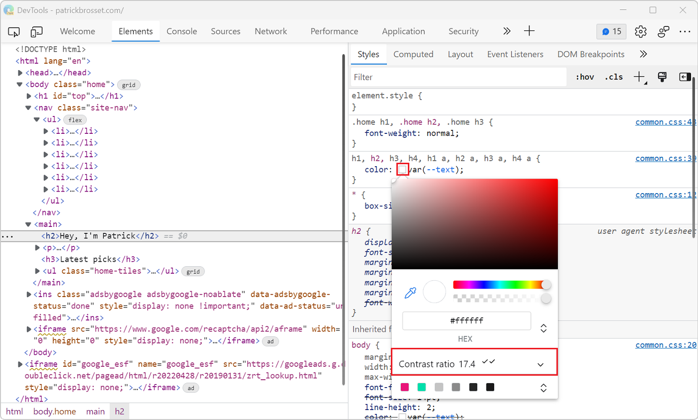

If the text doesn't have enough contrast, then you can fix the problem right here in DevTools.

1. Click the **show more** arrow next to the **Color contrast** value to reveal more information. Two lines will appear in the color picker.
1. Use these lines to choose a color that meets the recommendation.

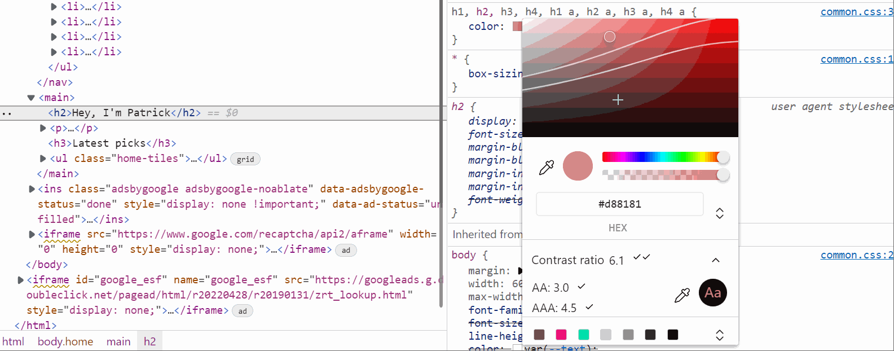

Another very common accessibility problem is missing alternative text for images (or alt text). Alt text helps users of screen readers perceive the content of an image, but it also important for cases where users decide to disable images, or when images fail to load, and even for search engine optimization. And, DevTools can detect missing alt text automatically! So there's really no excuses for not writing great textual substitute for your images.

1. Open DevTools by pressing **F12**.
1. Click **More Tools** (**+**) in the main toolbar at the top and select the **Issues** tool from the list.
1. Check if the list of issues contains an **Accessibility** category. If it does, check for **Images must have alternate text** warnings.
1. Open one of the warnings, review the problem, and click **Open in Elements** to see the problem directly in the **Elements** tool.

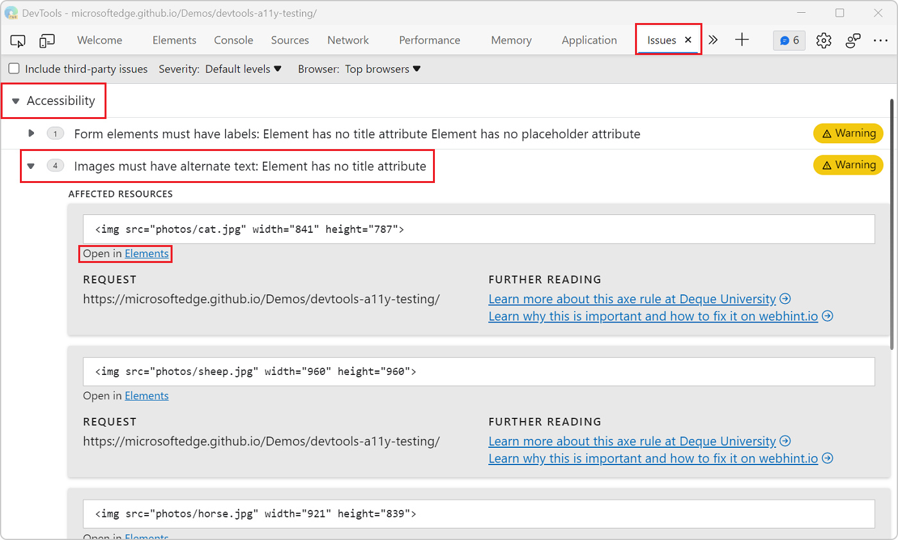

Now let's talk about source order. The order in which assistive technology (such as screen readers) navigates a page is linked to the order in which the various elements appear in the document source code. Now, this order might be very different from the order in which the elements appear, visually, on the screen. Using CSS, you can re-order things visually, without changing the document source order.

So, to make sure the document navigation makes sense to all, even to users of assistive technology, it is important to check that the source order itself makes sense.

Edge and Chrome DevTools have a **Source Order Viewer** feature that helps with this.

1. Open DevTools by pressing **F12**.
1. Open the **Elements** tool and select a layout element which you want to check the source order in.
1. Click **Accessibility** in the tool's sidebar.
1. At the bottom of the **Accessibility** pane, select the **Show source order** checkbox. An overlay appears showing the source order with numbers.
1. Keep selecting different elements in the DOM tree to review their source order.

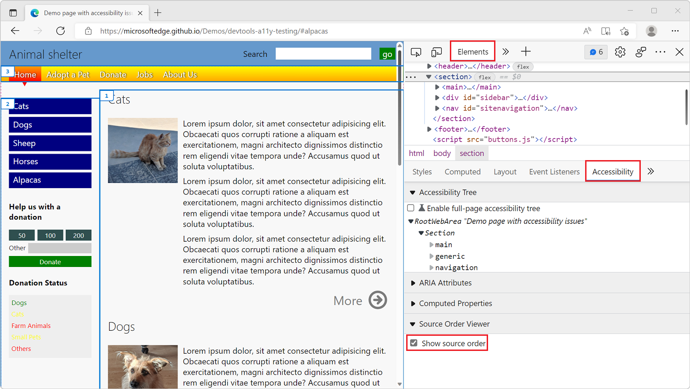

### Improve performance

Great performance can have a very positive impact on your website. A page that appears fast and responds to user actions instantly can impact user retention, engagement, and even revenue.

Performance improvement work can be daunting, but there are two useful tools in DevTools that can ease the pain: the **Performance** tool and the **Detached Elements** tool.

Let's start with the **Performance** tool. You'll find one in all browser DevTools, Edge, Chrome, Firefox, or Safari. They're all a little bit different, but at their core give you ways to understand the runtime performance of the inspected web page over a given period of time.

To use the tool in Edge:

1. Open DevTools by pressing **F12**.
1. Click **Performance** in the main toolbar at the top (you might have to click on the **More tabs** (**>>**) button first if the tab isn't visible.
1. Click the **Record** button.
1. Use the web page as a normal user would.
1. Stop the recording with the **Stop** button.

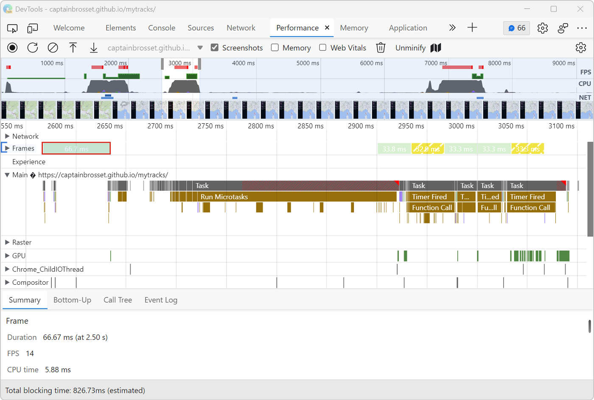

The **Performance** tool can tell you how busy (or idle) the browser was with things like running JavaScript code, reacting to user events, and re-rendering the page during the recording period. So it's a great way to find bottlenecks in your site's performance and therefore know what fixes would give the best bang for your bucks.

One example, if your site does a lot of animations and other visual things, is that the tool can report on frames per second (FPS) and alert you when the rate drops too low and could impact the user experience.

The **Performance** tool has a lot of functionality packed into a small user interface, so it can be important to go through its documentation to understand what everything does. To learn more, check out [Get started analyzing runtime performance](https://docs.microsoft.com/microsoft-edge/devtools-guide-chromium/evaluate-performance/)

Another important performance aspect is memory. How much memory your site uses of what's available, and whether it keeps on using more and more memory over time can make your site, and even the entire computer, run slow.

One type of memory leaks is DOM leaks, where the front-end JavaScript code does a lot of DOM node manipulation and, in the process, keeps references to more and more DOM nodes it doesn't need any longer. As the complexity of your app or site grows, it gets easier to make mistakes and introduce these types of memory leaks by accident.

Edge comes with a tool called **Detached Elements** which is great for investigating this type of memory leaks. Knowing that you have a leak isn't too hard, but knowing where it originates from can feel like playing hide-and-seek in the dark. The **Detached Elements** tool points at DOM nodes that are still around in memory but not used in the page, and tells you which part of your code still references them. This way you can take a look at your code, and decide whether these nodes are, indeed, being leaked and need to be destroyed, potentially saving a lot of memory and improving performance.

To use the tool in Edge:

1. Open DevTools by pressing **F12**.
1. Click **More Tools** (**+**) in the main toolbar at the top and select the **Detached Elements** tool from the list.
1. Click the **Get detached elements** button to list the DOM nodes in memory that aren't used in the page.
1. You can then use the app as a user would, and keep clicking that button to update the list. You can also click the **Collect garbage** button to force the browser to run its garbage collection mechanism, to see if some nodes have been collected in the meantime.

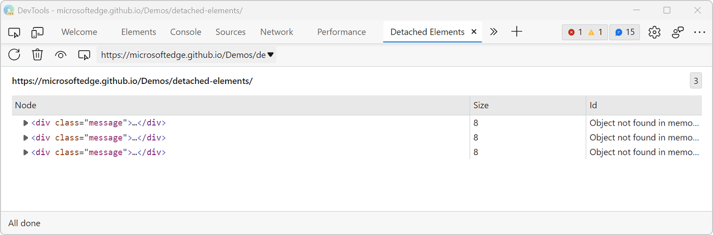

This should already give you a pretty good idea of where to start looking, but the tool is also integrated with the **Memory** tool, and using the **Memory** tool is great for finding where the listed DOM nodes are references from.

1. Click the **Analyze** button and wait for the heap snapshot to be taken.
1. Click any of the numbers appearing in the **Id** column to jump right from a DOM node in the **Detached Elements** tool to its list of retainers in the **Memory** tool.

The information displayed in the **Retainers** section of the **Memory** tool will give you hints as to which part of your code is currently keeping the DOM node alive in memory.

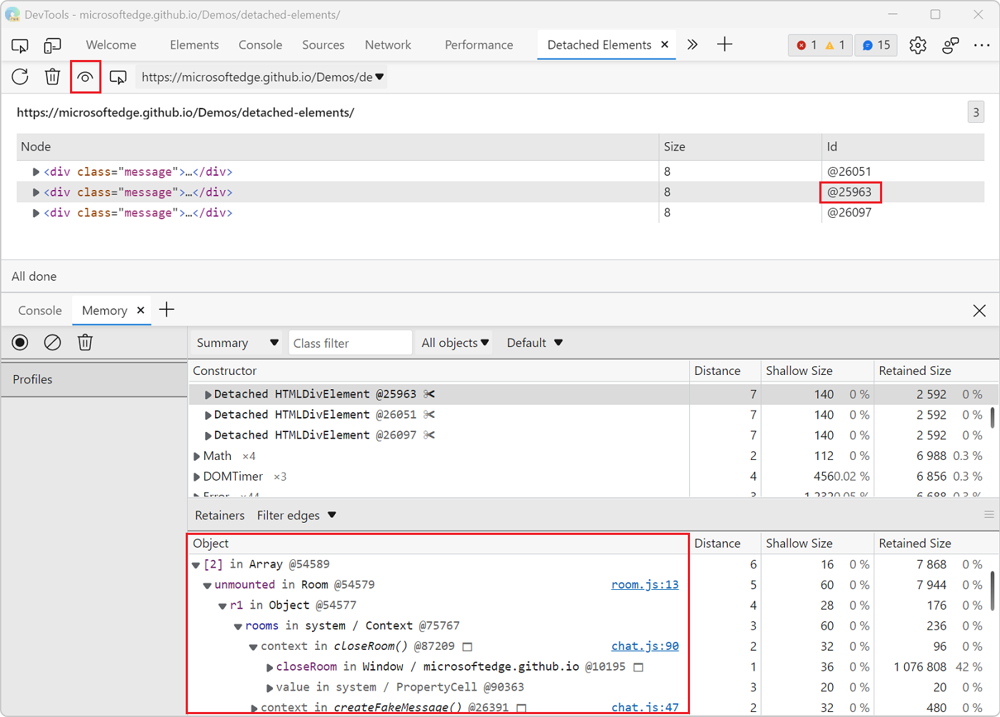

Learn more about using the **Detached Elements** tool in [Debug DOM memory leaks with the Detached Elements tool](https://docs.microsoft.com/microsoft-edge/devtools-guide-chromium/memory-problems/dom-leaks).

## Conclusion

I hope what we saw today was useful. If there's one thing I'd love for you to take away from this is that building a great Azure Static Web App starts with building a great web experience for all!

Learning the tools at your disposal to find and fix the most common mistakes that prevent such a great experience is important, and the Edge DevTools VS Code extension eases the pain by integrating directly in your existing environment.

## Exercise
Install the latest version of the **[Microsoft Edge Developer Tools extension for VS Code](https://marketplace.visualstudio.com/items?itemName=ms-edgedevtools.vscode-edge-devtools)** and try out some of these features. **Try identifying and fixing accessibility issues**, or use the **Performance tool** to analyze the runtime performance, of a Static Web App you've deployed.