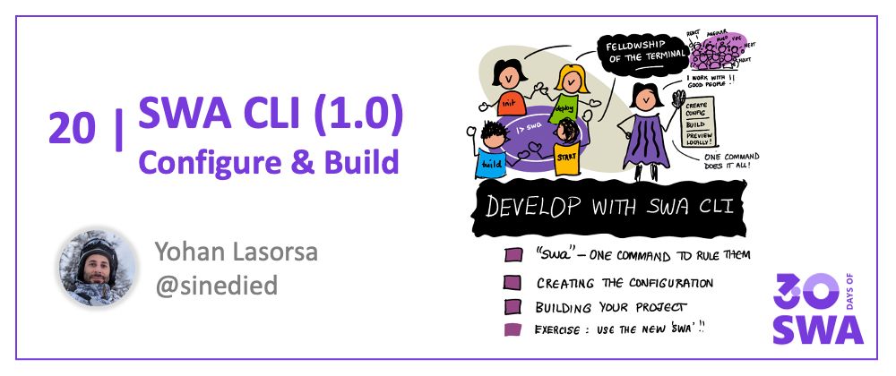
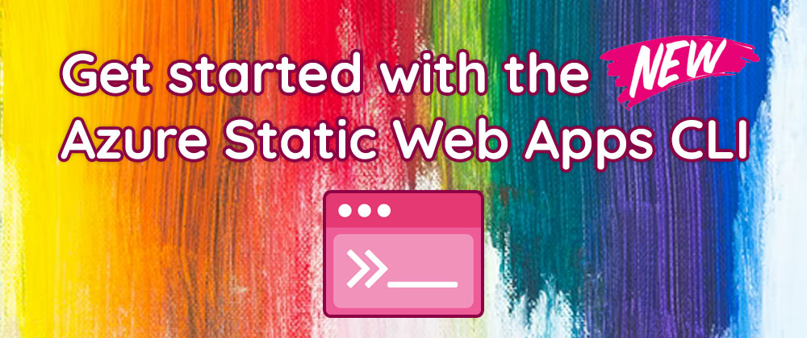
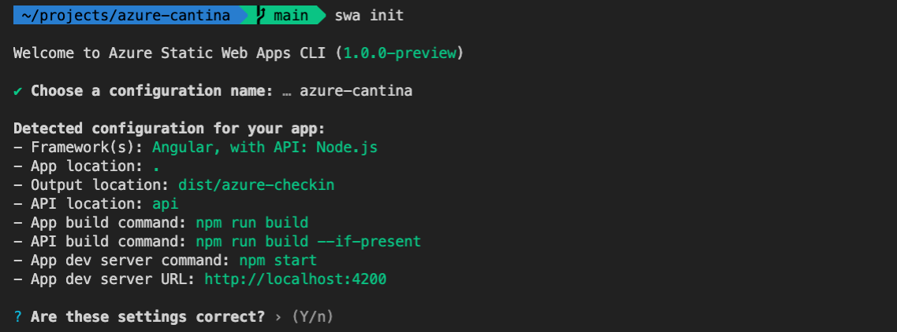

<head>
  <meta name="twitter:url" content="https://www.azurestaticwebapps.dev/blog/devtools-swacli-develop" />
  <meta name="twitter:title" content="##19: Develop with SWA CLI" />
  <meta name="twitter:description" content="Join @sinedied on #30DaysOfSWA as debuts the new SWA CLI for @AzureStaticApps and walks through the build process!" />
  <meta name="twitter:image" content="https://www.azurestaticwebapps.dev/assets/images/19-banner-ecd588da06f9f1af0f0e8a5f3323aa20.png" />
  <meta name="twitter:card" content="summary_large_image" />
  <meta name="twitter:creator" content="@nitya" />
  <meta name="twitter:site" content="@AzureStaticApps" /> 
  <link rel="canonical" href="https://dev.to/azure/get-started-with-the-new-azure-static-web-apps-cli-mm3" />
</head>


Welcome to `Week 3, Day 5` of **#30DaysOfSWA**!! 

We're past the halfway mark in "Dev Tools" week! We looked at developer tools to help provision Azure resources, automate cross-browser testing, streamline CI/CD, and debug/audit your SWA for performance and accessibility. But what about **local development** - something to help me go from _start_ (project creation & configuration) to _finish_ (build & deploy) in **one tool**? Let's say hello to the [Azure Static Web Apps CLI](https://aka.ms/30DaysOfSWA/swa-cli).

:::info What We'll Cover
 * `swa` - One command to rule them all!
 * Creating the configuration
 * Building your project
 * Running your app locally
 * **Exercise**: Use the new `swa` CLI to build and run a starter app!
:::




You may have missed it, but the [new Azure Static Web Apps CLI](https://github.com/Azure/static-web-apps-cli) is now available!


It would take a whole post to describe all the changes and new features, but here are some of the highlights. With the new `init`, `build`, `start` and `deploy` commands, the complete developement cycle of your app is now available *in a single tool*, directly from the command line. 




To get started, make sur you have a recent [Node.js](https://nodejs.org) version installed (>14) and type this command in your terminal:

```sh
npm i -g @azure/static-web-apps-cli
```

We'll now have a look at the new commands and the most important features.

:::note
If you've never heard of Static Web Apps (or SWA for short), it's a web app hosting service provided by Azure, offering streamlined full-stack development with many built-in features like authentication, customizable routing, serverless functions and more. It also has a great [free tier](https://azure.microsoft.com/free/?WT.mc_id=javascript-0000-yolasors) 😉
:::

## `swa`

As the new CLI introduces a gazillion new options, it must quite a steep learning curve to get started? Quite the opposite!

Every command starts with `swa`, and now it might also be the only thing you'll need.

```sh
# yes, that's all you need to type
swa
```

This command is a macro shorcut for `swa init`, `swa build`, `swa login` and `swa deploy`. We'll get to the details of all these commands in a bit, the most important thing here is that `swa` is the only command you need to know to configure a new project for use with Static Web Apps, build it and deploy it. You don't have to worry about any options or flags, just type `swa` and you'll be on your way. 


## Creating the configuration

The first of the new commands is `swa init`. This commands with detect your project configuration and the frameworks you're using to suggest a configuration for you, so you won't have to read through [the shiny new docs](https://azure.github.io/static-web-apps-cli/) to figure out what options you need.



After asking a name for your project configuration, you can validate or edit the detected project settings. Once finished, it will create a `swa-cli.config.json` file in the current folder with your settings. You can commit this file in your project repository so everyone from your team can use it.


## Building your project

After the configuration is created, you're all set to use other commands without having to bother with any options or flags.

Whether you need to build your front-end app, your API, or both, the `swa build` command will do the job. It also takes care of installing your NPM dependencies (if needed) detecting if you're using npm, Yarn or PNPM with your project.


## Running your app locally

Historically, being able to run your app locally was the first feature of the SWA CLI. Of course it's still there, and `swa start` allows you to emulate the SWA runtime environment, along with the routing, authentication features and API. A few changes were made to improve the developer experience, and of course bugs were fixed to more closely match the real SWA runtime.

Previously, if you were using an API, you had to install [Functions Core Tools](https://docs.microsoft.com/azure/azure-functions/functions-run-local?tabs=v4%2Cwindows%2Ccsharp%2Cportal%2Cbash&WT.mc_id=javascript-0000-yolasors#publish) and make sure to match the tools version with the Node.js version you're using, but now the whole process is automated for you. If you don't have the tools installed or if the wrong version is installed, you don't have to worry about it: it will be automatically installed for you when needed.


## Next steps

With these new commands, you can already setup your project, build it and test it locally. Using `swa start` is also great for debugging your app and API in a live running environment. Once you're happy with the result, you can deploy it to Azure, and that's what we'll explore in the next post.

In the meantime, you can also head to [the new docs website](https://azure.github.io/static-web-apps-cli/) to learn more about the new features and how to use them.


## Tell us your feedback!

We're also [here on dev.to](https://dev.to/azure/get-started-with-the-new-azure-static-web-apps-cli-mm3) to listen and help as much as we can! 🙂

Please tell us your experience, your difficulties, your questions, and what features you would like to see in the next versions of the SWA CLI.

## Resources

Want to see the Static Web Apps CLI in action? The tool became generally available yesterday, launching at the [Azure Static Web Apps Anniversary](https://aka.ms/swaanniversary). Watch the segment to see the SWA CLI in action.

<iframe width="560" height="315" frameborder="0"  src="https://www.youtube.com/embed/1e6k5HNK4F8" title="YouTube video player" allow="accelerometer; autoplay; clipboard-write; encrypted-media; gyroscope; picture-in-picture" allowfullscreen></iframe>