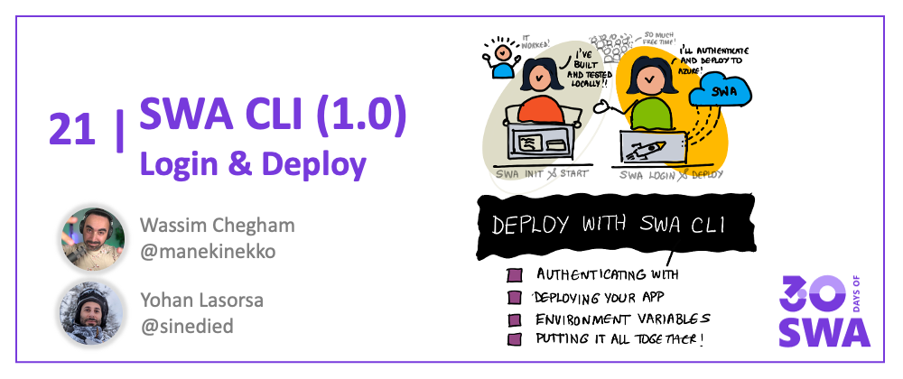

<head>
  <meta name="twitter:url" content="https://www.azurestaticwebapps.dev/blog/devtools-swacli-deploy" />
  <meta name="twitter:title" content="#20: Deploy with SWA CLI" />
  <meta name="twitter:description" content="Join @sinedied and @manekinekko on #30DaysOfSWA in part 2 of the intro to SWA CLI for @AzureStaticApps - focused on deployment!" />
  <meta name="twitter:image" content="https://www.azurestaticwebapps.dev/assets/images/20-banner-62cb7a9019981d88c514d8875b8547d9.png" />
  <meta name="twitter:card" content="summary_large_image" />
  <meta name="twitter:creator" content="@nitya" />
  <meta name="twitter:site" content="@AzureStaticApps" /> 
  <link rel="canonical" href="https://dev.to/azure/deploy-your-static-web-apps-to-azure-directly-from-the-command-line-2ip8" />
</head>


Welcome to `Week 3, Day 6` of **#30DaysOfSWA**!! 

This is second part of the 2-part series that focuses on the launch of the [Azure Static Web Apps CLI](https://azure.github.io/static-web-apps-cli/?WT.mc_id=30daysofswa-61155-cxall) at the [Azure Static Web Apps Anniversary event](https://docs.microsoft.com/en-us/events/learntv/swa-anniversary-may-2022?WT.mc_id=30daysofswa-61155-cxall) on May 19, 2022. Yesterday's post introduced the core `swa` command and walked through the `swa init` and `swa start` commands - and covered configuration. 

Today, we'll explore the `swa login` and `swa deploy` commands that help with deploying your locally-developed app to the Azure cloud. And we'll cover the use of Environment Variables to streamline the developer experience further.

:::info What We'll Cover
 * Logging in to Azure
 * Deploying your app
 * Environment variables
 * **Exercise**: Use the new `swa` CLI to authenticate, and deploy your app
:::




For this second article about the SWA CLI, we'll talk about the new deployment options. And yes, you can now deploy your apps straight from the command line! Who's better than the person who implemented it to talk about it? I'll let my friend [Wassim](https://twitter.com/manekinekko) explain it all to you.

> If you've never heard of Static Web Apps (or SWA for short), it's a web app hosting service provided by Azure, offering streamlined full-stack development with many built-in features like authentication, customizable routing, serverless functions and more. It also has a great [free tier](https://azure.microsoft.com/free/?WT.mc_id=30daysofswa-61155-cxall) 😉

## Logging in to Azure

In the new SWA CLI for Azure Static Web Apps, we introduced a new `swa login` command allowing you to log in to your Azure account, straight from the command line. This command will encrypt and store your credentials in your system's key Chain, so you don't have to enter them again.

In most common cases, the `swa login` will pick your current active Azure credentials from the following locations (in this order):

1. Your environment variables, if you have set one or all of following [variables](https://azure.github.io/static-web-apps-cli/docs/cli/env-vars#azure-identity?WT.mc_id=30daysofswa-61155-cxall):
    - `AZURE_TENANT_ID`
    - `AZURE_CLIENT_ID`
    - `AZURE_CLIENT_SECRET`
2. Your current Visual Studio Code, if you're using VS Code and is connected to Azure.
3. Interactive prompt using your browser.
4. The last fallback is the device code flow, which will prompt you to log in to your Azure account using a generated device code.

However, if you need, you can also provide any of these credentials from the command line, using the available flags:

```bash
Usage: swa login [options]

login into Azure

Options:
  -S, --subscription-id <subscriptionId>    Azure subscription ID used by this project
                                            (default: "process.env.AZURE_SUBSCRIPTION_ID")
  -R, --resource-group <resourceGroupName>  Azure resource group used by this project
  -T, --tenant-id <tenantId>                Azure tenant ID (default: "process.env.AZURE_TENANT_ID")
  -C, --client-id <clientId>                Azure client ID
  -CS, --client-secret <clientSecret>       Azure client secret
  -n, --app-name <appName>                  Azure Static Web App application name
  -cc, --clear-credentials                  clear persisted credentials before login (default: false)
  -u, --use-keychain                        enable using the operating system native keychain
                                            for persistent credentials (default: true)
  -nu, --no-use-keychain                    disable using the operating system native keychain
```

Once logged in, the SWA CLI will store your active Azure subscription ID and tenant ID in a local file called `.env` at the root of your project:

```bash
➜ swa login

Welcome to Azure Static Web Apps CLI (1.0.0)

Checking Azure session...
✔ Successfully logged into Azure!
✔ Saved project credentials in .env file.
✔ Successfully setup project!
```

This file will be used when deploying your project to Azure using the `swa deploy` command.

## Deploying your app

The new SWA CLI makes it even more easier to deploy your apps to Azure. You can now deploy your app directly from the command line, using one single `swa deploy` command.

The `swa deploy` command is smarter enough to figure out if you already have an Azure Static Web Apps instance available, and if so, it will use it. Otherwise, it will create a new one on the fly - or prompt you to select one from a list of already available ones:

```bash
➜ swa deploy

Welcome to Azure Static Web Apps CLI (1.0.0)

Using configuration "thundr" from file:
  /home/wassimchegham/oss/@thundr-dev/thundr/swa-cli.config.json

Deploying front-end files from folder:
  /home/wassimchegham/oss/@thundr-dev/thundr/app/dist/thundr-ui

Deploying API from folder:
  /home/wassimchegham/oss/@thundr-dev/thundr/api

Checking Azure session...
✔ Successfully logged into Azure!

Checking project settings...
? Choose your Static Web App › - Use arrow-keys. Return to submit.
❯   >> Create a new application
    swa_samples/angular-web-bluetooth
    swa_samples/catsify
    swa_samples/hexa
    swa_samples/ngxtools
    swa_samples/nitrooo
  ↓ swa_samples/photobooth-teams

```

The `swa deploy` command is also able to detect if your existing Static Web Apps instance has already been deployed from a CI/CD pipeline and inform you about it!

## Deploying from a CI/CD pipeline

Deploying from CI/CD pipelines is a common practice in many projects. You can use the `swa deploy` command to deploy your app to Azure from your CI/CD pipeline. You can accomplish this by setting a deployment token:

```bash
➜ swa deploy --print-token --app-name thundr --resource-group swa_samples

Welcome to Azure Static Web Apps CLI (1.0.0)

Checking project "thundr" settings...
✔ Successfully setup project!

Deploying to environment: preview

Deployment token:
7c3fc44b858164b677-truncated-8c80ace9-39a8-416c-ae22-864745c0470b003
```

```bash
swa deploy --deployment-token=7c3fc44b858164b677-truncated-8c80ace9-39a8-416c-ae22-864745c0470b003b003
```

You can also set the deployment token as an [environment variable](https://azure.github.io/static-web-apps-cli/docs/cli/env-vars#deploy-settings?WT.mc_id=30daysofswa-61155-cxall):

```bash
export SWA_CLI_DEPLOYMENT_TOKEN=7c3fc44b858164b677-truncated-8c80ace9-39a8-416c-ae22-864745c0470b003b003
swa deploy
```

## Environment variables

The new SWA CLI introduced a new set of environment variables to make it easier for you to configure your experience. You can customize the behavior of the SWA CLI by setting the following environment variables:
- General settings
- Emulator settings
- Deploy settings
- Runtime settings
- Login experience

You can read more about these environment variables in the [Environment Variables section](https://azure.github.io/static-web-apps-cli/docs/cli/env-vars??WT.mc_id=30daysofswa-61155-cxall) in our new documentation website.

## Next steps

From the start of your project to its deployment to Azure, with all the needed local testing in-between, you should now be equipped to take care of your complete development process all from the command line. Now the main challenge remaining for you is to deploy and grow your app 😉.

If you'd like to learn some tips you can use when developing your app, you can check out the [Static Web Apps - Tips & Tricks](https://aka.ms/StaticWebAppsTips??WT.mc_id=30daysofswa-61155-cxall) video series.

You can also learn more about all the new features of the SWA CLI and how to use them by looking at the [new docs website](https://azure.github.io/static-web-apps-cli/?WT.mc_id=30daysofswa-61155-cxall).

## Tell us your feedback!

We're also here on dev.to to listen and help as much as we can! 🙂

Please tell us your experience, your difficulties, your questions, and what features you would like to see in the next versions of the SWA CLI.


## Resources

Want to see the Static Web Apps CLI in action? The tool became generally available yesterday, launching at the [Azure Static Web Apps Anniversary](https://aka.ms/swaanniversary). Watch the segment to see the SWA CLI in action.

<iframe width="560" height="315" frameborder="0"  src="https://www.youtube.com/embed/1e6k5HNK4F8?WT.mc_id=30daysofswa-61155-cxall" title="YouTube video player" allow="accelerometer; autoplay; clipboard-write; encrypted-media; gyroscope; picture-in-picture" allowfullscreen></iframe>