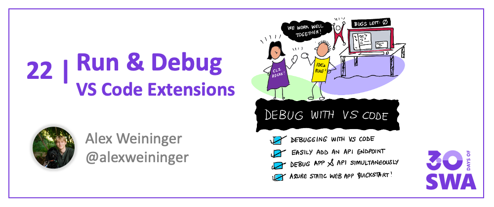

<head>
  <meta name="twitter:url" content="https://www.azurestaticwebapps.dev/blog/devtools-vscode" />
  <meta name="twitter:title" content="#21: Debug with VS Code" />
  <meta name="twitter:description" content="Join @alexweininger as we wrap DevTools week on #30DaysOfSWA with a look at seamless debugging using @code for @AzureStatic Apps!" />
  <meta name="twitter:image" content="https://www.azurestaticwebapps.dev/assets/images/21-banner-4c8833d85f3b63b56f65329fd492dcb5.png" />
  <meta name="twitter:card" content="summary_large_image" />
  <meta name="twitter:creator" content="@nitya" />
  <meta name="twitter:site" content="@AzureStaticApps" /> 
  <link rel="canonical" href="https://www.azurestaticwebapps.dev/blog/devtools-vscode" />
</head>


Welcome to `Week 3, Day 7` of **#30DaysOfSWA**!! 

This week has been all about the SWA developer tools. To conclude the week, we'll show how the [Azure Static Web Apps extension for VS Code](https://marketplace.visualstudio.com/items?itemName=ms-azuretools.vscode-azurestaticwebapps) can make using all of these awesome tools easier!


:::info WHAT WE'LL COVER TODAY
 * Debugging with VS Code
 * Easily add an API endpoint
 * Debug API and Frontend simultaneously
 * **Resource(s):** [Azure Static Web Apps Quickstart: With VS Code](https://docs.microsoft.com/en-us/azure/static-web-apps/getting-started?tabs=vanilla-javascript)
:::




## Prerequisites 🛠️

1. **Google Chrome installed** - we make use of the debugger

2. **Azure Static Web Apps extension for VS Code** - [View on Marketplace](https://marketplace.visualstudio.com/items?itemName=ms-azuretools.vscode-azurestaticwebapps)

3. **Azure Static Web Apps CLI** - [View on GitHub](https://github.com/Azure/static-web-apps-cli)

```
npm install -g @azure/static-web-apps-cli@latest
```

## 1. Getting started 🟢

1. Clone one of these repositories, and open it up in VS Code

 
| Framework | Repository |
|---|---|
Angular | https://github.com/staticwebdev/angular-basic
React | https://github.com/staticwebdev/react-basic
Svelte | https://github.com/staticwebdev/svelte-basic

2. Run `npm install`


> Theme: [Cobalt2 Theme Official by Wes Bos](https://marketplace.visualstudio.com/items?itemName=wesbos.theme-cobalt2)

## 2. Run and debug 🐞


 
1. Go to the "Run and Debug" view
2. Click "Show all automatic debug configurations."
2. In the dropdown, select "Azure Static Web Apps..."
3. Select the app you want to debug

This will start the Azure Static Web Apps CLI in the VS Code terminal, and launch the Chrome debugger on `http://localhost:4280`.

Now you can set and hit breakpoints in your frontend code. 


 
## 3. Add API route ⚡️

Azure Static Web Apps has integrated API support provided by Azure Functions. In order to add and debug an API route, we must install some Azure Functions tools.

1. **Azure Functions extension for VS Code** - [Install from Marketplace](https://marketplace.visualstudio.com/items?itemName=ms-azuretools.vscode-azurefunctions)

2. **Azure Functions Core Tools** - [View on GitHub](https://github.com/Azure/azure-functions-core-tools)

```
npm i -g azure-functions-core-tools@4 --unsafe-perm true
```

Now, you can add an API route to your app using the command palette (press `F1`) and searching "Create HTTP Function".


Select a language (I chose JavaScript), then name your Function (I put "hello"). And then an API route will be created for you that you can make requests to at `/api/hello`.


## 4. Debug app & API ✨
 
We can debug our API routes and our frontend app simultaneously in VS Code.

Select the "SWA: Run ..." debug configuration and click the green "Run and debug" button.


VS Code will now run your Functions API routes and your frontend. When it's all started, a Chrome window will open at `http://localhost:4280`.

Set a breakpoint in your Function endpoint.


Go to `http://localhost:4280/api/hello` in the Chrome window to hit the breakpoint.
 


## 5. Next steps 🏃‍♀️

Now that you got your static web app running locally, you can [deploy your static web app to Azure for free](https://docs.microsoft.com/en-us/azure/static-web-apps/getting-started?tabs=react).

## Troubleshooting 🔍

If you're having issues, please check out the [troubleshooting section in our wiki](https://github.com/microsoft/vscode-azurestaticwebapps/wiki/Guide:-Debugging-a-Static-Web-App-with-VS-Code#troubleshooting-).

## Resources 🔗

* [Azure Static Web Apps documentation](https://docs.microsoft.com/en-us/azure/static-web-apps/)
* [Azure Static Web Apps CLI](https://github.com/Azure/static-web-apps-cli)
* [Azure Static Web Apps extension for VS Code](https://marketplace.visualstudio.com/items?itemName=ms-azuretools.vscode-azurestaticwebapps)

## Next Week

This marks the end of Week 3 of #30DaysOfSWA, with a focus on `Developer Tools`. Want a visual recap of what we covered .. here you go!! To recap:
 * We provisioned Azure resources - using the Azure Portal and Azure CLI
 * We added automated, cross-browser, e2e testing - using Playwright
 * We built multi-stage deployment pipelines - using Azure DevOps
 * We debugged and audited perf & accessibility - using Edge DevTools on VSCode
 * We got unified local development and cloud deployment - using SWA CLI
 * We explored rich extensions and seamless CLI interactions - using VS Code


So what do we have planned for next week? 

We've already covered core concepts, usage examples and developer tools -- so that leaves: **Best Practices!** Join us for the final week of #30DaysOfSWA where we define the end-to-end developer experience, explore various Azure Service integrations to enhance your SWA, dive into a cool case study, and end with a `Tips & Tricks` series that brings you back full circle to development.

Thanks for sticking with us on this journey!