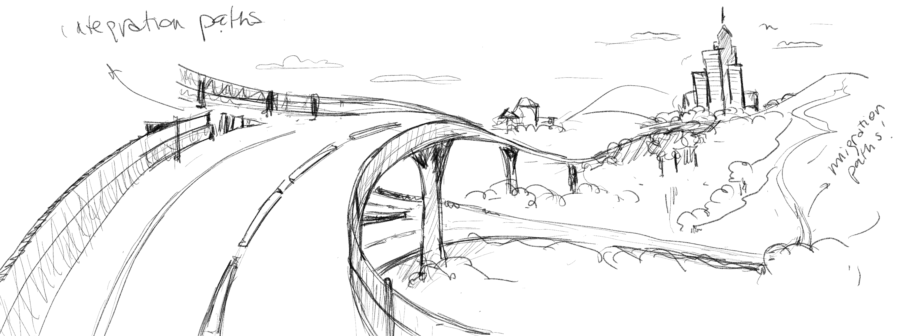
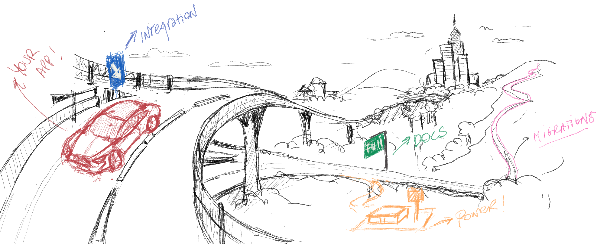
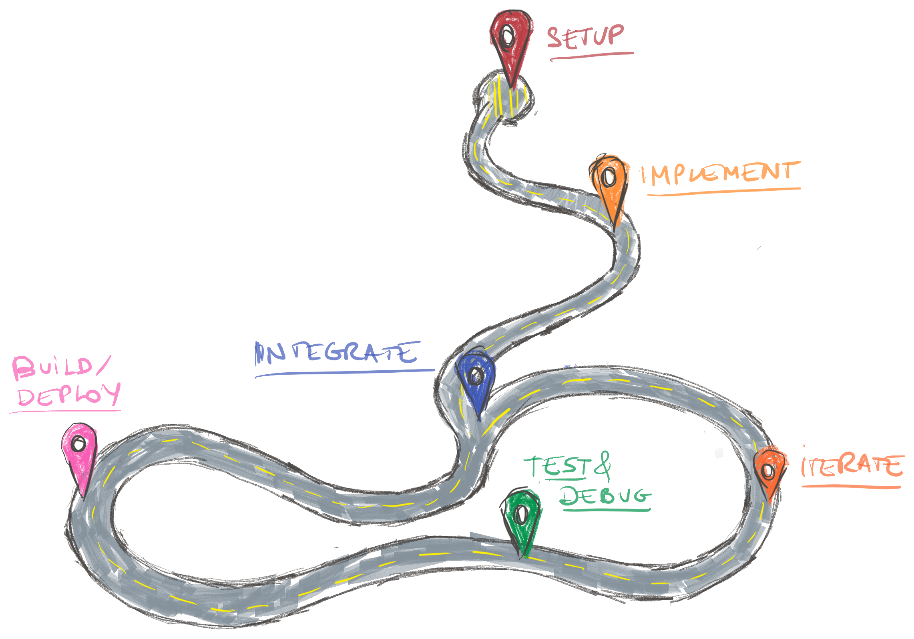
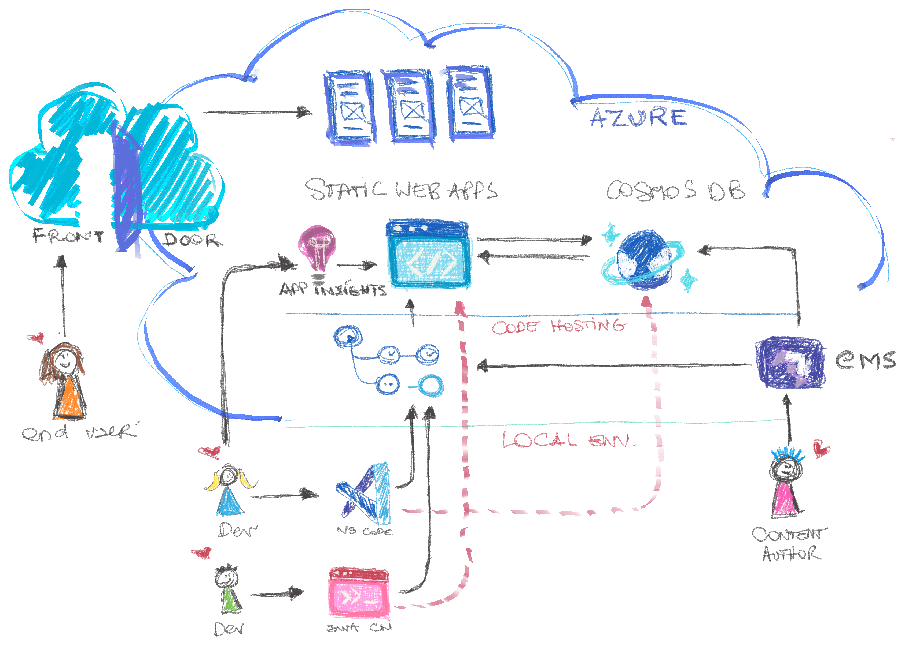

<head>
  <meta name="twitter:url" content="https://www.azurestaticwebapps.dev/blog/practices-e2e" />
  <meta name="twitter:title" content="#22: E2E Development & SWA" />
  <meta name="twitter:description" content="Join @anfibiacreativa as we kick off 'Best Practices' week on #30DaysOfSWA with a discussion on End-to-End Developer Experiences for @AzureStatic Apps!" />
  <meta name="twitter:image" content="https://www.azurestaticwebapps.dev/assets/images/22-banner-c5cc6f06159eb61034c900af02756c3a.png" />
  <meta name="twitter:card" content="summary_large_image" />
  <meta name="twitter:creator" content="@nitya" />
  <meta name="twitter:site" content="@AzureStaticApps" /> 
  <link rel="canonical" href="https://www.azurestaticwebapps.dev/blog/practices-e2e" />
</head>

Welcome to `Week 4, Day 1` of **#30DaysOfSWA**!! 

This kickstarts our **"Best Practices"** week where we'll explore additional topics that help up deliver an enhanced or more optimal modern web application experience to our users. We'll start by looking at the End-to-End _developer experience (DX)_ - the importance of having a smooth and seamless DX to complement the UX (user experience), and best practices to improve your developer experience by architecting your applications and integrating services in more effective ways. Let's dive in!

:::info What We'll Cover
 * What is an end-to-end developer experience (DX)?
 * What are core DX components when building and deploying static web apps?
 * How can we improve DX implementing best practices?
 * How can we create an architecture matrix to guide E2E DevEx?
 * **Exercise**: Try to reproduce the architecture seen below!
:::

Today we explore the importance of a great development experience and how can you improve yours, when building and deploying your static web applications using Azure Static Web Apps!

I admit it took me some time to write this post. It would have been much easier for me to write about a specific topic with code examples and technical definitions, than describing what developer experience means to me.

The definition of developer experience, like anything else you _experience_, is subjective. It has a lot of you, in it. It changes with you, and the context you're a part of. Things like _how long you've been in the business_ or _what type of software you work on_, or _where do you deploy it_, will all impact your perception of an experience.

So how to put it in words? How to define it and scope it? 

It's impossible for me to do it in a way that feels relatable to everyone. I can only explain it, from the perspective inferred by my needs and my perception of the outcome, as an individual developer, and how it impacts my vision and my work. 

## Predictability

Let me start by saying that in my personal life, when I think of memorable experiences, a lot of them have been the consequence of an impulse. A spontaneous act. In my personal life, I am not much of a planner. I am the kind of person that wakes up every Saturday morning and declares "We are going somewhere far away this weekend!". And my husband (who is all the contrary from me and needs a lot of structure!) will ask questions like:
 * Ok, where do you wanna go? 
 * Have you booked a hotel? 
 * Do you know where we will have lunch? 

And I would invariably respond: "I don't care! Let's just hop in the car, drive somewhere and figure it all out on the way there!". That's because I think that experimenting and experiencing, go hand in hand, when it comes to adventure. And the actual _way there_, is part of the fun.

> **At work, however, I like predictability.** 

I like structure, repeatability, patterns & conventions. I appreciate having a framework, an opinion others agree with so I'm on the same page with my team. And I like all this because it oftentimes leads to quick results and success.

## A Road Analogy

Experiences are like roads. They can take you places -- or not. And to me, **development experiences are just like the roads we travel on**:

 * They have milestones - so I can measure progress.
 * They have multiple lanes - so I have flexibility.
 * They have entry and exit ramps - so I can change paths quickly. 
 * They have destinations - so I know I'm getting somwhere specific.

When I first got into web development, there were a fewer types of roads. Most were linear and slow, particularly when it came to frontend development. You needed repeated round-trips to the same server, just to get something to render on a page.

By contrast, today we're speeding along multi-lane freeways with numerous twists and turns, interconnecting roads, and possibilities ([aka configurations](https://dev.to/azure/04-configuring-static-web-apps-2oa7)) to choose from. To reach a destination, you may have to use ramps to connect two different roads - similar to how we connect tow different services [via an API](https://dev.to/azure/03-api-enabling-static-web-apps-25kh). 

If we continue with this analogy, then **a bad development experience is like poor road planning or construction**:

- the road is old, bumpy, cracked
- the signposts are few and far between, giving the user insufficient time to process and follow instructions. 
- if you miss an exit, you may have to travel a long distance before you have the opportunity to turn around
- there may be no way to access a desired road from another one - no exit or entry ramps at all!
- if your car breaks down, or your run out of fuel - there may not be service stations nearby to for refill or recharge.
- or you may find a station, but you have no idea of the cost of refill or recharge before you commit to taking that exit.
- there may not be any way to get food or drinks for many miles.

You can probably guess how these travel constraints map onto poor developer experiences, but let's spell it out:

- having to slow down due to infrastructure conditions
- feeling like you're not making any progress
- having the certainty that your application quality is degrading due the environment and lack of resources or support, resulting in technical debt
- not having the ability to [secure your implementation](https://dev.to/azure/05-securing-static-web-apps-5fe3)
- not finding the right, complete or fresh documentation to help you understand the best path
- not having the right SDK's, API methods, or means of integrating your app to other software, to accomplish simple or more complex tasks, like authentication, storage, content authoring [with a headless CMS](https://dev.to/azure/12-headless-cms-swa-built-with-blazor-1e2d) or setting up your CI/CD pipeline
- not having the right tools to [build](https://dev.to/azure/02-building-static-web-apps-2j72), [deploy](https://dev.to/azure/07-deploying-static-web-apps-48e), optimize, [preview](https://dev.to/azure/06-previewing-static-web-apps-4p36), monitor or speed up your processes
- not being able to scale or not being sure how much it will cost you
- not having fun, as you go

**Because, let's face it: developing should be a fun experience. And for that you need the right vehicle, the right infrastructure, and a plan.** 
And when you lack all that, it's like riding a Lamborghini across a sandy desert.

:::info WHAT WE CAN CONCLUDE
Is that developer experience refers to the entirety of physical, emotional and cognitive experiences of an individual while using a tool or technology to complete a software development task. It can equate to suffering (when bad), enduring (when fustrating or neutral), or to feeling pleasure and delight (when great).
:::

Making the right architecture and technology decisions, will definitely impact the outcome. And we can only make those decisions right, when we ask the right questions.

## Architecture: What core infrastructure, capabilities and resources do we need?

As we hope you have learned from following this [30 days of Static Web Apps](https://dev.to/azure/kicking-off-30daysofswa-2d8g), it is a dedicated offering for frontend developers working with SPA's and Static Generated websites. We continue to work to extend its capabilities, and support more frameworks and use cases.

### Documentation: Should be fresh & relevant!
When thinking about those milestones that should hit along the road of a great end-to-end developer experience, we are working hard to make sure you always find complete and fresh documentation to help you get started and know all the possibilities you have with Static Web Apps, upfront, and to keep supporting you with relevant documentation and content as your applications grow.

### Workflows: Building blocks & seamless integrations!
Not only have we been working to offer an intuitive user interface at the Azure portal itself. We have been very intentional at the time of making sure integration with the [tools](https://dev.to/azure/15-develop-with-azure-tools-3h47), and platforms frontend developers know, use and love, like GitHub and VS Code, is seamless. 

Static Web Apps automatically pushes a GitHub actions workflow file as you generate the application as a resource, and you can create it from the portal, if you prefer a UI guided experience, but also without ever leaving your favorite code editor, by installing the [official extension](https://marketplace.visualstudio.com/items?itemName=ms-azuretools.vscode-azurestaticwebapps)!

And if you prefer a command line experience, you can use the brand new Static Web Apps CLI, with extended support to login to Azure, create, build and deploy apps, and a local emulator, so you can test your apps before you ever deploy to the cloud.

Creating your static web applications and configuring your pipelines, has never been this easy!

### Efficient & Versatile: Serverless + Containerized APIs

Because we recognize that the use cases for Jamstack and JavaScript full-stacks applications in general are becoming more and more complex, part of our strategy for a delightful end-to-end development experience relies on the simplification and standarization of mechanisms for API integration, via serverless functions through industry compliant patterns and via our super efficient devkits.

And that includes a concern that has historically been a challenge for frontend developers: the integration with databases and data storage. Azure Static Web Apps is unique in that it integrates very well with our CosmosDB database, a versatile cloud database that offers different API's to meet different developer skills and server a myriad of use cases in a very effective way.

### Security & Performance: E2E testing + debugging

And when we go to the service station, it may be a good time to check our oil levels, air pressure and wipe our window panes. And what a better way to do it than with tools from the same developer ecosystem and that play right (yes, you got me! I'm playing with words now!) like [Playwright](https://dev.to/azure/16-test-automation-with-playwright-odk) and Edge Developer Tools. 

So now when you use the newly release Preview environments, to test development from a specific staging branch, you will have also the ability to integrate with best-in-class tooling, iteration after iteration, until feature complete.

## Alignment: The ultimate e2e roadmap should _map_ to the development cycle

Any aspect on its own, can describe an end-to-end experience. For instance:
 * If I want to secure my app against unauthorized access, I must implement identity. That's an E2E experience.
 * If I want to persist data, I'll need to integrate with a database. An E2E experience.
 * If I want to integrate third-party services on demand, I'll need event-driven functions. Another E2E experience.

The ultimate end-to-end experience, however, is that that encompasses all components described by a matrix of architecture definitions and best practices,  mapping to the software development cycle itself.

When we are in the system design phase for our application, we will start thinking about what in research is known as "Jobs to be Done", and materialize them or _get them done_ , using tools or integrating with other products or services.

 **Setup phase**.
Job to be done will be generic - "I need to build a static web app. 

- What do I need? => I need a framework.
- What does the framework require => It's a JS framework that runs in the browser, or in a Node.js runtime. I need a node environment and a node package manager to manage dependencies. 
- Selected framework has its own CLI => I need it to optimize it and build it. 
- I want to version it, so I need a version control tool. To collaborate, I need to host that code in a central, remote location (aka version control hosting). 
- And because we want to build it remotely each time we integrate with a CI/CD pipeline, that includes a runner and some virtualization or emulation. - And we want to publish it, so I need a hosting service. 
- And..."_

And those are the _requirements_ that we start mapping to _setup and service capabilities_, so we can put together local and remote environments capable to fulfill them.

## Welcome to the matrix

So let's do together an exercise of architecture definitions based out of developer _jobs to be done_, classifying them by the milestone we defined in the previous graphic. As a bonus, we will map them to a requirement, that can be a business requirement, a developer job to be done, or an end user story.

The matrix will be roughly based on the high-level diagram below:

| Job to be done | Product/Service | Phase | Requirement | 
|----------|-------------|------|------|
|As a developer, I want to use the tools I am familiar with, to code, build and deploy my Jamstack (Statically Generated) applications| VS Code / SWA CLI | Setup | As an end-user, I want to be able to access an online catalogue of products with their respective detail pages |
|As a developer, I want to connect my remote repository where I collaborate with other team members, to the service I will be deploying my app to | GitHub / VS Code / Static Web Apps* | Setup | As a business owner, I want the code and secrets for my e-commerce platform to be stored safely |
|As a developer, I want to setup a CI/CD pipeline, for remote collaboration and fast/agile integration |  GitHub Actions Static Web Apps | Setup | As a content author, I want to see the new content published when I submit it to the content authoring tool, without any additional manual work |
|As a developer, I want to integrate with a database to store content and assets | CosmosDB*† / Azure Functions*† / Static Web Apps* | Implementation or Integration | As a business owner I want all assets and information to stored safely and versioned |
|As a developer, I want to integrate with a (headless) CMS for 3rd party content authoring | Azure Functions*† / Static Web Apps* |Implementation or Integration | As a content author, I want to see the new content published when I submit it to the content authoring tool |
|As a developer, I want to trigger the CI/CD workflows via custom/scheduled events | GitHub Actions* / Durable Functions** | Integration | As a business owner, I want my teams to automate the process of building and deploying new code or content so we can achieve optimal time-to-value |
|As a developer, I want to secure my implementation to make sure requests to our service come from my application | Indentity Platform† | Implementation or Integration | As a business owner, I want to make sure our e-commerce tool is secure and compliant with laws and regulations |
|As a developer, I want to restrict access to certain pages to users with a certain role| Identity Platform† | Implementation or Integration | As an end user, I want to keep a private profile with my payment methods and other PII |
|As a developer, I want to localize the UI to several different languages | Cognitive Services*† | Implementation or Integration | As an end user, I want to access content in my own language |
|As a developer, I want to personalize recommendations in dynamic pages | Cognitive Services*† | Implementation or Integration | As an end user, I want to have recommendations that are relevant to me |
|As a developer, I want to integrate with a 3rd party payment platform | _3rd party_ / Azure Functions* | Implementation or Integration | As a business owner, I want payments processed by a reliable 3rd party provider |
|As a developer, I want to preview and debug changes before I promote them to production | Static Web Apps Preview/Edge Developer Tools | Build/Deploy/Testing | As a business owner, I want to preview changes before they go live |
|As a developer, I want to reduce technical debt by implementing an e2e test automation suite | Playwright / GitHub Actions | Testing | As an end user, I want the user interface to respond quickly and accurately, when I interact with it |
|As a developer, I want to be able to publish my application to the web | Static Web Apps | Build/Deploy | As a business owner, I want my application to be accessible by web users from all parts of the world, with the least possible latency |
|As a developer, I want to enable a mechanism for the application to be accessible via a distributed network | Azure Front Door | Setup/Integration | As a user I want web pages I visit, to load very fast |
|As a developer I want to integrate with analytics tools, to share data with stakeholders | Static Web Apps / App Insights | Setup/Testing | As a business owner, I want to know what products are being queried the most to understand market trends |

(*)Expresses the ability to operate directly from the VS Code context via an extension, or locally with the CLI capability
(†) Expresses the existence of an SDK to accelerate and secure the implementation

> **As we can see, you don't need to be part of a massive organization or a large, distributed team, to implement certain workflows and give structure to your own development cycles in process, to gain in developer productivity and delightful experiences.**

Writing down your own matrix as you start, and extending it as your application scales and has extended requirements, can help you better organize yourself, make sure you're implementing best practices, and even evaluate tools and technologies to make sure you're on the right, most optimal path.

Static Web Apps is a modern, low configuration capability for Jamstack development, that offers you a myriad of satellite integrations, for free! And it has the advantage of growing with you, should you need more capacity, more tools, or even a full migration.

## To wrap this up...

Developer Experience is an end-to-end exercise that can be connected to the development, implementation and/or integration of a single feature or a group of them, from design, to execution, to testing, to release. 

In order for developers to have a *great* experience they enjoy, from one end to the other, they need to find:

- guidelines that help them define a problem they can design an effective solution
- technologies that are compatible as building blocks for it
- complete, accurate and fresh documentation to support at all times
- tools that simplify the _jobs to be done_ or tasks, individual and collective (to a single developer or a team of them)
- underlying mechanisms (exposed to the developer or not depending on their wishes or needs), for effectual program compilation, transpilation, testing, deployment and execution (such as runtimes and pipelines)
- definitions and hooks for integration (with other technologies) or and migration (to other technologies)

When all those, and some more, are fulfilled, developers become more productive, focused, and can spend their time doing what they love, instead of wasting it in undifferentiated tasks.

## Exercise
Try to reproduce the architecture seen above! Most of the integrations are available to the free tier! Show us how far you got!