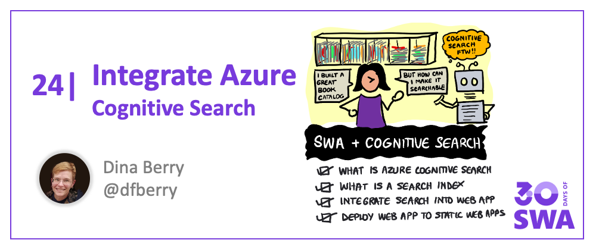

Welcome to `Week 4, Day 2` of **#30DaysOfSWA**!! 

Yesterday, we kicked off "Best Practices" week by talking about the end-to-end developer experience. Key to this is the ability to seamlessly integrate relevant tools and services that enhance the user experience - without adding complexity to the developer workflow. Today, we'll look at this in practice, by walking through a tutorial that integrates your Azure Static Web Apps deployed website with **Azure Cognitive Search** - allowing you to add custom search capability to your deployed web app in just a few steps.

## What We'll Cover
 * What is Azure Cognitive Search?
 * What is a Search Index?
 * Add Cognitive Search to a Website
 * Deploy to Azure Static Web Apps
 * **Exercise**: Create your own search index. Deploy your app to SWA.




## Make Your App Searchable!

Today we explore adding search to a website with [Azure Cognitive Search](https://docs.microsoft.com/en-us/azure/search/search-what-is-azure-search) - a cloud search service that provides infrastructure, APIs, and tools, for building rich integrated search capabilities for your mobile and web applications. It even allows for custom search functionality to enhance the default experience.

We'll walk through the following example today. Want to follow along? You can [grab the source code](https://github.com/Azure-Samples/azure-search-javascript-samples/blob/master/search-website/) and explore it as we walk through the tutorial.

We will be using a **Book Catalog** example - one of the most common uses of search for a website - to demonstrate how fast it is to get this service up and running with your deployed Azure Static Web App.


This sample website provides access to a catalog of 10,000 books. The user experience goes something like this:
 * The user searches the catalog by entering text in the search bar. 
 * As they enter text, we can use the Search Index's suggest feature to complete the text proactively. 
 * Once the query finishes, we display the results with a subset of details. 
 * Users select a book to see the details stored in the book's Search Index.

Simple, right? Let's look under the hood at how this works, and then dive into the implementation details.

## What is Azure Cognitive Search?

[Azure Cognitive Search](https://docs.microsoft.com/en-us/azure/search/search-what-is-azure-search) is a cloud search service that gives you, as the developer, the ability to provide rich search experiences. Architecturally, a search service sits between the external data stores that contain your unindexed data, and your client app that sends query requests to a search index and handles the response.


Cognitive Search **can integrate with other Azure services** that automate data ingestion/retrieval from Azure data sources, and skillsets that incorporate consumable AI from Cognitive Services, such as image and natural language processing, or custom AI that you create in Azure Machine Learning or wrap inside Azure Functions.

Once you create your Azure resource for Cognitive Search, you can access it with the following key information:

* **Resource name:** what you named your Cognitive Search instance.
* **Index name:** your resource can hold many indexes, each with its own identifiable name.
* **Admin key:** used to upload data into the search index
* **Query key:** used by the API to find data in the search index

So, we've used the term _search index_ many times - what does that mean?

## What is a search index?

Search functionality needs data to query. In Azure Cognitive Search, this data is held in a _search index_. Because this particular sample is already written for you, it includes the upload of the JSON data into the search index. If you're starting from scratch, look at the [Quickstart](https://docs.microsoft.com/en-us/azure/search/search-get-started-portal) to learn how you can create an Azure Cognitive Search index with **your** data.

The trickiest part is mapping your data into Cognitive Search types. In order to do this, you provide a [schema file](https://github.com/Azure-Samples/azure-search-javascript-samples/blob/master/search-website/bulk-insert/good-books-index.json) that describes each data field. 


### Searchable title

An example of a field in the schema file for this book catalog is the book title:

```json
{
    "name": "title",
    "type": "Edm.String",
    "facetable": false,
    "filterable": false,
    "key": false,
    "retrievable": true,
    "searchable": true,
    "sortable": false,
    "analyzer": "standard.lucene",
    "indexAnalyzer": null,
    "searchAnalyzer": null,
    "synonymMaps": [],
    "fields": []
},
``` 

The **type** is a `Edm.String` and it uses the `standard.lucene` **analyzer**. It is searchable and retrievable (comes back in the query results).

### Filter by language

The book catalog search also allows a filter by language. This filter, known as a facet, is provided by the **facetable** property.

```json
{
    "name": "language_code",
    "type": "Edm.String",
    "facetable": true,
    "filterable": true,
    "key": false,
    "retrievable": true,
    "searchable": false,
    "sortable": false,
    "analyzer": null,
    "indexAnalyzer": null,
    "searchAnalyzer": null,
    "synonymMaps": [],
    "fields": []
},
```

### Suggest search terms as a user types

The schema also tells the search index what fields to watch when providing search **suggesters**, as the user types an entry in the search box. For this sample, suggestions are based on author names and book titles.

```json
"suggesters": [
{
    "name": "sg",
    "searchMode": "analyzingInfixMatching",
    "sourceFields": [
    "authors",
    "original_title"
    ]
}
```

Once the search index is created with data, you can view the data in the Visual Studio Code extension for Cognitive Search.


## Add search to website

After the search index is created with the data, you can add search functionality through the UI. Your UI passes the user's search request to your API. The API queries the search index and returns the results. 

The [client code](https://github.com/Azure-Samples/azure-search-javascript-samples/blob/master/search-website/src) provides interactive functionality:
* Provides [Search component](https://github.com/Azure-Samples/azure-search-javascript-samples/blob/master/search-website/src/components/SearchBar/SearchBar.js)
    * Provides [suggestions](https://github.com/Azure-Samples/azure-search-javascript-samples/blob/master/search-website/src/components/SearchBar/Suggestions/Suggestions.js) from the API as the user types in the search box
    * [Filters the results](https://github.com/Azure-Samples/azure-search-javascript-samples/blob/master/search-website/src/components/Facets/Facets.js) when the user selects or deselects from a list of filters (facets).
* Provides [results component](https://github.com/Azure-Samples/azure-search-javascript-samples/blob/master/search-website/src/components/Results/Results.js), possibly [paging](https://github.com/Azure-Samples/azure-search-javascript-samples/blob/master/search-website/src/components/Pager/Pager.js). 

The [serverless code](https://github.com/Azure-Samples/azure-search-javascript-samples/tree/master/search-website/api) provides the following API to respond to client requests:
* [Search](https://github.com/Azure-Samples/azure-search-javascript-samples/blob/master/search-website/api/Search/index.js) the catalog
* Provide [suggestions](https://github.com/Azure-Samples/azure-search-javascript-samples/blob/master/search-website/api/Suggest/index.js)
* Get [specific item's](https://github.com/Azure-Samples/azure-search-javascript-samples/tree/master/search-website/api/Lookup) data

## Deploy to SWA

The sample is deployed to SWA from a GitHub action, created for you by the Visual Studio Code extension for SWA.

Once you create and deploy the sample, you need to set environment variables to connect from the serverless API to your Cognitive Search resource. Then the book catalog website is available and searchable. 

## Exercise: Upload data to search index

1. [Fork the GitHub sample repo](https://docs.microsoft.com/azure/search/tutorial-javascript-overview#fork-and-clone-the-search-sample-with-git), and clone it to your local computer. This is a necessary step because the GitHub action needs to be written to a repo your user account has access to.
1. [Create a resource group](https://docs.microsoft.com/azure/search/tutorial-javascript-overview#create-a-resource-group-for-your-azure-resources) to hold both your SWA and Cognitive Search resources.
1. [Create a search index](https://docs.microsoft.com/azure/search/tutorial-javascript-create-load-index#create-an-azure-search-resource) in Visual Studio Code with the Cognitive Search extension.  
1. [Get the admin key](https://docs.microsoft.com/azure/search/tutorial-javascript-create-load-index#create-an-azure-search-resource). 
1. [Set admin key and resource name](https://docs.microsoft.com/azure/search/tutorial-javascript-create-load-index#prepare-the-bulk-import-script-for-search) in sample's bulk_insert_books.js script. 
1. Don't check in these changes with git. You don't want these secrets in your public fork.
1. [Install dependencies and bulk insert data](https://docs.microsoft.com/azure/search/tutorial-javascript-create-load-index#run-the-bulk-import-script-for-search) in the `./bulk-insert` folder:

    ```javascript
    npm install && npm start
    ```

1. Your search index is ready to answer search queries.

## Exercise: Deploy SWA to Azure

1. In Visual Studio Code, [create the SWA resource](https://docs.microsoft.com/azure/search/tutorial-javascript-deploy-static-web-app#create-a-static-web-app-in-visual-studio-code). This process adds a GitHub action YAML file to your fork and deploys that version to your SWA resource.

    At this point, the website should be available, but search isn't connected yet.

1. [Get the query key](https://docs.microsoft.com/azure/search/tutorial-javascript-deploy-static-web-app#get-cognitive-search-query-key-in-visual-studio-code) for your search index. Your API needs these secrets (query key and Cognitive Search resource name), to answer queries from your serverless API.
1. [Set the secrets](https://docs.microsoft.com/azure/search/tutorial-javascript-deploy-static-web-app#add-configuration-settings-in-azure-portal) for your serverless API in the Azure portal. 

    Search is now connected from your API to your Cognitive Search index.

1. [Use your search-enabled website](https://docs.microsoft.com/azure/search/tutorial-javascript-deploy-static-web-app#use-search-in-your-static-web-app) to find a book. 
1. Type _slowly_ to see the suggestions based on what you enter.
1. Filter the results to a different language. 
1. Select a book to see all its details. 

## Troubleshooting

* Make sure you used the **admin key** in the upload file.
* Make sure you used the **query key** in the SWA config. 


## Next steps

This website provides basic search functionality for books. Go beyond the basics with:
* [Spell check](https://docs.microsoft.com/en-us/azure/search/speller-how-to-add)
* [Fuzzy search](https://docs.microsoft.com/en-us/azure/search/search-query-fuzzy)
* [Semantics](https://docs.microsoft.com/en-us/azure/search/semantic-ranking)

This is just one of many samples provided in the [Azure for JavaScript Developers](https://docs.microsoft.com/en-us/azure/developer/javascript/how-to/create-static-web-app) page. Explore the Static Web Apps section and explore other Azure services you can integrated into your modern web app!
