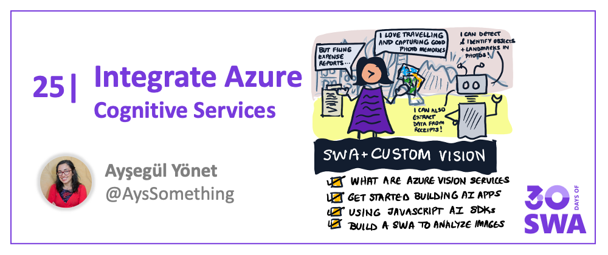

<head>
  <meta name="twitter:url" content="https://www.azurestaticwebapps.dev/blog/practices-cognitive-services" />
  <meta name="twitter:title" content="#24: Custom Vision & SWA" />
  <meta name="twitter:description" content="Join @AysSomething as we kick off 'Best Practices' week on #30DaysOfSWA with a discussion on adding AI capabilities to @AzureStatic Apps using Cognitive Services!" />
  <meta name="twitter:image" content="https://www.azurestaticwebapps.dev/assets/images/24-banner.png" />
  <meta name="twitter:card" content="summary_large_image" />
  <meta name="twitter:creator" content="@nitya" />
  <meta name="twitter:site" content="@AzureStaticApps" /> 
  <link rel="canonical" href="https://www.azurestaticwebapps.dev/blog/practices-cognitive-services" />
</head>

Welcome to `Week 4, Day 3` of **#30DaysOfSWA**!!

We continue our Best Practices week by looking at year another Azure Services integration option for your Azure Static Web Apps deployment. Yesterday we talked about adding search to your website using pre-trained Azure AI models. Today we'll discuss how you can use Vision AI Services.

## What We'll Cover

-   What are Azure Vision Services
-   How to get started building your AI applications
-   How to use the JavaScript AI SDKs
-   How to analyze a document using Form Recognizer
-   How to deploy your APIs and Static Web App(SWA)
-   **Exercise** [Build and deploy a SWA to analyse images](https://docs.microsoft.com/samples/azure-samples/js-e2e-client-cognitive-services/build-and-deploy-a-static-web-app-to-azure/?WT.mc_id=javascript-68057-ayyonet)

## Resources

* [Azure Custom Vision](https://aka.ms/AzureCustomVision) - Documentation
* [Azure AI Fundamentals: Explore computer vision](https://docs.microsoft.com/en-us/learn/paths/explore-computer-vision-microsoft-azure/?WT.mc_id=javascript-68057-ayyonet) - Learn Module
* [SWA Next.js ](https://docs.microsoft.com/azure/static-web-apps/deploy-nextjs?WT.mc_id=javascript-68057-ayyonet) - Documentation





## What are Azure Vision Services?

Azure AI Vision is part of [Azure Cognitive Services](https://docs.microsoft.com/azure/cognitive-services/what-are-cognitive-services?WT.mc_id=javascript-57623-ayyonet) - cloud-based AI services that give you Terminator-like powers.


You can take a picture and [analyze it to describe the image, detect objects, landmarks and famous people](https://docs.microsoft.com/azure/cognitive-services/computer-vision/quickstarts-sdk/image-analysis-client-library?tabs=visual-studio&pivots=programming-language-javascript&WT.mc_id=javascript-57623-ayyonet) or [your users](https://docs.microsoft.com/azure/cognitive-services/face/build-enrollment-app?tabs=android&WT.mc_id=javascript-57623-ayyonet), [read documents](https://docs.microsoft.com/azure/cognitive-services/computer-vision/quickstarts-sdk/client-library?tabs=visual-studio&pivots=programming-language-javascript&WT.mc_id=javascript-57623-ayyonet) and scan information on an ID or a business card. All of these superpowers are available to you - an API call away - using Azure’s Cognitive and Applied AI Services. Let’s dive into what we can build and what we can customize.

## Get Started building AI apps

If you are planning to infuse your application with AI, the first place you need to look at is our [Applied AI Services](https://docs.microsoft.com/azure/applied-ai-services/?WT.mc_id=javascript-57623-ayyonet). Applied AI services are solving the most common use cases and build on top of our Cognitive Services. In terms of Vision related services, we have two Applied AI Services, [Form Recognizer](https://docs.microsoft.com/azure/applied-ai-services/form-recognizer/?WT.mc_id=javascript-57623-ayyonet) and [Video Analyzer](https://docs.microsoft.com/azure/azure-video-analyzer/?WT.mc_id=javascript-57623-ayyonet).

Azure Form Recognizer is built using [Optical Character Recognition(OCR)](https://docs.microsoft.com/azure/cognitive-services/computer-vision/overview-ocr?WT.mc_id=javascript-57623-ayyonet), [Text Analytics](https://docs.microsoft.com/azure/cognitive-services/language-service/overview?WT.mc_id=javascript-57623-ayyonet) and [Custom Text](https://docs.microsoft.com/azure/cognitive-services/language-service/custom-text-classification/overview?WT.mc_id=javascript-57623-ayyonet) from Azure Cognitive Services and has [custom trained models](https://docs.microsoft.com/azure/applied-ai-services/form-recognizer/concept-custom?WT.mc_id=javascript-57623-ayyonet) for things like vaccination cards, passports and tax documentation. If you are wondering why you need Form Recognizer, you can try reverse engineering some of its features by using the Cognitive Services.


I won’t wish that for any of you and that’s why your first stop should be [Applied AI Services documentation](https://docs.microsoft.com/azure/applied-ai-services/?WT.mc_id=javascript-57623-ayyonet) to see if your problem is solvable by any of these services. Whenever your problem is not solved or you need more flexibility, you can build with Cognitive Services, [Computer Vision](https://docs.microsoft.com/azure/cognitive-services/computer-vision/overview-image-analysis?WT.mc_id=javascript-57623-ayyonet), [Custom Vision](https://docs.microsoft.com/azure/cognitive-services/custom-vision-service/?WT.mc_id=javascript-57623-ayyonet) or [Face](https://docs.microsoft.com/azure/cognitive-services/face/overview?WT.mc_id=javascript-57623-ayyonet) APIs.

A great way to start playing with these APIs and explore your specific use case is through [Vision Studio Preview](https://preview.vision.azure.com/) or [Form Recognizer Studio preview](https://formrecognizer.appliedai.azure.com/studio). For example, I was wondering if I can recognize Mixed Reality devices using Computer Vision. Since these devices are very new and still not a common object, they were not recognized by our all-purpose object detection model. Before building an app, I was able to easily see that I need to train a custom model. You can check and see your logo or your product is easily recognizable or you should start training a custom model on the Studio without writing any code and find the code samples right inside the Studio.

If the object you want to detect is not recognized, you can train a custom model through [customvision.ai](https://customvision.ai) and deploy it. You will get a custom API endpoint to call and your client implementation won’t be different than using any other service. There are couple of best practices for training a custom model. Most importantly, you need a variety of images in different contexts. For example if you want to find Waldo, you can’t just train with Waldo’s profile picture, you need to also use his pictures in a crowd.

You can read how I’ve trained my custom model and built an [No Code prototype here](https://medium.com/microsoftazure/no-code-ai-app-with-azure-cognitive-services-custom-vision-and-power-apps-ca47c019dcd0) using [Power Apps AI Builder](https://docs.microsoft.com/ai-builder/overview?WT.mc_id=javascript-57623-ayyonet)

## How to use the JavaScript AI SDKs

Using any of these APIs works pretty much the same way if you are working with an image instead of a video to analyze:

-   Sign into your Azure account or [sign up for $200 free credit](https://azure.microsoft.com/free/?WT.mc_id=javascript-57623-ayyonet).
-   [Create an Azure Cognitive Services or Specific service resource](https://docs.microsoft.com/en-us/azure/cognitive-services/cognitive-services-apis-create-account?WT.mc_id=javascript-57623-ayyonet) and get the key and endpoint information.
-   Install the related service’s [JavaScript SDK](https://www.npmjs.com/~azure-sdk) and [Azure Identity SDK](https://www.npmjs.com/package/@azure/identity).
-   Take a picture or upload an image.
-   Initialize an AzureCredentials object using your resource key.
-   Initialize a Client object with the Azure credential object & endpoint.
-   Use the client’s analyze method to make an API call, wait for response.

The class and method names change, like `DocumentAnalysisClient` for Form Recognizer, `PredictionAPIClient` for Custom Vision or `FaceClient` for facial recognition. If you are training a custom model or using a specific model for form recognizer, you have couple of things that you will do but the most important part of it is taken care of by our SDK functionality.

## How to analyze a document using Form Recognizer

Let’s see the code in action for Form Recognizer using their [new JavaScript SDK](https://www.npmjs.com/package/@azure/ai-form-recognizer/v/4.0.0-beta.3). You can start with your [choice of Static Web Apps templates](https://github.com/staticwebdev) or add the code to your existing application.

We need to import the SDK objects and your environment variables:

```javascript
import {
	AzureKeyCredential,
	DocumentAnalysisClient,
	DocumentField,
	FormRecognizerApiVersion,
	PrebuiltModels,
} from "@azure/ai-form-recognizer";

const key = process.env.FORM_RECOGNIZER_KEY || "";
const endpoint = process.env.FORM_RECOGNIZER_ENDPOINT || "";
```

In your async callback function that starts the analysis, like a picture upload or click event callback, you will initialize the client object and poll until you have all the results from your analysis.

```javascript
async function Analyze() {
	const client = new DocumentAnalysisClient(endpoint, new AzureKeyCredential(key));

	const poller = await client.beginAnalyzeDocument("prebuilt-document", formUrl);

	const { keyValuePairs, entities } = await poller.pollUntilDone();

	//Do amazing things with the data.
}
```

Do something with the results, either sign in your user with their ID doc data or display the key value pairs to your user.

## Deploy your app to SWA

If you are using one of the SWA templates, all you need to do is push your code to share it with the word.

If you are not using a template, you can use the [Azure Static Web Apps VS Code Extension](https://marketplace.visualstudio.com/items?itemName=ms-azuretools.vscode-azurestaticwebapps) or [SWA CLI](https://github.com/Azure/static-web-apps-cli) to [deploy your app to an](https://docs.microsoft.com/azure/static-web-apps/deploy-nextjs?WT.mc_id=javascript-57623-ayyonet) SWA resource.

If you have a lot of images and would like to batch process or if you are doing multiple things with your image, like detect objects, read the text in the image and translate, you might want to use a [Azure Functions App](https://docs.microsoft.com/azure/azure-functions/?WT.mc_id=javascript-57623-ayyonet). Thankfully [creating and API for your Static Web App](https://docs.microsoft.com/azure/static-web-apps/functions-bring-your-own?WT.mc_id=javascript-57623-ayyonet) is one of the features of the VSCode extension.
Check out my video for step by step instructions to deploy your SWA with Functions.

[](https://youtu.be/VzML-6DClVU)

I hope you are inspired to enhance your applications with Azure Applied AI or Cognitive Services. Checkout the [Build AI talk](https://aka.ms/MSBuild2022) and [demo](https://github.com/Azure-Samples/papiro) to see what else you can do with AI.

[](https://youtu.be/L10-LnbXxEo)

[Reach out to me on twitter](https://twitter.com/AysSomething) if you have questions, you want to share what you build or discuss your ideas.


## Exercise

Want to explore Azure Cognitive Service integrations with your Azure Static Web App? Try walking through one of these tutorials to get hands-on experience with development:
 * [Build and deploy a SWA to analyse images](https://docs.microsoft.com/samples/azure-samples/js-e2e-client-cognitive-services/build-and-deploy-a-static-web-app-to-azure/?WT.mc_id=javascript-68057-ayyonet) - build a React application that analyzes an image using Azure Cognitive Services (Computer Vision) - deploy the app to Azure Static Web Apps.
 * [Machine Learning With Custom Vision](http://aka.ms/ws-customvision) - complete this workshop where you learn to build a model to detect dog breeds using the Custom Vision API, then deploy it to Azure Static Web Apps with an Azure Functions backend.