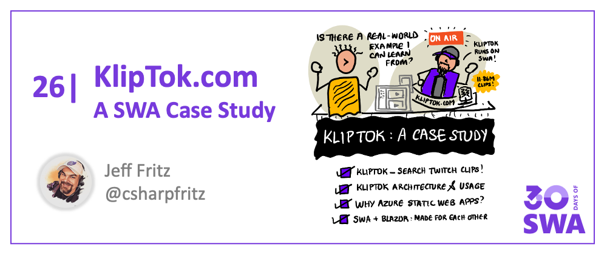
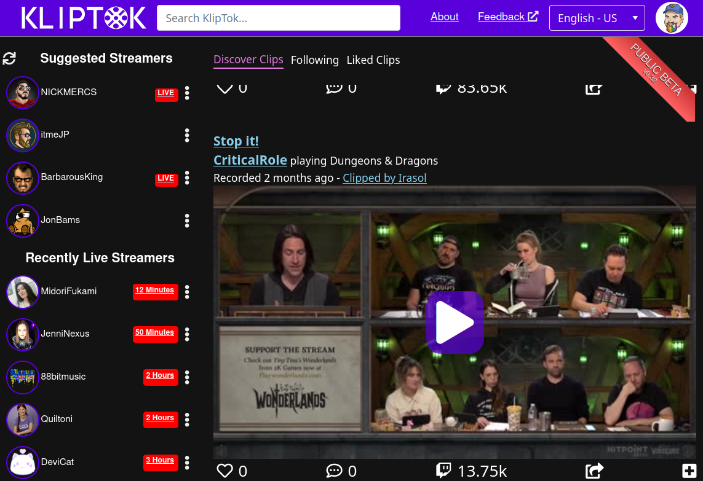
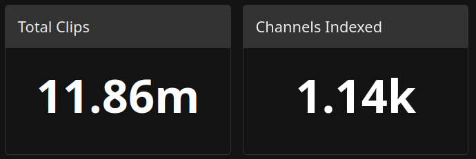
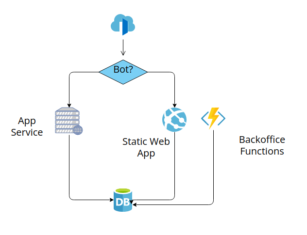

<head>
  <meta name="twitter:url" content="https://www.azurestaticwebapps.dev/blog/practices-case-study" />
  <meta name="twitter:title" content="#25: KlipTok.com: A SWA Case Study" />
  <meta name="twitter:description" content="Join @csharpfritz on #30DaysOfSWA and learn how he built Kliptok.com with @AzureStaticApps to make Twitch clips searchable!" />
  <meta name="twitter:image" content="https://www.azurestaticwebapps.dev/assets/images/25-banner.png" />
  <meta name="twitter:card" content="summary_large_image" />
  <meta name="twitter:creator" content="@nitya" />
  <meta name="twitter:site" content="@AzureStaticApps" /> 
  <link rel="canonical" href="https://www.azurestaticwebapps.dev/blog/practices-case-study" />
</head>

Welcome to `Week 4, Day 4` of **#30DaysOfSWA**!! 

Week 4 focuses on Best Practices for Azure Static Web Apps. In the last two posts we explored Azure Services integrations that enhance and extend the capabilities of your deployed static website. Today, we take things in a different direction with our first **Case Study** - featuring  [KlipTok](https://kliptok.com), a [Twitch](https://twitch.tv) clip search and indexing service built by Jeff Fritz, and hosted on Azure Static Web Apps!

## What We'll Cover
 * What is KlipTok?
 * Why did KlipTok choose Azure Static Apps?
 * How do Azure Static Apps and Blazor work together?
 * **Exercise**: Check out the [KlipTok](https://kliptok.com) website and see it in action.

## KlipTok Makes Twitch Videos Searchable

[KlipTok](https://kliptok.com) is a website that I started building while streaming live on Twitch in November 2019.  At the time, I wanted to build a website that would allow folks to discover Twitch clips from their favorite creators in the same way that they navigate and interact with TikTok. 

[Twitch](https://twitch.tv) is a live-streaming service that many people use to watch folks play video games.  When something interesting happens on Twitch, viewers can isolate a clip (up to 60 seconds long) from the stream and share it with their friends.  These clips are often fun and interesting, but typically they are not discoverable.  This is **KlipTok's goal - index and make those clips more available to everyone**.

## How does KlipTok Work?

Behind the scenes, KlipTok monitors Twitch for new clips from streamers that are signed up with the site and indexes them.  The clips are then transcribed and searchable on the site.  Visitors can view, like, and comment on clips.  Additionally, anyone can create playlists of clips to share with their friends.

<iframe width="560" height="315" src="https://www.youtube.com/embed/6uMCAHEM8Es" title="YouTube video player" frameborder="0"  allowfullscreen></iframe>

You can read the full story behind my decision process [on my blog](https://jeffreyfritz.com/2021/04/introducing-kliptok/) or watch me build a subset of its features on a livestream in Nov 2020, in the video above.

After the first 18 months of running KlipTok, the **application currently manages almost 12 million clips, totalling nearly 60 GB of data in the index**.  You can view the live dashboard at [kliptok.com/status](https://kliptok.com/status) to see the current status of the application.

 

 ## KlipTok Chooses Azure Static Apps

 I chose [Azure Static Apps](https://docs.microsoft.com/en-us/azure/static-web-apps/overview) to build and deploy the KlipTok application, and to help demonstrate [Blazor](https://blazor.net) running at scale in a large application.  This allows the application to **scale the HTTP services to deliver content** into the browser while delivering a high-performance experience with the Blazor application running in the browser on top of WebAssembly. 

 KlipTok also operates a second [Azure Functions](https://docs.microsoft.com/en-us/azure/azure-functions/functions-overview) service called the 'BackOffice' that performs the **synchronization of Twitch clips** and other data aggregation tasks.  When new channels are added to KlipTok for monitoring, the BackOffice service is triggered with a message on [Azure Service Bus](https://docs.microsoft.com/en-us/azure/service-bus-messaging/service-bus-messaging-overview) to add the channel and begin processing their clips for the index.  
 
 We also use this Backoffice functions app to create an [ML.NET](https://docs.microsoft.com/en-us/dotnet/machine-learning/) model that is used to **recommend streamers to the user**.  The model is trained on the collection of channels that KlipTok users follow and recommends channels to users based on other users who follow the same channels.	The model is updated every day with new data to help make more accurate recommendations to logged in KlipTok users. 

 By Twitch's terms of service, no videos are allowed to be shipped off of their platform for the first 24 hours after they are recorded.  This means that the clips should be referenced and embedded from Twitch using their own clip player, saving KlipTok from having to download and store the content. KlipTok can now deliver appropriate SEO-optimized content as well as render open-graph cards appropriate for Twitter, Facebook, LinkedIn and other sites.

## The KlipTok Architecture

We do have one small problem when using Blazor Web Assembly and Azure Static Websites -- search engines and social media sites do not know **how to crawl and present web assembly generated content**.  
 
To solve this, I added [Azure Front Door](https://docs.microsoft.com/en-us/azure/frontdoor/front-door-overview) to the site with an Azure App Service we ironically call the 'Static Site'. Azure Front Door is Microsoft’s modern cloud Content Delivery Network (CDN) - allowing us to take advantage of a globally-distributed edge network to make our content delivery faster and more efficient.
 
With a few rules added to Azure Frontdoor (to detect bots), users can now be redirected to the static site and KlipTok can deliver appropriate SEO optimized content along with the [open-graph](https://ogp.me/) cards for Twitter, Facebook, LinkedIn and other social sharing sites.

 

## Why Azure Static Web Apps?

When KlipTok was originally conceived, I wanted to **spend very little money and allow the site to scale easily** with new traffic as it grows.  As a C# and Blazor developer, this gave me the perfect intersection of my favorite technologies, keep costs low, and start to develop an application that demonstrates the capabilities of Blazor with a **VERY** large dataset.

Over time, the system components of KlipTok have matured and been swapped out.  Azure Table Storage gave way to MySQL and has been since replaced by RavenDb.  The Azure Functions were originally communicating using Azure Queues, and many of them are now using Azure Service Bus.

This maturing of the system components has allowed me to build and understand how other customers are using Azure and how we can improve the product to make developers of systems like KlipTok more productive. 

Using Azure Static Web Apps makes it easier for developers to integrate other Azure services - which then makes it possible for me to evolve KlipTok's architecture and capabilities quickly, to reflect changing needs.

## SWA & Blazor: Made for each other

As a developer, I've been very happy with the combination of Blazor and Azure Static Web Apps.  The ability to build a Blazor application and know that I will always have APIs scaling to meet my customers needs is a huge plus.

Blazor Web Assembly uses an HttpClient to communicate with web servers;in the case of an Azure Static Web App it communicated with an HTTP triggered function.  This allows me to dramatically simplify the definition and interaction of front-end code and the back-end code.

For example: when a user clicks the **Like** button on a clip, the Blazor application can post a message to the hosted function to increment the like count.  This function then updates the like count in RavenDb, then updates the UI with the new like count.  The Blazor application needn't wait for the function to complete before updating the UI - it can just add or subtract one from the like count.

## Summary

KlipTok has been an absolute joy to build and the journey to deliver it has been a great success.  I'm very excited to continue working on KlipTok and continue to grow the application while discovering and demonstrating more cool Blazor and Azure features. Have questions or comments? Find me on Twitch 

## Exercise

 * **Want to see this Azure Static Web App in action**? Click over to [KlipTok](https://kliptok.com) and login with your Twitch account! Then browse the site  to have KlipTok start showing you clips from your favorite creators. 
 * **Want to explore building your own Azure Static Web App with Blazor?** Check out my [earlier blog post](/blog/build-with-blazor#exercise-remix-fritzs-hats) for a great exercise where you'll start with my open-source project - [Fritz's Really Cool Hats](https://github.com/csharpfritz/Fritz.HatCollection) - to customize, build and deploy a Blazor-powered app to Azure Static Web Apps.