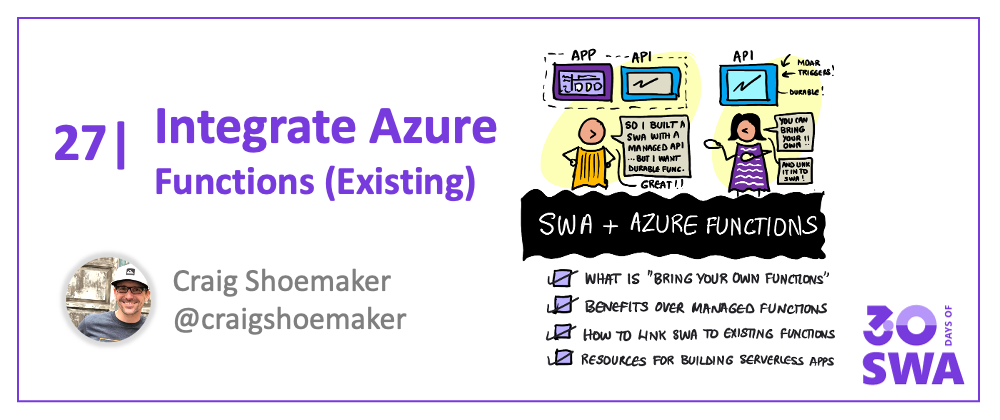

<head>
  <meta name="twitter:url" content="https://www.azurestaticwebapps.dev/blog/practices-byo-functions" />
  <meta name="twitter:title" content="#24: Custom Vision & SWA" />
  <meta name="twitter:description" content="Join @CraigShoemaker on #30DaysOfSWA as he walks us through the what-why-how, of 'Bringing Your Own Functions' to @AzureStatic Apps!" />
  <meta name="twitter:image" content="https://www.azurestaticwebapps.dev/assets/images/26-banner.png" />
  <meta name="twitter:card" content="summary_large_image" />
  <meta name="twitter:creator" content="@nitya" />
  <meta name="twitter:site" content="@AzureStaticApps" /> 
  <link rel="canonical" href="https://www.azurestaticwebapps.dev/blog/practices-byo-functions" />
</head>

Welcome to `Week 4, Day 5` of **#30DaysOfSWA**!! 

All week, we'll explore end-to-end development workflows with Azure Static Web Apps as one component that is integrated with other services to deliver an enhanced modern web application experience.

The default Azure Static Web Apps architecture separates the web application into two components: static assets (served from global content distribution services) and dynamic API endpoints (implemented using serverless architectures). In our [API-enabling SWA](blog/deploying-swa) post, we focused on **Managed Functions**, where the Azure Static Web Apps service configures and manages your Azure Functions Deployment.

Today, we'll explore the other option **Bring Your Own Functions** - where you can use pre-existing (or independently developed) Azure Functions applications and manage their deployment separately.


## What We'll Cover
* What is "Bring Your Own Functions" (BYOF)? 
* Benefits of BYOF over Managed Functions
* Switching from Managed Functions to BYOF
* **Resources**: Building Serverless apps with Azure Functions
* **Exercise**: Complete [this learning module](https://docs.microsoft.com/en-us/learn/modules/automatic-update-of-a-webapp-using-azure-functions-and-signalr/), add real-time updates to your SWA!



## What does "Bring Your Own Functions" (BYOF) mean?

In our [API-enabling SWA](blog/deploying-swa) post, we mentioned that the Azure Static Web App can implement Serverless API using Azure Functions in two ways:

* **Managed Functions** - where the Azure Static Web Apps service configures and manages your Azure Functions deployment.
* **Bring Your Own Functions** - where you use a pre-existing Azure Functions application and manage the deployment yourself.

The second option means that you build and deploy a serverless application using Azure Functions that exists _independent_ of your Azure Static Web App deployment. These applications can make use of the [full Azure Functions feature set](https://docs.microsoft.com/en-us/azure/azure-functions/functions-overview) without any of the limitations imposed for Managed Functions in SWA. All you need to do is **configure** the Static Web App service to use this new serverless API endpoint.


## Why "Bring Your Own Functions"?

Bring Your Own Functions is a power feature of Azure Static Web Apps that lets you link existing Functions apps and allows you to **avoid the restrictions of Managed Functions**. This means you can:

*   Implement and run functions in any language using **[custom handlers](https://docs.microsoft.com/azure/azure-functions/functions-custom-handlers)**.
*   Use **[triggers and bindings](https://docs.microsoft.com/azure/azure-functions/functions-triggers-bindings?tabs=csharp)** to create complex workflows with ease.
*   Implement **[Durable Functions](https://docs.microsoft.com/azure/azure-functions/durable/durable-functions-overview?tabs=csharp)** that remain stateful in serverless contexts.
*   Use any other Azure Functions features and adopt **[best practices](https://docs.microsoft.com/en-us/azure/azure-functions/functions-best-practices?tabs=csharp)**.

These kinds of capabilities become critical when you deploy real-world applications at scale. Note that Azure Static Web Apps has two hosting plans: free and standard where the Free tier supports only Managed Functions. To take advantage of the power of "Bring Your Own Functions" you need to be on the standard plan.


## Linking an existing Functions app


Using an existing Functions app in Static Web Apps is easy - **all your have to do is link the two apps together**. Once you create the link, then a Functions app published under the following URL:

```
https://my-functions-app.azurewebsites.net/api/data
```

...is now also available under the `api` route in your static web app. 

For instance:

```
https://red-sea-123.azurestaticapps.net/api/data
```

Linking an existing Functions app is a two step process: (1) Update the [staticwebapp.config.json](https://docs.microsoft.com/azure/static-web-apps/configuration) file, and (2) Link the apps via the Azure portal.

### 1. Update the configuration

Edit your site's `staticwebapp.config.json` file to make these changes:

* Set the `api_location` value to an empty string (`""`)

### 2. Link apps via the Azure portal

Navigate to your static web app in the Azure portal and make these changes:

* Click on **Functions** in the *Settings* menu
* Click **Production** in the *Environment* dropdown
* Click **Link to Function app** next to the *Functions type* dropdown
* Select your subscription from the *Subscription* dropdown
* Select your Functions app name from the *Function App* dropdown
* Click the **Link** button

Now your Functions app is linked to your website and is available under the `api` route for your Static Web App!

## Resources

### 1. Overview
Are you new to the whole idea of serverless applications and a Functions-based backend? Watch this video overview of Azure Functions - then check out the [developer guide](https://docs.microsoft.com/en-us/azure/azure-functions/functions-reference?tabs=blob).

<iframe width="640" height="360" src="https://www.youtube.com/embed/8-jz5f_JyEQ" title="YouTube video player" frameborder="0" allowfullscreen></iframe>

### 2. Quickstart

Want to get a quickstart with Azure Functions? You can code your functions in C#, Java, JavaScript, PowerShell, Python, TypeScript and more (e.g., Go, Rust). For example, you can create JavaScript Functions apps in the following ways:
 * [Using Visual Studio Code](https://docs.microsoft.com/en-us/azure/azure-functions/create-first-function-vs-code-node)
 * [Using Commandline Tools](https://docs.microsoft.com/en-us/azure/azure-functions/create-first-function-cli-node?tabs=azure-cli%2Cbrowser)
 * [Using an ARM Template](https://docs.microsoft.com/en-us/azure/azure-functions/functions-create-first-function-resource-manager?tabs=visual-studio-code%2Cazure-cli) = JSON configuration file

### 3. Learning Path

Want a more comprehensive tour of Azure Functions features and capabilities, with hands-on modules? Try the [Create Serverless Applications](https://docs.microsoft.com/en-us/learn/paths/create-serverless-applications/) learning path. It has 11 modules covering both core concepts and usage examples.


## Exercise
Complete [this learning module](https://docs.microsoft.com/en-us/learn/modules/automatic-update-of-a-webapp-using-azure-functions-and-signalr/)to learn how to use Azure SignalR to get real-time updates to your app using Azure Functions. _Then put that learning to use by updating one of your existing SWA projects to use this capability_.