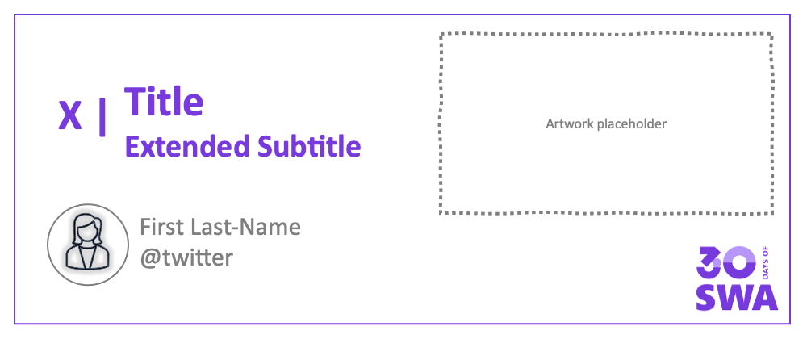

<head>
  <meta name="twitter:url" content="https://www.azurestaticwebapps.dev/blog/30-days-showcase" />
  <meta name="twitter:title" content="" />
  <meta name="twitter:description" content="" />
  <meta name="twitter:image" content="" />
  <meta name="twitter:domain" content="" />
  <meta name="twitter:card" content="summary_large_image" />
  <meta name="twitter:creator" content="@nitya" />
  <meta name="twitter:site" content="@AzureStaticApps" /> 
  <link rel="canonical" href="https://www.azurestaticwebapps.dev/blog/30-days-showcase" />
</head>

Welcome to `The Last Day!` of **#30DaysOfSWA**!! 

Here's how you can keep going..

## What We'll Cover
 * 
 * 
 * 
 * **Exercise** 
 * **Resource(s):** 

