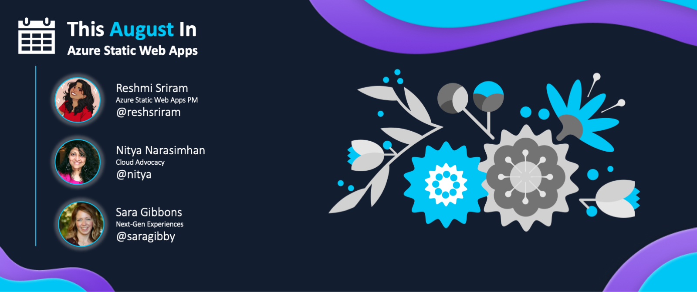
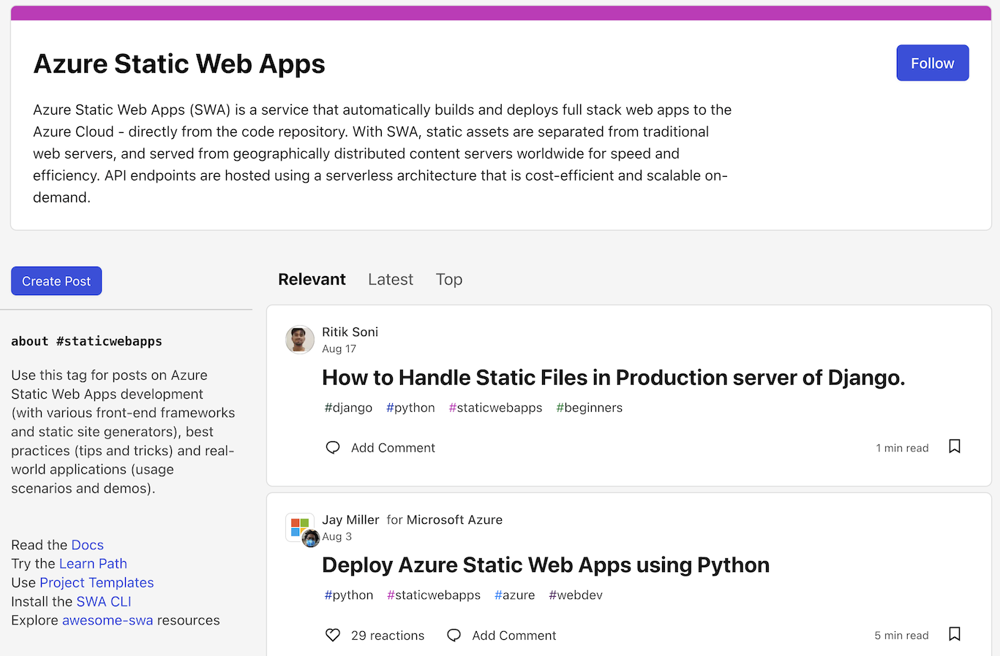

<head>
  <meta name="twitter:url" content="https://www.azurestaticwebapps.dev/blog/roundup-2022-aug" />
  <meta name="twitter:title" content="This Month in Azure Static Web Apps: Aug 2022" />
  <meta name="twitter:description" content="A monthly roundup of news, articles, events and more - on Azure Static Web Apps" />
  <meta name="twitter:image" content="https://www.azurestaticwebapps.dev/img/png/roundup/aug.png" />
  <meta name="twitter:card" content="summary_large_image" />
  <meta name="twitter:creator" content="@nitya" />
  <meta name="twitter:site" content="@AzureStaticApps" /> 
  <link rel="canonical" href="https://www.azurestaticwebapps.dev/blog/roundup-2022-aug" />
</head>

It's here!! Our first roundup of **This Month in SWA** 🎉
 
Each month, on the last Wednesday, we'll publish a roundup of Azure Static Web Apps product news, events, and content updates on this blog. Over time, we hope to make it your one-stop destination to catch up on all the exciting things happening in the SWA ecosystem, in one friendly post.

 * Want to make sure you don't miss it? <a href="/blog/rss.xml" target="_blank">**Subscribe to the feed**</a>.
 * Want to contribute items for roundup? [**Submit this custom issue**](https://github.com/staticwebdev/30DaysOfSWA/issues/new?assignees=&labels=ThisMonthIn+-+Community&template=---this-month-in-swa--community-submission.md&title=This+Month+In%3A+Community).
 * Want to catch up on past posts? [**Browse past editions.**](/thismonth#view-past-editions)

---

---

## Product News

_This section covers recent news or announcements from the product team. Read on to learn the latest news from the world of Azure Static Web Apps!_ 

* **Jun 22** | [Azure SWA now supports more API options](https://azure.microsoft.com/en-us/updates/public-preview-new-api-backend-options-in-azure-static-web-apps/)  You can now link Azure App Service, Azure Container Apps, and Azure API Management services seamlessly to your SWA's API endpoint. Read the [docs](https://docs.microsoft.com/en-us/azure/static-web-apps/apis-overview) and explore the [sample walkthrough](https://techcommunity.microsoft.com/t5/apps-on-azure-blog/new-api-backend-options-in-azure-static-web-apps/ba-p/3516882) to learn more.

* **Jun 8** | [Static Web Apps CLI is generally available](https://azure.microsoft.com/en-us/updates/static-web-apps-cli-now-available/).   The v1.0 release was launched in late May, adding new commands like `swa init`, `swa login` and `swa deploy` to create an all-in-1 tool for local SWA development. [_Explore the documentation here_](https://azure.github.io/static-web-apps-cli/)

Don't forget to bookmark the [**Azure Updates**](https://azure.microsoft.com/en-us/updates/?query=static%20web%20apps) page to get updates at any time.

---

## Dev Resources

_This section covers content, events and code samples from Microsoft authors. Check them out for relevant learning resources and best practices._

* **Aug 3** | `dev.to` -  [**Deploy Azure Static Web Apps using Python**](https://dev.to/azure/deploy-azure-static-web-apps-using-python-1hn7) by _Jay Miller_. Are you a Python developer interested in exploring Azure Static Web Apps? In this post, Jay walks you through configuring and deploying your first Python SWA from VS Code.

* **Jul 22** | `TechCommunity` - [**Host your website on Azure Static Web Apps for free**](https://techcommunity.microsoft.com/t5/educator-developer-blog/host-your-website-on-azure-static-web-apps-for-free/ba-p/3579709?WT.mc_id=academic-74011-sagibbon) by _Julia Muiruri_.  Students looking to get started with Azure, create your Azure for Students account and deploy your first website within minutes!

* **Jul 20** | `dev.to` -[**Taking a SWA DevOps Pipeline to the next level**](https://dev.to/azure/taking-a-swa-devops-pipeline-to-the-next-level-5co3) by _Aaron Powell_. We know SWA works seamlessly with GitHub Actions to automate the default build-deploy workflow. What if you need a more complex custom CI/CD pipeline? This article walks you through one such example. 

---

## Community Buzz

:::info AUTHORED BY DEVS LIKE YOU!
_This section highlights content from our amazing developer community - submitted directly, or published to the relevant tag in sites like Tech Community and dev.to._
:::

* **Jul 19** | `techcommunity.com` - [**Azure Adventure – A RPG game to test student’s Azure practical skills**](https://techcommunity.microsoft.com/t5/educator-developer-blog/azure-adventure-a-rpg-game-to-test-student-s-azure-practical/ba-p/3576331?WT.mc_id=academic-74011-sagibbon) by _Wong Cyrus, Dept Information Technology of the Hong Kong Institute of Vocational Education_.  Azure Adventure is an open source HTML5 RPG game that builds on top of the latest version of Azure Automatic Grading Engine, utilizing SWA.

---

## Upcoming Events

_This section highlights in-person or online events that are likely to feature Azure Static Web Apps content or developer conversations - links to CFPs or registration links are welcome!_

* **Sep 1-30, 2022** | [Serverless September](https://aka.ms/serverless-september) - explore Serverless on Azure
* **Oct 7, 2022** | [Microsoft Student Summit](https://developer.microsoft.com/en-us/reactor/overview/student-summit-2022/) - virtual event held globally
* **Oct 12-14, 2022** | [Microsoft Ignite](https://ignite.microsoft.com/en-US/home) - in-person (Seattle) and online 

---

## Did You Know?

_Each month, we hope to turn the spotlight on one key resource or person that is worth knowing about, in the context of Azure Static Web Apps._

:::info 🌟 SPOTLIGHT ON:  DEV.TO
[Dev.to](https://dev.to) is an inclusive community of software developers where you can publish content and have conversations on technology in collaborative and learning-driven ways. 

 * Explore the [**#staticwebapps**](https://dev.to/t/staticwebapps) tag - to browse ~100 articles on SWA.
 * Leave comments or reactions - to provide valued feedback! 
 * Create [**a tagged post**](https://dev.to/new/staticwebapps) - to share your own learnings.
:::

Here's a snapshot of what that tag profile looks like! **Follow** the tag to get articles in your dev.to feed - or [subscribe to the feed](https://dev.to/feed/tag/staticwebapps) from your favorite RSS reader.

> 

That's all we had for this roundup! Tell us what you think about this new format for a monthly summary! And don't forget to send us _your_ contributions.

---

## 🚨 | Call For Content

:::tip Next Roundup: Sep 28, 2022
Submissions welcome till Sep 25, 2022.

 * Did you author an article, create a SWA application or sample?
 * Are you organizing an event with a SWA-related session?
 * Are you a student who just created your first SWA app or blog post?

Submit the details [**using this custom issue**](https://github.com/staticwebdev/30DaysOfSWA/issues/new?assignees=&labels=ThisMonthIn+-+Community&template=---this-month-in-swa--community-submission.md&title=This+Month+In%3A+Community) as soon as possible. We can't wait to share your contributions!
:::
