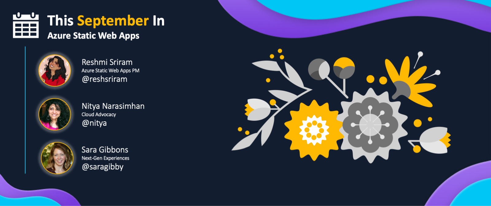

<head>
  <meta name="twitter:url" content="https://www.azurestaticwebapps.dev/blog/roundup-2022-sep" />
  <meta name="twitter:title" content="This Month in Azure Static Web Apps: Sep 2022" />
  <meta name="twitter:description" content="A monthly roundup of news, articles, events and more - on Azure Static Web Apps" />
  <meta name="twitter:image" content="https://www.azurestaticwebapps.dev/img/png/roundup/sep.png" />
  <meta name="twitter:card" content="summary_large_image" />
  <meta name="twitter:creator" content="@nitya" />
  <meta name="twitter:site" content="@AzureStaticApps" /> 
  <link rel="canonical" href="https://www.azurestaticwebapps.dev/blog/roundup-2022-sep" />
</head>

It's here!! Our September roundup of **This Month in SWA** 🎉
 
Each month, on the last Wednesday, we'll publish a roundup of Azure Static Web Apps product news, events, and content updates on this blog. Over time, we hope to make it your one-stop destination to catch up on all the exciting things happening in the SWA ecosystem, in one friendly post.

 * Want to make sure you don't miss it? <a href="/blog/rss.xml" target="_blank">**Subscribe to the feed**</a>.
 * Want to contribute items for roundup? [**Submit this custom issue**](https://github.com/staticwebdev/30DaysOfSWA/issues/new?assignees=&labels=ThisMonthIn+-+Community&template=---this-month-in-swa--community-submission.md&title=This+Month+In%3A+Community).
 * Want to catch up on past posts? [**Browse past editions.**](/thismonth#view-past-editions)

---

---

## Product News

_This section covers recent news or announcements from the product team. Read on to learn the latest news from the world of Azure Static Web Apps!_ 

* **Aug 31** | [Generally available: Enterprise-grade edge for Azure Static Web Apps](https://azure.microsoft.com/en-us/updates/generally-available-enterprisegrade-edge-for-azure-static-web-apps/)   Enterprise-grade edge for Azure Static Web Apps is now generally available. Enable faster page loads, enhance security, and optimize reliability for your global applications.

* **Sep 27** | [Support for .NET Core 3.1 in Azure Static Web Apps that use Azure Functions will end on Dec 3, 2022](https://learn.microsoft.com/en-us/azure/static-web-apps/configuration#platform)   After this date, your existing static web apps that use Azure Functions will continue to work, but security patches and customer service for .NET Core 3.1 will no longer be provided.

* **Sep 27** | [Support for Node 12 in Azure Static Web Apps will end on Dec 3, 2022](https://learn.microsoft.com/en-us/azure/static-web-apps/configuration#platform)   After this date, your existing static web apps that use Azure Functions will continue to work, but security patches and customer service for Node 12 will no longer be provided.  

---

## Dev Resources

_This section covers content, events and code samples from Microsoft authors. Check them out for relevant learning resources and best practices._

* **Aug 14** | `learn.microsoft.com` - [Learn: A Full Stack Application with Azure SQL & Prisma](https://learn.microsoft.com/en-us/shows/beginners-series-to-learn-a-full-stack-application-with-azure-sql-prisma/) by _Glaucia Lemos_. Your complete guide to create a scalable full-stack application using: Node.Js, Prisma, Azure SQL, Azure Functions along with deploying to Azure Static Web Apps integrated with GitHub Actions!

* **Sep 2** | `techcommunity.com` - [How to move your React website from localhost to the internet](https://techcommunity.microsoft.com/t5/educator-developer-blog/how-to-move-your-react-website-from-localhost-to-the-internet/ba-p/3611601) by _Bethany Jepchumba_. Now that you have your frontend React app running locally, time to take it to the cloud. Follow this step-by-step guide utilizing Azure Static Web Apps CLI to deploy your site.

* **Sep 23** | `youtube.com` - [New API back-end options in Azure Static Web Apps | Azure Friday](https://www.youtube.com/watch?v=adKWRm-J2oQ) by _Annina Keller and Scott Hanselman_. Annina shows how Azure Static Web Apps provides built-in serverless API endpoints via integration with Azure services, including Azure App Service, Azure API Management, Azure Container Apps, and Azure Functions. [Read the full Tech Community article](https://techcommunity.microsoft.com/t5/apps-on-azure-blog/use-static-web-apps-api-and-api-management-authorizations-to/ba-p/3603755)

---

## Community Buzz

:::info AUTHORED BY DEVS LIKE YOU!
_This section highlights content from our amazing developer community - submitted directly, or published to the relevant tag in sites like Tech Community and dev.to._
:::

* **Aug 25** | `c-sharpcorner.com` - [Static Web Apps With APIs With Azure Functions](https://www.c-sharpcorner.com/article/static-web-apps-with-apis-with-azure-functions/) by _Jorge Levy_.  Did you know you can deploy a full-stack application with Azure Static Web Apps?Follow along with this walk through to create a vanilla JavaScript frontend app with a C# Azure Function for an API.

* **Sep 1** | `dev.to` - [Taking Azure Static Web Apps from Out of the Box to Your Complex Pipelines](https://dev.to/stacy_cash/taking-azure-static-web-apps-from-out-of-the-box-to-your-complex-pipelines-3kgf) by _Stacy Cashmore_. When you have a large and complex application, and your SWA is only a small part of that stack, build process is key. Here is how to get that dialed in to your needs.

* **Sep 3** | `github.com` - [Simple Library Management](https://github.com/samipak458/Simple-Library-Managment) by _Muhammad Samiullah_. For those new to web development, here's a starter app for you! Learn JavaScript, web storage and deploying your first site to Azure Static Web Apps.

---

## Upcoming Events

_This section highlights in-person or online events that are likely to feature Azure Static Web Apps content or developer conversations - links to CFPs or registration links are welcome!_

* **Oct 7, 2022** | [Microsoft Student Summit](https://developer.microsoft.com/en-us/reactor/overview/student-summit-2022/) - virtual event held globally
* **Oct 12-14, 2022** | [Microsoft Ignite](https://ignite.microsoft.com/en-US/home) - in-person (Seattle) and online
* **Nov 9-10, 2022** | [GitHub Universe](https://githubuniverse.com/) - in-person (San Francisco) and online

---

## Did You Know?

_Each month, we hope to turn the spotlight on one key resource or person that is worth knowing about, in the context of Azure Static Web Apps._

:::info 🌟 SPOTLIGHT ON:  Student Ambassadors
[Microsoft Learn Student Ambassadors](https://studentambassadors.microsoft.com/) is our community program of over 3,000 higher-education students globally.

We ❤️ feedback! And are currently working with all of our Ambassadors to review the existing Azure Static Web Apps Learn documentation and training to hear their perspective and ideas.
:::

If you are a student, we'd also love to hear from you while we go through this review. Here is how you can provide your feedback on our Azure Static Web App Learn documentation and training materials.

1. Checkout this great list of current [Azure Static Web App Learn materials](https://github.com/microsoft/studentambassadors/tree/main/Bug-Bash) the Ambassador team has put together.
2. Pick out an item to review. 
3. If you find a bug, have an idea, or just have a question, share it with us! Go to the [microsoft/studentambassadors](https://github.com/microsoft/studentambassadors) repo to [create a new issue](https://github.com/microsoft/studentambassadors/issues/new/choose). _Be sure to tag if you are student, Ambassador, or educator_.

---

## 🚨 | Call For Content

:::tip Next Roundup: Oct 26, 2022
Submissions welcome till Oct  19, 2022.

 * Did you author an article, create a SWA application or sample?
 * Are you organizing an event with a SWA-related session?
 * Are you a student who just created your first SWA app or blog post?

Submit the details [**using this custom issue**](https://github.com/staticwebdev/30DaysOfSWA/issues/new?assignees=&labels=ThisMonthIn+-+Community&template=---this-month-in-swa--community-submission.md&title=This+Month+In%3A+Community) as soon as possible. We can't wait to share your contributions!
:::
