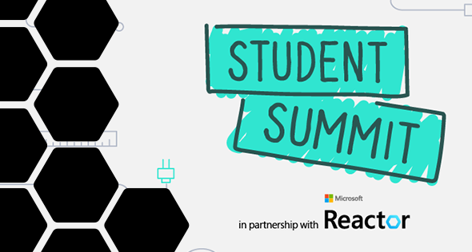

<head>
  <meta name="twitter:url" content="https://www.azurestaticwebapps.dev/blog/roundup-2022-oct" />
  <meta name="twitter:title" content="This Month in Azure Static Web Apps: Oct 2022" />
  <meta name="twitter:description" content="This October in @AzureStaticApps - we cover hybrid rendering with @nextjs, universal rendering with @nuxt_js and put the spotlight on #MicrosoftStudentSummit" />
  <meta name="twitter:image" content="https://www.azurestaticwebapps.dev/img/png/roundup/oct.png" />
  <meta name="twitter:card" content="summary_large_image" />
  <meta name="twitter:creator" content="@nitya" />
  <meta name="twitter:site" content="@AzureStaticApps" /> 
  <link rel="canonical" href="https://www.azurestaticwebapps.dev/blog/roundup-2022-oct" />
</head>

It's here!! Our October roundup of **This Month in SWA** 🎉

:::info ABOUT THE ROUNDUP 

We publish a roundup of Azure Static Web Apps product news, announcements and content updates **on the last Wednesday of each month**. Catch up on all the updates in one friendly post - and don't forget to contribute _your_ updates for inclusion in the next issue!

 * Want to make sure you don't miss it? <a href="/blog/rss.xml" target="_blank">**Subscribe to the feed**</a>.
 * Want to contribute items for roundup? [**Submit this custom issue**](https://github.com/staticwebdev/30DaysOfSWA/issues/new?assignees=&labels=ThisMonthIn+-+Community&template=---this-month-in-swa--community-submission.md&title=This+Month+In%3A+Community).
 * Want to catch up on past posts? [**Browse past editions.**](/thismonth#view-past-editions)

:::

---

---

## Product News

_This section covers recent news or announcements from the product team. Read on to learn the latest news from the world of Azure Static Web Apps!_ 

* **Oct 03** | [Universal Rendering with Nuxt 3 and Azure Static Web Apps](https://techcommunity.microsoft.com/t5/apps-on-azure-blog/universal-rendering-with-nuxt-3-and-azure-static-web-apps/ba-p/3586297?WT.mc_id=javascript-74011-ninarasi). Previously, you were able to deploy a static rendered Nuxt app on Azure Static Web Apps, where the entire app is pre-generated as static content. However, Nuxt 3 also supports universal rendering, which provides the performance and search engine optimization of server-side rendering while still enabling client-side interactivity. [**Get Started**](https://learn.microsoft.com/en-us/azure/static-web-apps/deploy-nuxtjs?WT.mc_id=javascript-74011-ninarasi) with this tutorial.

* **Oct 08** | [Extending Next.js Support in Azure Static Web Apps](https://techcommunity.microsoft.com/t5/apps-on-azure-blog/extending-next-js-support-in-azure-static-web-apps/ba-p/3627975?WT.mc_id=javascript-74011-ninarasi)   It's here - Azure Static Web Apps has **preview** support for Hybrid Next.js apps, making zero-config deployments with Next.js even easier with support for Server-Side Rendering, Incremental Static Regeneration (SSR and ISR respectively), API Routes, advanced image compression, and Next.js Auth. [**Get Started**](https://learn.microsoft.com/en-us/azure/static-web-apps/deploy-nextjs-hybrid?WT.mc_id=javascript-74011-ninarasi) with this tutorial.

---

## Dev Resources

_This section covers content, events and code samples from Microsoft authors. Check them out for relevant learning resources and best practices._

* **Oct 13** | [Cloud-Native Architectures on Azure: Microsoft Ignite Update](https://techcommunity.microsoft.com/t5/apps-on-azure-blog/cloud-native-architectures-on-azure-microsoft-ignite-update/ba-p/3650098?WT.mc_id=javascript-74011-ninarasi)    Read it to get a sense of where Azure Static Web Apps fits in the Cloud-Native ecosystem for building serverless solutions on Azure. Then [**Watch The Session**](https://ignite.microsoft.com/sessions/8950b2b1-62eb-48f9-90ef-5ad779ce8e22?source=sessions?WT.mc_id=javascript-74011-ninarasi) to see a demo of the Next.js Hybrid Rendering preview, and learn about what's next for Azure Static Web Apps.

* **Oct 24** | [Create blazing-fast web apps with Next.js and Azure Static Web Apps](https://www.youtube.com/watch?v=w6uH1CZEhcg&WT.mc_id=javascript-74011-ninarasi)   Discover how Azure Static Web Apps support for Next.js hybrid rendering can help you create web applications optimized for SEO and performance in this **5-minute video walkthrough**, part of the 20-part series of [Azure Tips & Tricks: Static Web Apps](https://www.youtube.com/playlist?list=PLlrxD0HtieHgMPeBaDQFx9yNuFxx6S1VG&WT.mc_id=javascript-74011-ninarasi) that takes you from core concepts to best practices.

---

## Community Buzz

:::info AUTHORED BY DEVS LIKE YOU!
_This section highlights content from our amazing developer community - submitted directly, or published to the relevant tag in sites like Tech Community and dev.to._
:::

* **Oct 03** | Microsoft MVP Stacy Cashmore just published a book on [Beginning Azure Static Web Apps](https://link.springer.com/book/10.1007/978-1-4842-8146-8) with a focus on "Building and Deploying Dynamic Web Applications with Blazor". The book covers dynamic content with Azure Functions, discusses the JAMstack revolution, and contains examples built using Visual Studio 2022. You can find [**Stacy's tweet**](https://twitter.com/Stacy_Cash/status/1576956491218976768) with more details.

---

## Upcoming Events

_This section highlights in-person or online events that are likely to feature Azure Static Web Apps content or developer conversations - links to CFPs or registration links are welcome!_

* **Oct 27** | Join MVP Stacy Cashmore at [Microsoft Reactor](https://reactor.microsoft.com/en-us/reactor/events/17239/) and go **From Zero To Deployed App in 60 Minutes**
* **Nov 8-10** | Register for [_.NET Conf 2022_](https://www.dotnetconf.net/) and attend the session on **Azure Static Web Apps with Blazor and .NET**.
* **Nov 9-10** | Register for [GitHub Universe](https://githubuniverse.com/) and look out for some great sessions from [Microsoft speakers](https://githubuniverse.com/events/detail/speakers) there!

---

## Did You Know?

_Each month, we hope to turn the spotlight on one key resource or person that is worth knowing about, in the context of Azure Static Web Apps._

:::info 🌟 SPOTLIGHT ON:  Microsoft Student Summit
Did you know the [Microsoft Student Summit](https://developer.microsoft.com/en-us/reactor/overview/student-summit-2022?WT.mc_id=javascript-74011-ninarasi) was just held as a global virtual event **on October 7, 2022** The event was held virtually in several regions, to suit local time zones and regional community interests. 

And you can catch up on all the recordings from these sessions in [**this handy playlist**](https://www.youtube.com/playlist?list=PLmsFUfdnGr3zU8GBuF3772MWhO4mMjMA-?WT.mc_id=javascript-74011-ninarasi)

:::

Azure Static Web Apps was a key focus for the Student Audience with sessions focused on the topic at 6 of 7 regional events. Here are links to the relevant recordings:
 * North America (Thomas And Ricardo) - [View Recording](https://youtu.be/_rfVNPWdcNg?t=7505)
 * EMEA (Sandro) - [View Recording](https://www.youtube.com/watch?v=TLJvG98pSkc&list=PLmsFUfdnGr3zU8GBuF3772MWhO4mMjMA-&index=4&t=7168s&WT.mc_id=javascript-74011-ninarasi)
 * India (Reshmi) - [View Recording](https://youtu.be/e7tm1WpFK24?t=8750&WT.mc_id=javascript-74011-ninarasi)
 * Asia Pacific (Julia) - [View Recording](https://youtu.be/ZjHZ5zCGPbk?t=8528&WT.mc_id=javascript-74011-ninarasi)
 * Brasil (Lavinia) - [View Recording](https://youtu.be/NmjwsCExIQM?list=PLmsFUfdnGr3zU8GBuF3772MWhO4mMjMA-&t=7892&WT.mc_id=javascript-74011-ninarasi)
 * LATAM (Christopher and Francisco) - [View Recording](https://youtu.be/ROJFLILoJ9U?list=PLmsFUfdnGr3zU8GBuF3772MWhO4mMjMA-&t=6930&WT.mc_id=javascript-74011-ninarasi)

Microsoft Student Ambassadors also participated in a [Static Web Apps Bug Bash 🐞](https://github.com/microsoft/studentambassadors/issues) - getting hands-on experience with providing valuable product feedback, and working with product teams to help resolve identified issues! [**Learn more about the Microsoft Learn Student Ambassadors Program**](https://studentambassadors.microsoft.com/?WT.mc_id=javascript-74011-ninarasi)

---

## 🚨 | Call For Content

:::tip Next Roundup: Nov 30, 2022
Submissions welcome till Nov  23, 2022.

 * Did you author an article, create a SWA application or sample?
 * Are you organizing an event with a SWA-related session?
 * Are you a student who just created your first SWA app or blog post?

Submit the details [**using this custom issue**](https://github.com/staticwebdev/30DaysOfSWA/issues/new?assignees=&labels=ThisMonthIn+-+Community&template=---this-month-in-swa--community-submission.md&title=This+Month+In%3A+Community) as soon as possible. We can't wait to share your contributions!
:::
