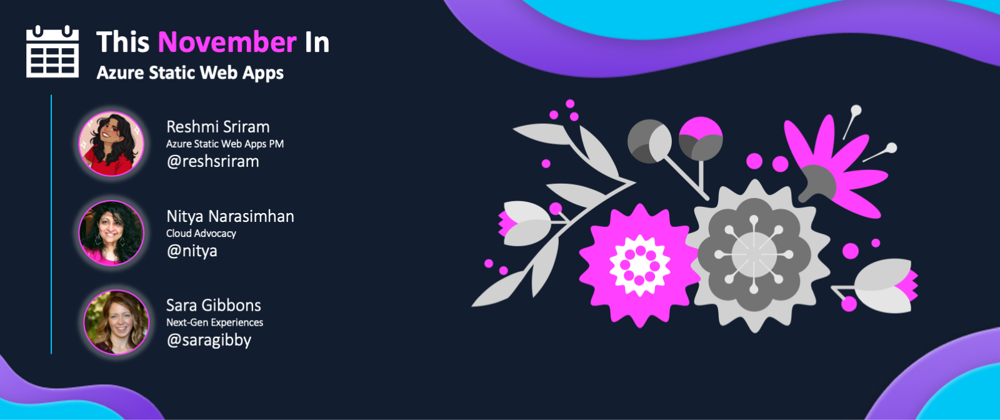

<head>
  <meta name="twitter:url" content="https://www.azurestaticwebapps.dev/blog/roundup-2022-nov" />
  <meta name="twitter:title" content="This Month in Azure Static Web Apps: Nov 2022" />
  <meta name="twitter:description" content="This November in @AzureStaticApps - we cover hybrid rendering with @nextjs, universal rendering with @nuxt_js and put the spotlight on #MicrosoftStudentSummit" />
  <meta name="twitter:image" content="https://www.azurestaticwebapps.dev/img/png/roundup/nov.png" />
  <meta name="twitter:card" content="summary_large_image" />
  <meta name="twitter:creator" content="@nitya" />
  <meta name="twitter:site" content="@AzureStaticApps" /> 
  <link rel="canonical" href="https://www.azurestaticwebapps.dev/blog/roundup-2022-nov" />
</head>

It's here!! Our November roundup of **This Month in SWA** 🎉

:::info ABOUT THE ROUNDUP 

We publish a roundup of Azure Static Web Apps product news, announcements and content updates **on the last Wednesday of each month**. Catch up on all the updates in one friendly post - and don't forget to contribute _your_ updates for inclusion in the next issue!

 * Want to make sure you don't miss it? <a href="/blog/rss.xml" target="_blank">**Subscribe to the feed**</a>.
 * Want to contribute items for roundup? [**Submit this custom issue**](https://github.com/staticwebdev/30DaysOfSWA/issues/new?assignees=&labels=ThisMonthIn+-+Community&template=---this-month-in-swa--community-submission.md&title=This+Month+In%3A+Community).
 * Want to catch up on past posts? [**Browse past editions.**](/thismonth#view-past-editions)

:::

---

---

## Product News

_This section covers recent news or announcements from the product team. Read on to learn the latest news from the world of Azure Static Web Apps!_ 

* **Nov 08** | [Azure Static Web Apps now fully supports .NET 7](https://azure.microsoft.com/en-us/updates/generally-available-azure-static-web-apps-now-fully-supports-net-7/?WT.mc_id=academic-7401100000-sagibbon) For your app’s frontend, Static Web Apps can now automatically build and deploy .NET 7.0 Blazor WebAssembly apps. For backend APIs, you can build and deploy .NET 7.0 Azure Functions with your static web apps. **[Get started](https://learn.microsoft.com/en-us/azure/static-web-apps/deploy-blazor?WT.mc_id=academic-74011-sagibbon)** by building your own Blazor + serverless API app.

* **Nov 09** | [Azure Static Web Apps now Supports Node 18](https://azure.microsoft.com/en-us/updates/public-preview-azure-static-web-apps-now-supports-node-18/?WT.mc_id=academic-74011-sagibbon) By using Node 18 for your app, you can leverage the latest language and runtime improvements in Node. For using Node 18 in your Azure functions, please use Functions version 4.x. **[Learn more](https://learn.microsoft.com/en-us/azure/static-web-apps/languages-runtimes?WT.mc_id=academic-74011-sagibbon)** on Azure Static Web Apps supported languages.

* **Nov 09** | [Static Web Apps support for Gitlab and Bitbucket](https://azure.microsoft.com/en-us/updates/generally-available-static-web-apps-support-for-gitlab-and-bitbucket/?WT.mc_id=academic-74011-sagibbon) This allows you to use Gitlab and Bitbucket as your CI/CD providers for Static Web Apps. You can bring your Gitlab or Bitbucket Project, create a simple YAML file using the provided template, and link it to a Static Web App created with a custom deployment source. Get started with this **[Gitlab tutorial](https://learn.microsoft.com/en-us/azure/static-web-apps/gitlab?tabs=vanilla-javascript?WT.mc_id=academic-74011-sagibbon)** and **[Bitbucket tutorial](https://learn.microsoft.com/en-us/azure/static-web-apps/bitbucket?tabs=vanilla-javascript?WT.mc_id=academic-74011-sagibbon)**

---

## Dev Resources

_This section covers content, events and code samples from Microsoft authors. Check them out for relevant learning resources and best practices._

* **Nov 01** | `github.com` -  [Next.js trivia app](https://github.com/aaronpowell/nextjs-graphql-trivia-demo) by _Aaron Powell_ This is a Next.js trivia demo application that shows how you can use GraphQL in an API route to talk to Azure Cosmos DB to make an application that can be deployed to Azure Static Web Apps using the hybrid Next.js app support.
* **Nov 08** | `techcommunity.com` -  [Deploy a React app to Azure Static Web Apps](https://techcommunity.microsoft.com/t5/healthcare-and-life-sciences/deploy-a-react-app-to-azure-static-web-apps/ba-p/3671939/?WT.mc_id=academic-74011-sagibbon) by _David Ginn and Phil Jirsa_ Watch Cloud Solution Architects David Ginn and Phil Jirsa demonstrate how to deploy a ReactJS application to Azure Static Web Apps using GitHub actions.
* **Nov 23** | `microsoft.github.io` - [Audio/Video Calling from a Custom App into a Teams Meeting](https://microsoft.github.io/MicrosoftCloud/tutorials/docs/ACS-to-Teams-Meeting) by _Dan Wahlin and Ayca Bas_ In this tutorial you'll learn how Azure Communication Services can be used in a custom React application to allow a user to make an audio/video call into a Microsoft Teams meeting

---

## Community Buzz

:::info AUTHORED BY DEVS LIKE YOU!
_This section highlights content from our amazing developer community - submitted directly, or published to the relevant tag in sites like Tech Community and dev.to._
:::

* **Nov 14** | `dev.to` - [Getting Started with Azure Static Web Apps](https://dev.to/danwahlin/getting-started-with-azure-static-web-apps-4a8j) by _Dan Wahlin_ Follow along with Dan has he shows you step-by-step how to create and deploy a React web app to Azure Static Web Apps, start to finish.
* **Nov 14** | `youtube.com` - [Azure Static Web Apps with Blazor and .NET](https://www.youtube.com/watch?v=FjGjguW1Xa0) by _Melissa Houghton_ Learn how to use Azure Static Web Apps with Blazor and .NET. Start by exploring Azure Static Web Apps, then take a look at getting started with Blazor WebAssembly paired with the serverless power of .NET Azure Functions or Azure Container Apps. And learning how to automatically build and deploy to Azure directly from our code repository.
* **Nov 20** | `github.com` -  [svelte-adapter-azure-swa](https://github.com/geoffrich/svelte-adapter-azure-swa) by _Geoff Rich_ Adapter for Svelte apps that creates an Azure Static Web App, using an Azure function for dynamic server rendering.

---

## 2022 Event Highlights

_As we wrap up 2022 and plan for 2023, here are some highlighted SWA event sessions not to be missed!_

* [Azure Static Web Apps 1st Anniversary 🥳](https://www.youtube.com/watch?v=1e6k5HNK4F8)
* [Use Static Web Apps to add a blog and link it to your Node web app](https://www.youtube.com/watch?v=vWwjMTeP1kU)
* [Using MSAL.js to integrate React Single-page applications with Azure Active Directory – July 2022](https://www.youtube.com/watch?v=7oPSL5wWeS0)

_Have an upcoming event you'd like to highlight? [Share it with us](https://github.com/staticwebdev/30DaysOfSWA/issues/new?assignees=&labels=ThisMonthIn+-+Community&template=---this-month-in-swa--community-submission.md&title=This+Month+In%3A+Community) so we can include it in our next roundup!_

---

## Did You Know?

_Each month, we hope to turn the spotlight on one key resource or person that is worth knowing about, in the context of Azure Static Web Apps._

:::info 🌟 SPOTLIGHT ON: Awesome AZD Templates

The Azure Developer CLI (AZD) is an open-source tool that accelerates the time it takes for you to get started on Azure - with a set of developer-friendly commands that map to key stages in your workflow (code, build, deploy, monitor).

Not only that, AZD uses extensible application templates ([Awesome AZD Templates](https://azure.github.io/awesome-azd/)) that include everything you need to get up and running on Azure for multiple scenarios. Each covering an end-to-end scenario that goes far beyond "Hello World!".

:::

Checkout the Static Web App enabled [Awesome AZD Templates](https://azure.github.io/awesome-azd/) we've created:
* [ToDo Application with a Node.js API and Azure Cosmos DB API for MongoDB on Static Web Apps and Functions](https://github.com/Azure-Samples/todo-nodejs-mongo-swa-func)
* [ToDo Application with a Python API and Azure Cosmos DB API for MongoDB on Static Web Apps and Functions](https://github.com/Azure-Samples/todo-python-mongo-swa-func)

As we work to build out Static Web App enabled [Awesome AZD Templates](https://azure.github.io/awesome-azd/), we'd love to hear from you! **[Share your template idea](https://github.com/Azure/awesome-azd/issues/new?assignees=nitya%2C+savannahostrowski&labels=requested-contribution&template=%F0%9F%A4%94-submit-an-idea-for-a-template.md&title=%5BIdea%5D+%3Cyour-template-name%3E)**, or if you have a template created you'd like to add to out list, **[share your template with us](https://github.com/Azure/awesome-azd/issues/new?assignees=nitya%2C+savannahostrowski&labels=new-contribution&template=%F0%9F%93%B2contribute-an-azd-template-.md&title=%5BNew+azd-template%5D+%3Cyour-template-name%3E)**!

---

## 🚨 | Call For Content

:::tip Next Roundup: Dec 28, 2022
Submissions welcome till Dec 21, 2022.

 * Did you author an article, create a SWA application or sample?
 * Are you organizing an event with a SWA-related session?
 * Are you a student who just created your first SWA app or blog post?

Submit the details [**using this custom issue**](https://github.com/staticwebdev/30DaysOfSWA/issues/new?assignees=&labels=ThisMonthIn+-+Community&template=---this-month-in-swa--community-submission.md&title=This+Month+In%3A+Community) as soon as possible. We can't wait to share your contributions!
:::
