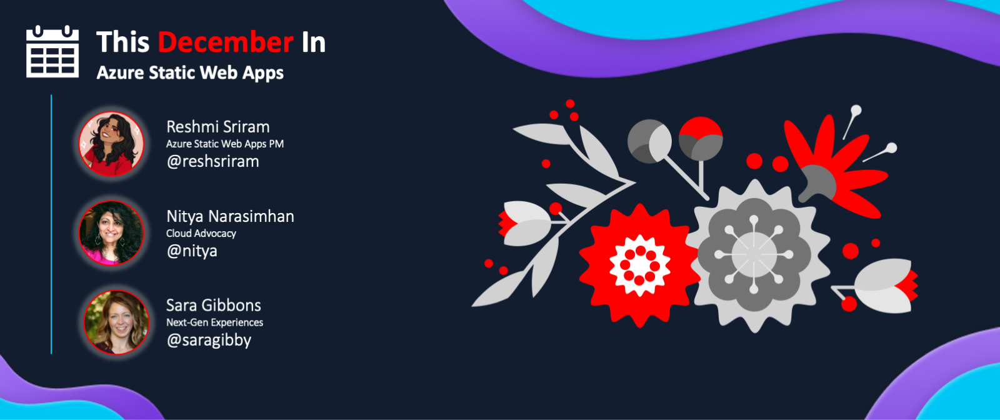

<head>
  <meta name="twitter:url" content="https://www.azurestaticwebapps.dev/blog/roundup-2022-dec" />
  <meta name="twitter:title" content="This Month in Azure Static Web Apps: Dec 2022" />
  <meta name="twitter:description" content="This December in @AzureStaticApps - we cover hybrid rendering with @nextjs, universal rendering with @nuxt_js and put the spotlight on #MicrosoftStudentSummit" />
  <meta name="twitter:image" content="https://www.azurestaticwebapps.dev/img/png/roundup/dec.png" />
  <meta name="twitter:card" content="summary_large_image" />
  <meta name="twitter:creator" content="@nitya" />
  <meta name="twitter:site" content="@AzureStaticApps" /> 
  <link rel="canonical" href="https://www.azurestaticwebapps.dev/blog/roundup-2022-dec" />
</head>

It's here!! Our December roundup of **This Month in SWA** 🎉

:::info ABOUT THE ROUNDUP 

We publish a roundup of Azure Static Web Apps product news, announcements and content updates **on the last Wednesday of each month**. Catch up on all the updates in one friendly post - and don't forget to contribute _your_ updates for inclusion in the next issue!

 * Want to make sure you don't miss it? <a href="/blog/rss.xml" target="_blank">**Subscribe to the feed**</a>.
 * Want to contribute items for roundup? [**Submit this custom issue**](https://github.com/staticwebdev/30DaysOfSWA/issues/new?assignees=&labels=ThisMonthIn+-+Community&template=---this-month-in-swa--community-submission.md&title=This+Month+In%3A+Community).
 * Want to catch up on past posts? [**Browse past editions.**](/thismonth#view-past-editions)

:::

---

---

## Product News

_This section covers recent news or announcements from the product team. Read on to learn the latest news from the world of Azure Static Web Apps!_ 

* **date** | [title](link)
* **date** | [title](link)

---

## Dev Resources

_This section covers content, events and code samples from Microsoft authors. Check them out for relevant learning resources and best practices._

* **date** | `` -  [title](link) by _author_
* **date** | `` -  [title](link) by _author_

---

## Community Buzz

:::info AUTHORED BY DEVS LIKE YOU!
_This section highlights content from our amazing developer community - submitted directly, or published to the relevant tag in sites like Tech Community and dev.to._
:::

* **date** | `` -  [title](link) by _author_
* **date** | `` -  [title](link) by _author_

---

## Upcoming Events

_This section highlights in-person or online events that are likely to feature Azure Static Web Apps content or developer conversations - links to CFPs or registration links are welcome!_

* **date** | Join [event name](link)
* **date** | Register for [event name](link)
* **date** | Register for [event name](link)

---

## Did You Know?

_Each month, we hope to turn the spotlight on one key resource or person that is worth knowing about, in the context of Azure Static Web Apps._

:::info 🌟 SPOTLIGHT ON:  

:::

---

## 🚨 | Call For Content

:::tip Next Roundup: Dec 28, 2022
Submissions welcome till Dec 21, 2022.

 * Did you author an article, create a SWA application or sample?
 * Are you organizing an event with a SWA-related session?
 * Are you a student who just created your first SWA app or blog post?

Submit the details [**using this custom issue**](https://github.com/staticwebdev/30DaysOfSWA/issues/new?assignees=&labels=ThisMonthIn+-+Community&template=---this-month-in-swa--community-submission.md&title=This+Month+In%3A+Community) as soon as possible. We can't wait to share your contributions!
:::
