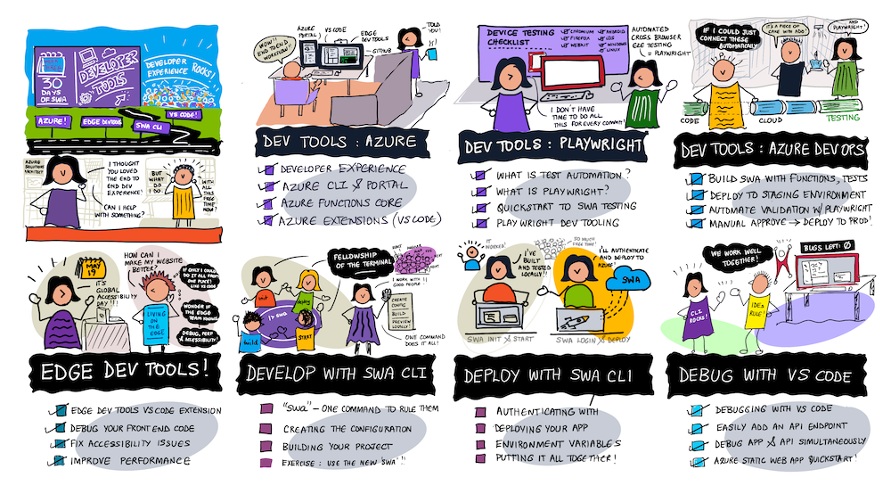
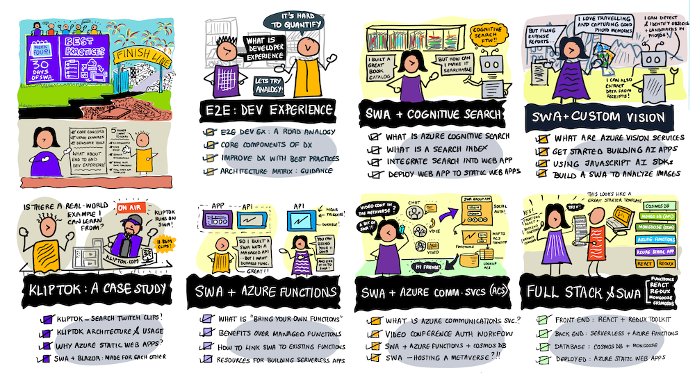
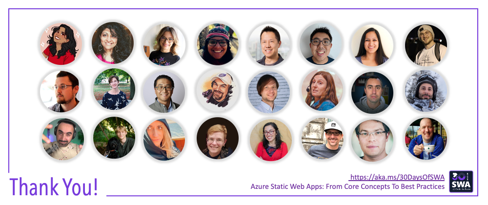

# Roadmap

Welcome to **#30DaysOfSWA** - a fun way to jumpstart your learning journey into Azure Static Web Apps. 

Over the next four weeks, we'll learn core concepts, see usage examples, explore developer tools, and discuss best practices to design richer end-to-end user experiences. We've put together a tentative plan for the content. While the weekly themes are fixed, we may adapt or alter planned posts in response to your feedback or requests.

So share your questions, comments and suggestions. Help us make this more journey better!
 * **Preferred**: Post feedback to our [Discussions](https://github.com/orgs/staticwebdev/discussions/categories/-30daysofswa) board. 
 * Alternatively, post feedback as comments in the related post [on dev.to](https://dev.to/nitya/series/17901).
 * You can also tweet comments or share learnings using the `#30DaysOfSWA` hashtag.

---

## Kickoff 

:::info KICKOFF

What is #30DaysOfSWA? How can you participate? Who are the people behind this project? Join us for a visual roadmap of the journey ahead, and get motivated to learn about Azure Static Web Apps in #30Days!
:::

---

## Core Concepts 

_Welcome to the first week of your learning journey. Let's talk about some fundamental concepts for developing and deploying Static Web Apps. At the end of this week you should have built and deployed a basic SWA._

:::info Week 1 ARTICLES
 * [**Introducing SWA**](blog/introducing-swa) _(Simona, Nitya)_ - What is Static Web Apps?
 * [**Building SWA**](blog/building-swa) _(Glaucia, Nitya)_  - Build & Deploy Your First SWA!
 * [**API-Enabling SWA**](blog/api-enabling-swa) _(Anthony, Nitya)_ - Add a Serverless API backend.
 * [**Configuring SWA**](blog/configuring-swa) _(Joseph, Nitya)_ -- Configure Build Process, App Settings & Behavior
 * [**Securing SWA**](blog/securing-swa)  _(Mitali, Nitya)_ - Built-in & Custom Authentication Options for SWA
 * [**Previewing SWA**](blog/previewing-swa)  _(Michail , Nitya)_ - Staging Deployments For Previewing (PR, Branches)
 * [**Deploying SWA**](blog/deploying-swa)  _(Reshmi)_ - Deploy from GitLab, BitBucket, Azure DevOps. Using ARM Templates
:::

---

## Usage Examples 

_Welcome to Week 2. So you know what SWA is but what web frameworks and libraries can you use it with? And what kinds of applications can you spin up quickly using this approach? Let's look at some examples_.

:::info Week 2 ARTICLES
 * [Build a Blog - with Astro](blog/build-with-astro) 
 * [Manage Inventory - with React](blog/build-with-react) 
 * [Get Creative - with Vue](blog/build-with-vuejs) 
 * [Share Content - with Docusaurus](blog/build-with-docusaurus) 
 * [Headless CMS - with Blazor](blog/build-with-blazor) 
 * [Hosting PWA - with SWA](blog/pwa-on-swa) 
 * [Show & Tell - SWArm of Apps](blog/show-and-tell) 
:::

---

## Developer Tools

_Welcome to Week 3 - let's talk about the developer experience in building and deploying modern web apps. We'll introduce you to a few tools that can simplify your develop-debug-deploy-test workflows. While some are SWA-specific, others are useful for modern web app dev in general._

:::info Week 3 ARTICLES
 * [Develop - with Azure Tools](blog/devtools-azure) - 
 * [Test Automation - with Playwright](blog/devtools-playwright) - 
 * [Multi-Stage Deploy - with Azure DevOps](blog/devtools-ado) - 
 * [Debug - with Edge DevTools](blog/devtools-msedge) - 
 * [Develop - with SWA CLI](blog/devtools-swacli-develop) - 
 * [Deploy - with SWA CLI](blog/devtools-swacli-deploy) - 
 * [Run & Debug - with VS Code](blog/devtools-vscode) - 
:::

---

## Best Practices

_We made it to the final week!! We've learned core concepts, seen examples of SWA in action, and explored tools to improve the developer experience. Now let's explore how SWA works with other Azure or third party services, and end with some tips and tricks to make your SWA development journey fun and functional!_

:::info Week 4 ARTICLES
 * [E2E Development - and SWA](https://www.azurestaticwebapps.dev/blog/practices-e2e) - a roadmap
 * [Cognitive Search - and SWA](https://www.azurestaticwebapps.dev/blog/practices-cognitive-search) - build a Searchable Catalog
 * [Cognitive Services - and SWA](https://www.azurestaticwebapps.dev/blog/practices-cognitive-services) - bring Custom Vision to your app
 * [KlipTok - and SWA](https://www.azurestaticwebapps.dev/blog/practices-case-study) - a real-world Case Study
 * [Azure Functions - and SWA](https://www.azurestaticwebapps.dev/blog/practices-byo-functions) - Bring Your Own Functions!
 * [Video Conferencing - and SWA](https://www.azurestaticwebapps.dev/blog/practices-cosmosdb) - integrate Azure Communication Services using SWA Auth and CosmosDB
 * [Full Stack - and SWA](https://www.azurestaticwebapps.dev/blog/practices-full-stack-react) - React/Redux front-end, Functions back-end and CosmosDB database (using Mongoose)
:::

---

## Wrap-up

:::success THANK YOU & NEXT STEPS
Thank you for staying the course with us. In the final two posts of this series we'll do two things:
 * **Look Back** - with a quick retrospective of what was covered.
 * **Look Ahead** - with resources and suggestions for how you can skill up further!

We appreciate your time and attention and we hope you found this curated tour valuable. Feedback and suggestions are always welcome. From our entire team, we wish you **good luck with the learning journey - now go build some apps and share your knowledge!** 🎉
:::

---