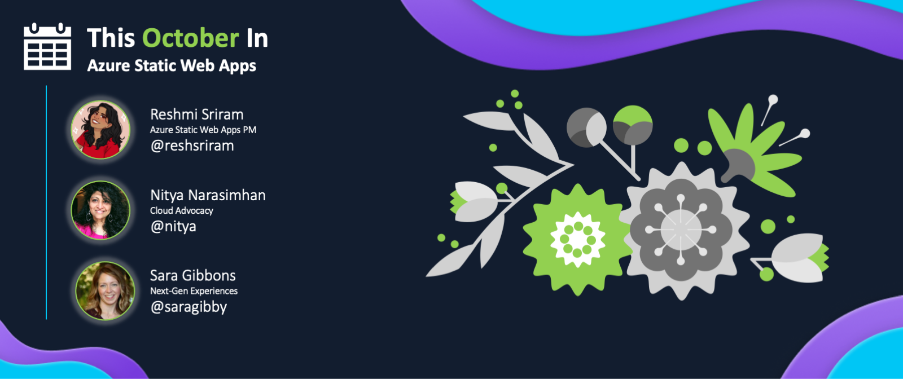

## This Month In SWA

Welcome to `This Month In SWA` - a monthly roundup of [Azure Static Web Apps](https://docs.microsoft.com/en-us/azure/static-web-apps/overview) news and updates from the Product Team, Cloud & Student Advocacy - and from you, our amazing Developer Community. 

[**Click here to read the latest issue**
](/blog/roundup-2022-oct)

---

## View Past Editions

We'll keep this section updated with links to the monthly roundup posts, once they've been published.

 * **Issue #01**: [August 31, 2022](https://www.azurestaticwebapps.dev/blog/roundup-2022-aug)
 * **Issue #02**: [September 27, 2022](https://www.azurestaticwebapps.dev/blog/roundup-2022-sep)
 * **Issue #03**: [October 26, 2022](https://www.azurestaticwebapps.dev/blog/roundup-2022-oct)

---

## Call For Contributions

**Have you built something recently you want to share**?  Use  [the custom issue](https://github.com/staticwebdev/30DaysOfSWA/issues/new/choose) to submit your news, articles, or events, for consideration this month, or in future issues.

* Next Publication Date: **October 26, 2022** 
* Contribution Deadline: **October 23, 2022**

---

## Why This Roundup?

Since we concluded the [#30DaysOfSWA](roadmap) series in May/June 2022, we've noticed many of you continuing to visit this site for updates. At the same time, we've seen new posts published on the [#staticwebapps tag on dev.to](https://dev.to/t/staticwebapps) and on [Tech Community](https://techcommunity.microsoft.com/t5/apps-on-azure-blog/bg-p/AppsonAzureBlog/label-name/Static%20Web%20Apps) blogs. And we've seen learning events shared [via tweets @AzureStaticApps](https://twitter.com/AzureStaticApps) that many of you may not be aware of. 

So we thought - why not _round up_ all the SWA news and activities each month, and make them available in a single post for convenient reading. The result: **This Month In SWA** - a blog post that we will publish on the last Wednesday of each month. The kind of content we hope to feature includes:

 * 🗓 | ** Events**: Past and Upcoming, featuring SWA talks or training opportunities.
 * 📢 | **Announcements**: Latest news or updates from the Product and Engineering teams.
 * 👀 | **Content Updates**: New articles, tutorials or samples authored by Microsoft developers.
 * 🐝 | **Community Buzz**: New articles, tutorials or samples authored by Community developers 
 * 🌟 | **Spotlight**: Featuring a project or person that makes a difference to SWA developers.

---

## How to Contribute?

Want to contribute content to our roundups? 

 * Just [submit this custom issue](https://github.com/staticwebdev/30DaysOfSWA/issues/new?assignees=&labels=ThisMonthIn+-+Community&template=---this-month-in-swa--community-submission.md&title=This+Month+In%3A+Community) with a link to your event, code project or content.
 * Feel free to share the issue with others for upvotes
 * We review submissions the week prior to publication
 * Accepted submissions will be tagged with link to post (and issue will be closed)

