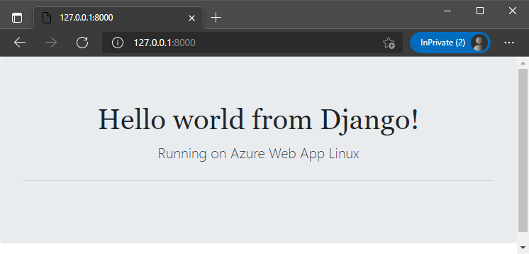

# How to create a Django Application
1. Create a **virtual environment** with any python version >=3.
    - If you are using Windows:
        ```shell
        python -m venv env
        ```
    - If you are using Linux:
        ```shell
        python3 -m venv env
       ```
2. Activate the virtual environment.
    - If you are using Windows in cmd:
        ```shell
        env\Scripts\activate
        ```
    - If you are using Linux
        ```shell
        source env/bin/activate
        ```
3. Once the virtual environment is activated, install Django:
    ```shell
    pip install Django
    ```
4. Create a Django project:  
    ```
    django-admin startproject project
    ```
5. Then cd into project folder and run the server with: 
    ```
    python manage.py runserver
    ```

    Django app will be listening by default in port 8000, so browse to http://localhost:8000/ to get the default page. To change this port, you can use `python manage.py runserver 0:8080`

6. Create an app for this project with:
    ```
    python manage.py startapp myapp
    ```
7. Open the file **`myapp/views.py`** and replace the content with:
    ```python
    from django.http import HttpResponse


    def index(request):
        return HttpResponse("Hello, world!")
    ```
8. Create the file **`myapp/urls.py`** and include the following code:
    ```python
    from django.urls import path

    from . import views

    urlpatterns = [
        path('', views.index, name='index'),
    ]
    ```
9. Open the file **`project/urls.py`** and add include module and a new urlpattern:

    ```python
    from django.contrib import admin
    from django.urls import path, include

    urlpatterns = [
        path('admin/', admin.site.urls),
        path('', include('myapp.urls'))
    ]
    ```
10. Open the file **project/settings.py** and add myapp in the array list:
    ```python
    INSTALLED_APPS = [
        'myapp',
        'django.contrib.admin',
        'django.contrib.auth',
        'django.contrib.contenttypes',
        'django.contrib.sessions',
        'django.contrib.messages',
        'django.contrib.staticfiles',
    ]
    ```
11. Save all files and run the server:
    ```
    python manage.py runserver
    ```

    Browse to http://localhost:8000/   

# Working with Django Template Engine and Styles
1. Download the static and templates folders located under **python-training-resources/ui/django/** from this git repository: `https://github.com/azureossd/python-training-resources.git`, you can clone it or download it as zip file.
2. Copy **static** and **templates** folders under **myapp/** folder.
3. Open the file **`myapp/views.py`** and replace the content by the following:

    ```python
    from django.http import HttpResponse
    from django.shortcuts import render

    def homePageView(request):
        return render(request, 'home/index.html', {'msg':'Hello World'})
    ```
4. Open file **myapp/urls.py** and replace the content by the following:
    ```python
    from django.urls import path

    from .views import homePageView

    urlpatterns = [
        path('', homePageView, name='home')
    ]
    ```
5. Open the file **project/settings.py** and import os in the top as followed:

    ```python
    from pathlib import Path
    import os
    ```
6. Then add a new variable called `SETTINGS_PATH` after `BASE_DIR` as followed:
    ```python
    # Build paths inside the project like this: BASE_DIR / 'subdir'.
    BASE_DIR = Path(__file__).resolve().parent.parent
    SETTINGS_PATH = os.path.dirname(os.path.dirname(__file__))
    ```
7. Add two directories (SETTINGS_PATH and templates) in the DIRS array inside TEMPLATES as followed:
    ```python
    TEMPLATES = [
        {
            'BACKEND': 'django.template.backends.django.DjangoTemplates',
            'DIRS': [os.path.join(SETTINGS_PATH, 'templates')],
            'APP_DIRS': True,
            'OPTIONS': {
                'context_processors': [
                    'django.template.context_processors.debug',
                    'django.template.context_processors.request',
                    'django.contrib.auth.context_processors.auth',
                    'django.contrib.messages.context_processors.messages',
                ],
            },
        },
    ]
    ```
8. Save all files and run the server:
    ```
    python manage.py runserver
    ```

    Browse to http://localhost:8000/    


## Final Result

   

